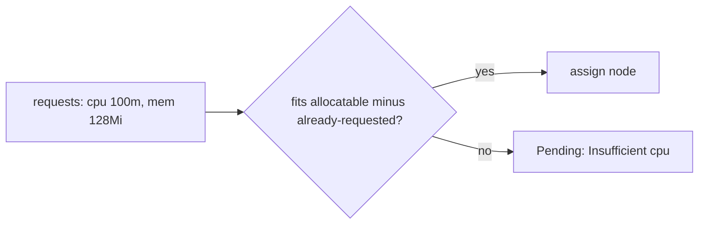
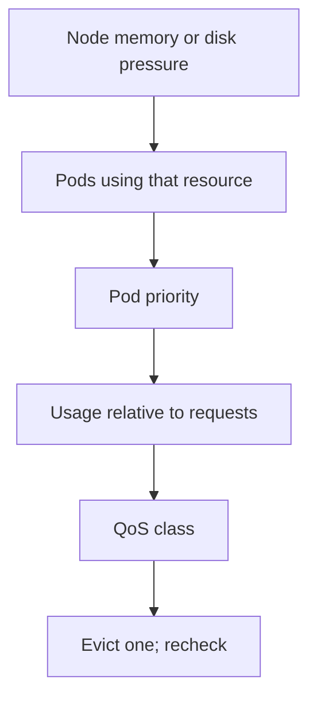

# Requests, limits, and pressure

*Stage 4 · Flight Control*

**You will be able to:** say what a request does, what a limit does, and how a Pod is ranked when a node runs short of resources.

## The problem

All Pods on a node share its CPU and memory. Without any rules, one service with a memory leak can starve its neighbours, including the database. Kubernetes needs two separate things: a way to decide *where a Pod fits* before it starts, and a way to *restrain it* once it runs. People often assume one setting does both.

## The idea in plain words

Booking a hotel room: the **reservation** says how big a room you need so the hotel can plan (a request). The **fire code** says the most people the room may hold (a limit). The reservation does not stop you bringing extra guests, and the fire code does not guarantee you a room.

| | `requests` | `limits` |
|---|---|---|
| Used by | The **scheduler** (does it fit?) and the **HPA** (utilisation = usage ÷ request) | The **kernel** (cgroups) while the Pod runs |
| What happens at the line | Not a ceiling | CPU: **throttled** (slowed). Memory: **OOMKilled** (killed immediately) |
| What it guarantees | That the capacity is reserved *on paper* | A hard ceiling |

CPU can be slowed and shared; memory cannot be taken back once given, so going over a memory limit means the kernel kills the process.

## How it works

The scheduler adds up the **requests** of Pods already on a node and compares with the node's allocatable capacity. A Pod fits only if its own request still fits. This is why a node can be "full" while its CPUs are idle: it is booked, not busy.



A request also feeds the HPA's arithmetic, so a Pod with no request gives the autoscaler nothing to divide by (`<unknown>`).

### Quality of Service (QoS) classes

From the requests and limits you set, Kubernetes assigns each Pod a class used when the node is under memory or disk pressure:

| Class | Rule | Evicted |
|---|---|---|
| `Guaranteed` | requests = limits for CPU and memory in every container | last |
| `Burstable` | some requests or limits, but not Guaranteed | middle |
| `BestEffort` | none set | first |

Apollo sets all ten workloads to `Guaranteed`. But QoS is not a shield: a Guaranteed Pod far over its memory request can still be chosen. The actual ranking combines the pressure type, Pod priority, usage relative to requests, and QoS.



## Apollo tiers

| Tier | Workloads | CPU | Memory |
|---|---|---|---|
| Flagship | `booking` | 200m | 256Mi |
| Default | `identity`, `flight`, `search` | 100m | 128Mi |
| Low / UI | `notification`, `frontend` | 50m | 64Mi |
| Data | 3 Postgres | 200m | 256Mi |
| Cache | `redis` | 100m | 128Mi |

(`100m` is one tenth of a CPU core; `128Mi` is 128 mebibytes.)

## Try it

```bash
kubectl get pods -n apollo-airlines-apps -o custom-columns=NAME:.metadata.name,QOS:.status.qosClass
kubectl describe node apollo11-worker | sed -n '/Allocated resources/,/Events/p'
kubectl top pods -n apollo-airlines-apps --containers
```

## Common misconceptions

- **"A request reserves real memory."** It reserves room on paper for scheduling.
- **"Pending with `Insufficient cpu` means the node is busy."** It means the node's requests are fully booked.
- **"`Guaranteed` can never be evicted."** It is evicted last, not never.

## Check yourself

<details>
<summary>A Pod is <code>Pending</code> with <code>Insufficient cpu</code> while the nodes are idle. Why?</summary>

Scheduling uses summed requests, not actual usage. Idle but over-requested nodes are full.
</details>

<details>
<summary>What happens at a memory limit versus a CPU limit?</summary>

Memory: OOMKilled (immediately). CPU: throttled (slower, not killed).
</details>

## Where this leads

Requests help the scheduler decide where a Pod goes. The next chapter looks at that decision in detail.
