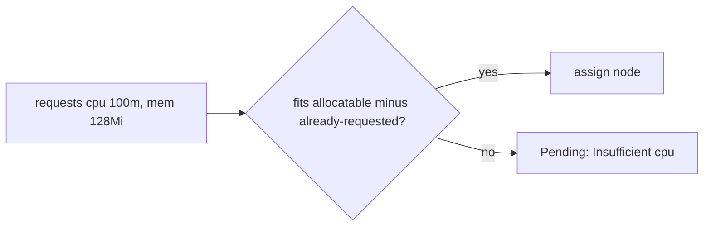
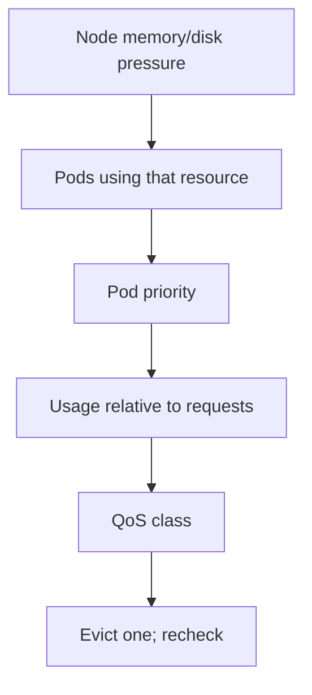

# Requests, limits, and pressure

*Stage 4 · Flight Control*

**You will be able to:** say what a request does, what a limit does, and how a Pod is ranked for eviction.

## Requests vs limits

| | `requests` | `limits` |
|---|---|---|
| Used by | **Scheduler** (does the Pod fit?), **HPA** (utilisation = usage ÷ request) | **Kernel cgroups** at runtime |
| Over the line | n/a (not a ceiling) | CPU: **throttled**. Memory: **OOMKilled** |
| Guarantee | Capacity is *reserved on paper*, not physical memory or performance | Hard ceiling |



- Node capacity is "booked" by **requests**, not live usage.
- No requests ⇒ HPA cannot compute CPU utilisation (`<unknown>`).

## QoS classes

| Class | Rule | Eviction |
|---|---|---|
| `Guaranteed` | requests = limits for CPU and memory in every container | last |
| `Burstable` | some requests/limits, not Guaranteed | middle |
| `BestEffort` | none | first |

- Apollo sets all ten workloads to `Guaranteed`.
- QoS is **not a shield**: a Guaranteed Pod using far more memory than requested can still be chosen.



- Eviction ranking combines pressure type, priority, usage vs requests, and QoS: not a fixed three-step ladder.

## Apollo tiers

| Tier | Workloads | CPU | Memory |
|---|---|---|---|
| Flagship | `booking` | 200m | 256Mi |
| Default | `identity`, `flight`, `search` | 100m | 128Mi |
| Low / UI | `notification`, `frontend` | 50m | 64Mi |
| Data | 3 Postgres | 200m | 256Mi |
| Cache | `redis` | 100m | 128Mi |

## Try it

```bash
kubectl get pods -n apollo-airlines-apps -o custom-columns=NAME:.metadata.name,QOS:.status.qosClass
kubectl describe node apollo11-worker | sed -n '/Allocated resources/,/Events/p'
kubectl top pods -n apollo-airlines-apps --containers
kubectl describe pod <pod> -n apollo-airlines-apps | grep -E 'OOMKilled|Reason'
```

## Check yourself

<details>
<summary>A Pod is <code>Pending</code> with <code>Insufficient cpu</code> while the nodes are idle. Why?</summary>

Scheduling uses summed **requests**, not actual usage. Idle but over-requested nodes are full.
</details>

<details>
<summary>What happens at a memory limit versus a CPU limit?</summary>

Memory: OOMKilled (immediate). CPU: throttled (slower, not killed).
</details>
