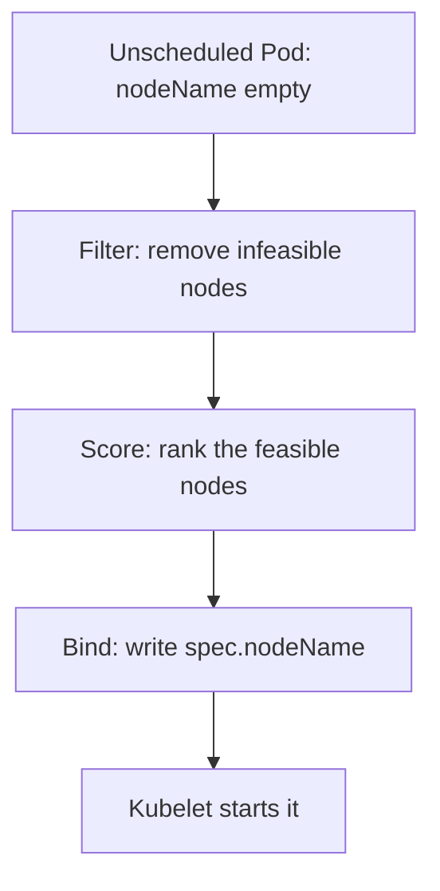

# Scheduling and placement

*Stage 4 · Flight Control*

**You will be able to:** read a `FailedScheduling` message, and choose between a taint, node affinity and topology spread for a placement goal.

## The problem

A new Pod has no node. Something must pick one, and not randomly: the node needs room, must not be off-limits, and ideally spreads the replicas so one machine failure does not take out the whole service. When it fails, the Pod sits in `Pending`, and you need to know why.

## The idea in plain words

The scheduler is an event planner seating guests. First it **eliminates tables** that cannot work (too small, reserved for someone else, wrong section). Then it **ranks the remaining tables** by preference (spread guests out, prefer the quiet side). Finally it **writes the guest's name on the chosen table card**.

Those are the three phases:



| Phase | Examples |
|---|---|
| Filter | Not enough CPU or memory, untolerated taint, missing required label, volume pinned elsewhere, hard topology constraint |
| Score | Least-allocated node, affinity weights, spread preference |
| Bind | An atomic write of `nodeName` |

Only the scheduler writes `nodeName`. Until it does, the kubelet does not know the Pod exists.

## Reading `Pending`

`Pending` with `NODE <none>` always means placement has not succeeded. The event text names the reason:

| Event text | Cause | Fix |
|---|---|---|
| `Insufficient cpu/memory` | Summed requests exceed allocatable | Free or add capacity, or lower requests |
| `untolerated taint` | A node taint the Pod does not tolerate | Add a toleration |
| `didn't match Pod's node affinity/selector` | No node has the required label | Label a node or fix the selector |
| `volume node affinity conflict` | The volume exists only on another node | Schedule on the volume's node |
| `unbound PersistentVolumeClaims` | The PVC is not bound | Investigate the claim |

## The controls

| Control | Hard or soft | Effect |
|---|---|---|
| **Taint** (on a node) | `NoSchedule` hard; `PreferNoSchedule` soft | Repels Pods without a matching toleration; does not evict Pods already running |
| **Toleration** (on a Pod) | Permission only | Lets the Pod be placed on a tainted node; does **not** attract it |
| **Node affinity**, `required…` | Hard | Pod runs only on matching nodes |
| **Node affinity**, `preferred…` | Soft | Raises the matching node's score |
| **Topology spread** | `DoNotSchedule` hard / `ScheduleAnyway` soft | Spreads replicas across hosts or zones (`maxSkew`) |

Taints push away; affinity pulls toward; a toleration merely removes a barrier. To *dedicate* a node to a workload you combine a taint (keep others off) with a toleration plus affinity (let this workload on and prefer it), which is exactly what the Stage 7 lab does.

Apollo's booking uses soft spread (`ScheduleAnyway`): the scheduler tries to put replicas on different nodes but will not leave a Pod unscheduled to achieve it. So check the `NODE` column rather than assume.

## Try it

```bash
kubectl describe pod <pod> -n apollo-airlines-apps | sed -n '/Events:/,$p'
kubectl describe node apollo11-worker | sed -n '/Allocated resources/,/Events/p'
kubectl get nodes -o custom-columns=NAME:.metadata.name,TAINTS:.spec.taints
```

## Common misconceptions

- **"A toleration sends the Pod to the tainted node."** It only permits it.
- **"A taint evicts what is already there."** `NoSchedule` affects new placements only.
- **"Spread constraints guarantee separate nodes."** Soft ones do not.

## Check yourself

<details>
<summary>A Pod tolerates a taint. Will it go to that node?</summary>

Not necessarily. A toleration only permits it. Affinity or scoring decides whether it lands there.
</details>

## Where this leads

Placement and eviction can also be triggered by people: a node drain for maintenance. The last reliability chapter covers limiting that.
