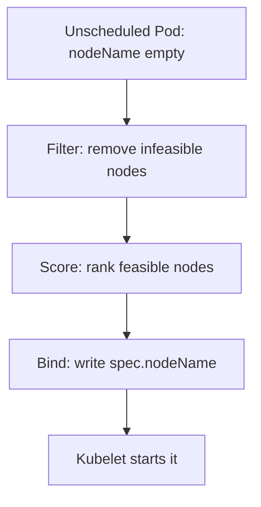

# Scheduling and placement

*Stage 4 · Flight Control*

**You will be able to:** read a `FailedScheduling` message and choose taint, affinity or spread for a placement goal.

## Three phases



| Phase | Examples |
|---|---|
| Filter | Insufficient CPU/memory, untolerated taint, missing required label, volume node affinity, hard topology constraint |
| Score | Least-allocated node, affinity weights, spread preference |
| Bind | Atomic write of `nodeName` |

## What `Pending` means

| Event text | Cause | Fix |
|---|---|---|
| `Insufficient cpu/memory` | Summed requests exceed allocatable | Free or add capacity; lower requests |
| `untolerated taint` | Node taint not tolerated | Add toleration |
| `didn't match Pod's node affinity/selector` | No node has the label | Label nodes / fix selector |
| `volume node affinity conflict` | PV pinned to another node | Schedule on the PV's node |
| `unbound PersistentVolumeClaims` | PVC not bound | Check the PVC |

## Controls

| Control | Hard/soft | Effect |
|---|---|---|
| Taint (node) | `NoSchedule` hard; `PreferNoSchedule` soft | Repels Pods without a toleration; does not evict running Pods |
| Toleration (Pod) | Permission only | Allows, does not attract |
| Node affinity `required…` | Hard | Pod only on matching nodes |
| Node affinity `preferred…` | Soft | Raises a node's score |
| Topology spread | `DoNotSchedule` hard / `ScheduleAnyway` soft | Spread across zones/hosts (`maxSkew`) |

- Apollo uses soft spread (`ScheduleAnyway`): a preference, check the `NODE` column.
- A taint **plus** a toleration still does not attract: pair it with affinity to dedicate a node (Stage 7).

## Try it

```bash
kubectl describe pod <pod> -n apollo-airlines-apps | sed -n '/Events:/,$p'
kubectl describe node apollo11-worker | sed -n '/Allocated resources/,/Events/p'
kubectl get nodes -o custom-columns=NAME:.metadata.name,TAINTS:.spec.taints
```

## Check yourself

<details>
<summary>A Pod tolerates a taint. Will it go to that node?</summary>

Not necessarily. A toleration only permits it. Affinity or scoring decides whether it lands there.
</details>
