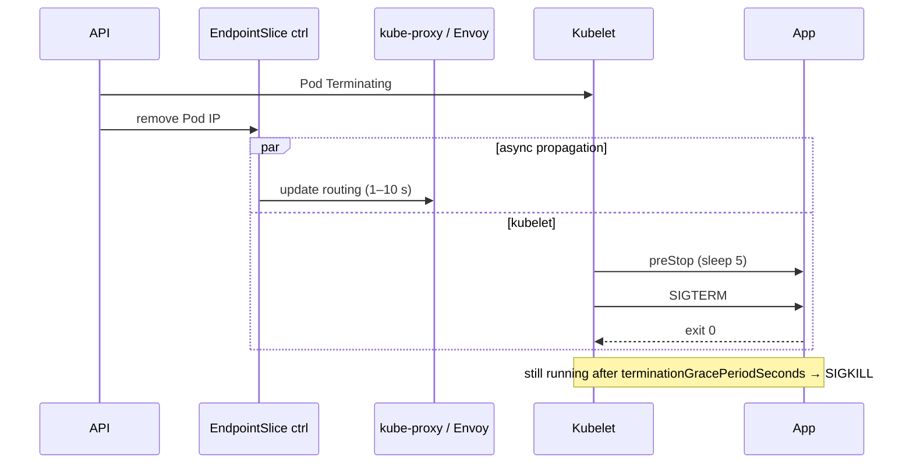

# Termination and draining

*Stage 4 · Flight Control*

**You will be able to:** order the events when a Pod terminates, explain the routing race, and say what `preStop`, SIGTERM handling and the grace period each contribute.

## The problem

During a rollout, a node drain or a scale-down, Pods are removed. A passenger's request may be halfway through when its Pod is told to stop, or may arrive a moment *after* the Pod started shutting down. Shutdown is not an instant; it is a coordinated sequence between several components, and if any step is wrong a booking fails.

## The idea in plain words

Closing a shop: you put up a "closed" sign, wait for people already inside to finish, then lock up. Crucially, the "closed" sign takes time to reach everyone: some customers are already on their way.

For a Pod: the **sign** is removing the Pod from the Service's endpoints; the **finishing** is the app draining its in-flight requests; the **lock-up** is the process exiting. The danger is that the sign propagates slowly while the shop starts locking up immediately.

## How it works



1. The Pod is marked `Terminating`.
2. Two things start **at once**: removal of the Pod's IP from endpoints (which then has to reach every proxy), and the kubelet's shutdown steps.
3. The kubelet runs the `preStop` hook, if any.
4. It sends **SIGTERM**, a polite "please stop" signal.
5. If the process is still alive after `terminationGracePeriodSeconds` (30 s), the kubelet sends **SIGKILL**, which ends it immediately (exit code 137).

### The race

Removing an endpoint and reprogramming every proxy takes a few seconds. During that window a request can still be sent to a Pod that has begun shutting down. If the app closes its listener at once, that request fails. The settings below narrow the window; none removes it entirely.

| Part | What it does | What it does not do |
|---|---|---|
| `preStop: sleep 5` | Delays SIGTERM so routing can catch up | Extend the grace period (it counts inside it) |
| SIGTERM handler (`srv.Shutdown`) | Stop accepting, finish in-flight requests, exit 0 | Help if the process ignores signals |
| `terminationGracePeriodSeconds` | Hard deadline before SIGKILL | Guarantee draining finished |

### What the app must do on SIGTERM

1. Stop accepting new connections.
2. Finish in-flight work within the remaining grace time.
3. Flush logs and metrics; commit or abort transactions.
4. Close database and cache connections.
5. Exit 0 before the deadline.

A subtle trap: inside a container the main process is PID 1, and PID 1 has **no default signal handling**. If the app does not install a SIGTERM handler, the signal is ignored and every shutdown takes the whole grace period before SIGKILL.

## Evidence

```bash
kubectl get endpoints booking -n apollo-airlines-apps -w
kubectl logs -n apollo-airlines-apps <pod> -f --timestamps
kubectl describe pod <pod> -n apollo-airlines-apps | grep -E 'Killing|Stopping'
```

A "graceful shutdown" log line proves the process caught SIGTERM, not that no request failed. Proving draining needs a traffic sampler running across the termination window. Note that `kubectl logs --previous` shows an earlier container in the *same* Pod; logs of a deleted Pod survive only if shipped to something like Loki.

## Common misconceptions

- **"Handling SIGTERM gives zero downtime."** It does not control how fast routing updates.
- **"The `preStop` sleep extends my time."** It is part of the same 30 s.
- **"A fast exit is always good."** Exiting before in-flight requests finish drops them.

## Check yourself

<details>
<summary>Why <code>sleep 5</code> if the Go code already handles SIGTERM?</summary>

SIGTERM handling does not control how long routing takes to stop sending traffic. The sleep covers that propagation delay.
</details>

<details>
<summary>A Pod terminates in exactly 30 s every time. What does that suggest?</summary>

The process ignores SIGTERM and is SIGKILLed at the grace-period limit.
</details>

## Where this leads

Pods also compete for node resources. Next: how requests and limits decide scheduling, throttling and eviction.
