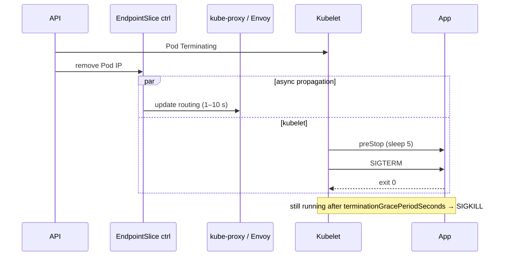

# Termination and draining

*Stage 4 · Flight Control*

**You will be able to:** order the events when a Pod terminates and say what `preStop`, SIGTERM handling and the grace period each do.

## Sequence



1. Pod marked `Terminating`.
2. Endpoint removal starts **and** the kubelet starts shutdown **concurrently**.
3. `preStop` hook runs.
4. SIGTERM.
5. After `terminationGracePeriodSeconds` (30 s): SIGKILL (exit 137).

## The race

- Removing an endpoint and reprogramming every proxy takes time. A request can still reach the terminating Pod.
- If the app closes its listener immediately, that request fails.
- Mitigation reduces the window; it never proves zero failures.

## The three parts

| Part | Does | Does not |
|---|---|---|
| `preStop: sleep 5` | Delays SIGTERM so routing can update | Extend the grace period (it counts inside it) |
| SIGTERM handler (`srv.Shutdown`) | Stop accepting, finish in-flight requests, close pools, exit 0 | Help if the process ignores signals |
| `terminationGracePeriodSeconds` | Hard deadline before SIGKILL | Guarantee draining finished |

## What the app must do on SIGTERM

1. Stop accepting new connections.
2. Finish in-flight work within the remaining grace time.
3. Flush logs/metrics, commit or abort transactions.
4. Close DB and cache connections.
5. Exit 0 before SIGKILL.

- PID 1 has no default signal handling in a container: a process that does not handle SIGTERM always takes the full grace period.

## Evidence

```bash
kubectl get endpoints booking -n apollo-airlines-apps -w
kubectl logs -n apollo-airlines-apps <pod> -f --timestamps
kubectl describe pod <pod> -n apollo-airlines-apps | grep -E 'Killing|Stopping'
```

- A "graceful shutdown" log line proves the process caught SIGTERM, **not** that no request failed. Proving draining needs a traffic sampler across the termination window.
- `kubectl logs --previous` shows an earlier container in the *same* Pod. Logs of a deleted Pod survive only if shipped (Loki).

## Check yourself

<details>
<summary>Why <code>sleep 5</code> if the Go code already handles SIGTERM?</summary>

SIGTERM handling does not control how long routing takes to stop sending traffic. The sleep covers that propagation delay.
</details>

<details>
<summary>A Pod terminates in exactly 30 s every time. What does that suggest?</summary>

The process ignores SIGTERM and is SIGKILLed at the grace-period limit.
</details>
