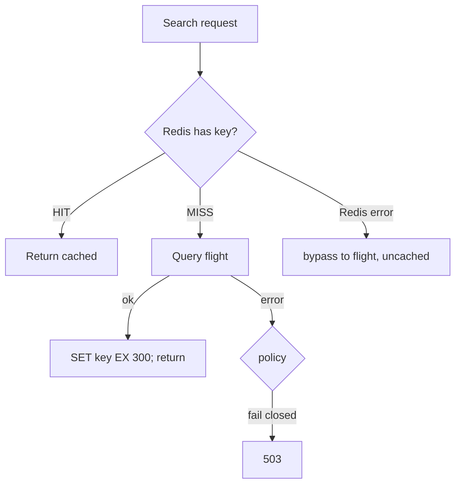

# Cache-aside

*Stage 7 · Orbital Maneuvering*

**You will be able to:** trace a request through hit, miss, database failure and cache outage, and choose a sensible TTL.

Passengers repeatedly search the same routes on the same dates, and flight schedules change rarely. Each search still goes through `search` to `flight` and runs a database query. That is wasted work: the same answer is recomputed again and again, loading the database and adding latency.

## Check the cache first

A **notepad by the phone**: before looking something up in the big filing cabinet, check the notepad. If the answer is there, use it. If not, fetch it from the cabinet and jot it down for next time. The notepad is quick but may be out of date, and it is never the official record.

**Cache-aside** is this pattern. `search` first asks Redis (the fast in-memory store). On a **hit** it returns the cached answer. On a **miss** it asks `flight` (and so PostgreSQL), stores the result in Redis with an expiry (**TTL**, time to live), and returns it. The "aside" means the application manages the cache itself; the database does not know the cache exists.

Apollo's key is `search:<origin>:<destination>:<date>`.

## The four branches



| Branch | What happens | Risk |
|---|---|---|
| **Hit** | Return in milliseconds; the database is untouched | The data may be **stale** until the TTL expires |
| **Miss** | Read the database, write the cache with a TTL, return | First-request latency |
| **Database failure on a miss** | Fail closed (503) or serve stale | Stale answers versus errors |
| **Cache outage** | Apollo bypasses the cache; search stays up and `readyz` reports `cache: unreachable` | A **stampede**: all reads now hit the database |

The last row is a hidden danger: a cache can mask an under-sized backend. When it disappears, the database suddenly sees the full request rate.

## Choosing a TTL

Match the TTL to how fast the data changes and how costly staleness is:

| Data | TTL |
|---|---|
| Airport codes, static routes | Hours |
| Flight schedules (Apollo search) | 5 min (`300 s`) |
| Seat availability, booking checks | **None.** Always ask the source of truth |

## Evidence

Prove a hit with three independent signals:

```bash
kubectl exec -n apollo-airlines-apps redis-0 -- redis-cli INFO stats | grep -E 'keyspace_(hits|misses)'
kubectl exec -n apollo-airlines-apps redis-0 -- redis-cli ttl "search:BOM:SIN:$(date -u +%F)"
curl -si -H 'Host: search.apollo.local' "http://<gateway>/api/search?origin=BOM&destination=SIN&date=$(date -u +%F)" | grep -i x-cache
```

The header tells you which code path ran, the counters tell you how often, and the TTL tells you what is stored and for how long.

## Common misconceptions

- **"Redis is my database now."** It is a disposable copy; PostgreSQL is the truth.
- **"Stale search results are a bug."** Within the TTL they are the design. Booking itself must read `flight` directly.
- **"A cache always makes things faster."** Measure (previous chapter).

## Check yourself

<details>
<summary>A seat is booked. Search still shows the old seat count for a few minutes. Bug?</summary>

No: expected staleness within the TTL. Booking itself must read `flight`, not the cache.
</details>

## Where this leads

A cache reduces work per request. When load still outgrows one Pod, the next lever is more replicas, chosen automatically.
