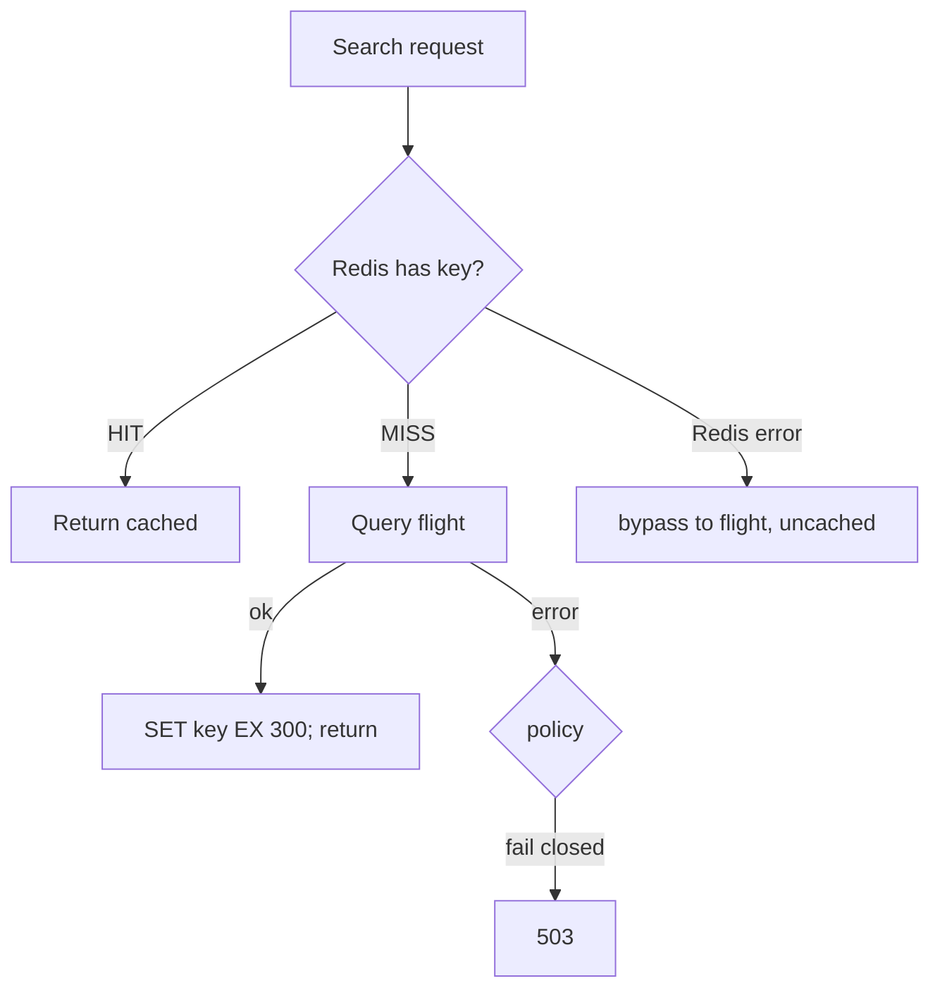

# Cache-aside

*Stage 7 · Orbital Maneuvering*

**You will be able to:** trace hit, miss, database failure and cache outage, and choose a TTL.

## Pattern

- `search` checks Redis for key `search:<origin>:<destination>:<date>` before querying `flight`.
- Redis is **not the source of truth**; PostgreSQL (via `flight`) is.



| Branch | What happens | Risk |
|---|---|---|
| Hit | Return in ms; DB untouched | **Stale** data until TTL expires |
| Miss | Read DB, write cache with TTL, return | First-request latency |
| DB failure on miss | Fail closed (503) or serve stale | Stale answers vs errors |
| Cache outage | Apollo bypasses the cache; search stays up, `readyz` reports `cache: unreachable` | **Stampede**: all reads hit the DB |

## TTL by volatility

| Data | TTL |
|---|---|
| Airport codes, static routes | Hours |
| Flight schedules (Apollo search) | 5 min (`300 s`) |
| Seat availability / booking checks | **None**: always ask the source |

## Evidence

```bash
kubectl exec -n apollo-airlines-apps redis-0 -- redis-cli INFO stats | grep -E 'keyspace_(hits|misses)'
kubectl exec -n apollo-airlines-apps redis-0 -- redis-cli ttl "search:BOM:SIN:$(date -u +%F)"
curl -si -H 'Host: search.apollo.local' "http://<gateway>/api/search?origin=BOM&destination=SIN&date=$(date -u +%F)" | grep -i x-cache
```

- Use three signals: header (code path), counters (`cache_hits_total`), and the key's TTL.

## Gotchas

- A cache hides load. When it disappears, the backend sees the full rate.
- Invalidation: seats change but the cached list does not until TTL or manual `DEL`.

## Check yourself

<details>
<summary>A seat is booked. Search still shows the old seat count for a few minutes. Bug?</summary>

No: expected staleness within the TTL. Booking itself must read `flight`, not the cache.
</details>
