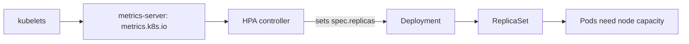
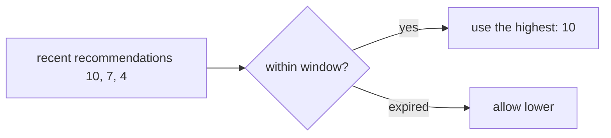

# Horizontal Pod Autoscaling

*Stage 7 · Orbital Maneuvering*

**You will be able to:** predict the replica count the HPA will choose, and explain why a missing CPU request makes it blind.

## The problem

When ticket sales open, search traffic can jump tenfold. A person changing `replicas` by hand reacts too slowly and forgets to scale back. We want the replica count to follow demand automatically: more Pods when busy, fewer when quiet.

## The idea in plain words

A **supermarket opening more checkouts** when queues build and closing them when quiet, using a clear rule such as "keep the average checkout about 70% busy".

The **HorizontalPodAutoscaler (HPA)** is a controller that does this for a Deployment. It periodically measures average CPU use across the Pods, compares it with the target, and sets `spec.replicas` accordingly.



## How it works

The decision is a simple proportion:

```text
desired = ceil( current replicas × currentMetric ÷ targetMetric )
```

Then it is clamped to `[minReplicas, maxReplicas]` and shaped by `behavior` policies. Example: 2 Pods at 140% of target 70% ⇒ `ceil(2 × 140 ÷ 70) = 4`.

### Utilisation is relative to the request

"CPU utilisation" is not a percentage of the machine. It is actual usage **divided by the Pod's CPU request**:

```text
utilisation % = actual CPU ÷ requested CPU
```

| Actual | Request | Utilisation (target 80%) | Reaction |
|---|---|---|---|
| 80m | 100m | 80% | Stable |
| 80m | 500m | 16% | Scales **down** (the request is oversized) |
| 80m | 50m | 160% | Scales **up** hard |
| 80m | none | `<unknown>` | **Blind:** no division possible, no scaling |

So requests are not decoration: they feed the scheduler, the QoS class and the HPA all at once.

### Apollo's search HPA

*Source: `templates/autoscaling/search-hpa.yaml`*

| Setting | Value |
|---|---|
| Range | dev 1–3; chart default 2–10 |
| Target | 70% CPU (prod 60%) |
| Scale up | immediate; add up to 100% or 4 Pods per 30 s (the larger) |
| Scale down | 300 s stabilisation; at most 50% per 60 s |

### Why scale down slowly

Traffic is bumpy. If the HPA removed Pods the instant load dipped, it would add them back a minute later and thrash (**flapping**). The **stabilisation window** remembers the highest recommendation over the last 5 minutes and uses that, so Pods are removed only after demand has stayed low.



## What it cannot do

- **Create node capacity.** If nodes are full, extra replicas stay `Pending` (`Insufficient cpu`).
- **Fix a non-CPU bottleneck** such as database connections or a slow dependency.

## Evidence

```bash
kubectl get hpa search-hpa -n apollo-airlines-apps
kubectl describe hpa search-hpa -n apollo-airlines-apps | sed -n '/Conditions:/,/Events:/p'
kubectl get pods -n apollo-airlines-apps -l app=search -w
```

## Common misconceptions

- **"The HPA scales on how busy the node is."** It uses usage relative to the Pod's request.
- **"`<unknown>` means leave it alone."** It means a required input is missing.
- **"More replicas always help."** Only if CPU on these Pods is the bottleneck and there is room to run them.

## Check yourself

<details>
<summary>2 replicas, 140% vs target 70%. Desired?</summary>

`ceil(2 × 140 ÷ 70) = 4` (capped at `maxReplicas`).
</details>

<details>
<summary>Why a 300 s scale-down window?</summary>

To avoid removing Pods during short dips and then re-adding them.
</details>

## Where this leads

The HPA changes how many Pods; the VPA considers how big each Pod should be. Combining them needs care.
