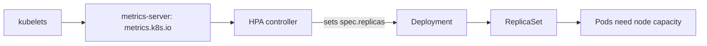
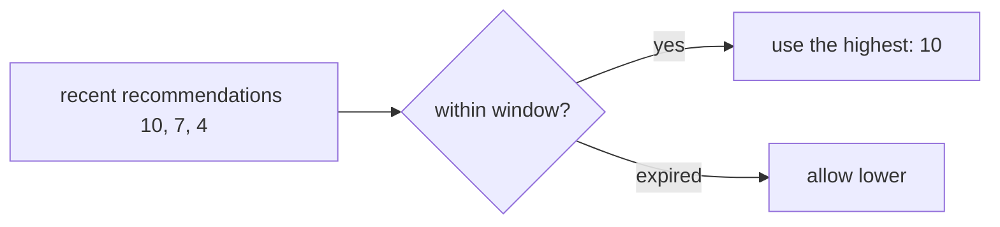

# Horizontal Pod Autoscaling

*Stage 7 · Orbital Maneuvering*

**You will be able to:** predict the HPA's desired replicas, and explain `<unknown>` targets.

## Loop



```text
desired = ceil( current replicas × currentMetric ÷ targetMetric )
```

- Then clamped to `[minReplicas, maxReplicas]` and by `behavior` policies.

## Utilisation uses **requests**

```text
utilisation % = actual CPU ÷ requested CPU
```

| Actual | Request | Utilisation (target 80%) | Reaction |
|---|---|---|---|
| 80m | 100m | 80% | Stable |
| 80m | 500m | 16% | Scales **down** (request too big) |
| 80m | 50m | 160% | Scales **up** hard |
| 80m | none | `<unknown>` | **Blind**: no scaling |

- Requests are inputs to scheduler, QoS and HPA at once.

## Apollo's search HPA

*Source: `templates/autoscaling/search-hpa.yaml`*

| Setting | Value |
|---|---|
| Range | dev 1–3; chart default 2–10 |
| Target | 70% CPU (prod 60%) |
| Scale up | immediate; +100% or +4 Pods per 30 s (max) |
| Scale down | 300 s stabilisation; ≤50% per 60 s |

## Stabilisation



- Scale up fast, down slowly: avoids **flapping** on brief dips.

## What it cannot do

- Create node capacity: extra replicas stay `Pending` (`Insufficient cpu`).
- Fix a non-CPU bottleneck (DB connections, a slow dependency).

## Evidence

```bash
kubectl get hpa search-hpa -n apollo-airlines-apps
kubectl describe hpa search-hpa -n apollo-airlines-apps | sed -n '/Conditions:/,/Events:/p'
kubectl get pods -n apollo-airlines-apps -l app=search -w
```

## Check yourself

<details>
<summary>2 replicas, 140% vs target 70%. Desired?</summary>

`ceil(2 × 140 ÷ 70) = 4` (capped at `maxReplicas`).
</details>

<details>
<summary>Why a 300 s scale-down window?</summary>

To avoid removing Pods during short dips and then re-adding them.
</details>
