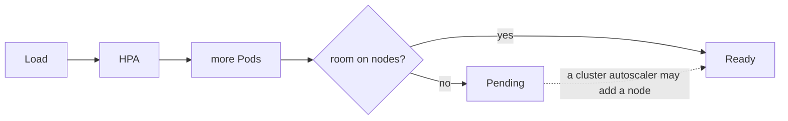

# VPA and capacity planning

*Stage 7 · Orbital Maneuvering*

**You will be able to:** read a VPA recommendation, choose an update mode, and explain why autoscalers are limited by real node capacity.

## The problem

The HPA is only as good as the Pod's CPU *request*, because utilisation is measured against it. But how do you know the right request? Guessing too high wastes capacity and makes the HPA scale down wrongly; too low and the Pod is starved. We need a measured suggestion.

## The idea in plain words

The HPA changes **how many** Pods; the **Vertical Pod Autoscaler (VPA)** looks at **how big** each Pod should be. Think of a tailor measuring you over a few weeks and recommending a size: useful advice, but you decide whether to buy it.

Apollo runs the VPA in **recommendation-only** mode. It watches real usage and publishes numbers; a person reads them and updates the requests.

| Output | Meaning |
|---|---|
| `lowerBound` | The minimum to avoid starving the Pod |
| `target` | The suggested steady-state request |
| `uncappedTarget` | The target ignoring min/max policy |
| `upperBound` | Headroom for spikes |


## How it works: update modes

| Mode | Behaviour | Risk |
|---|---|---|
| **`Off`** (Apollo) | Recommend only | None |
| `Initial` | Set requests only when Pods are created | Low |
| `Auto` / `Recreate` | Evicts running Pods to apply new sizes | High: restarts, and it fights the HPA |

Apollo enables the VPA by default (staging, prod) and disables it in dev; the admission webhook is intentionally left out. Recommendations stay empty until the recommender has collected enough samples.

## Why HPA and VPA fight on CPU

Imagine both are in charge of CPU:

1. Load rises, so the HPA adds replicas.
2. Load spreads, so CPU per Pod drops.
3. The VPA sees low use and **lowers the request**.
4. A lower request makes utilisation (use ÷ request) look **higher**, so the HPA scales out again.

They chase each other. The rule: never run both in an automatic mode on the same CPU. Use VPA `Off` to size, HPA to scale.

## Capacity is the real limit

Neither autoscaler creates hardware. The HPA asks for more Pods; the scheduler must find room.



Even a node autoscaler cannot help if the Pod's own constraints (impossible affinity, quota, zone) cannot be met.

## Evidence

```bash
kubectl describe vpa search-vpa -n apollo-airlines-apps      # staging / prod
kubectl top pods -n apollo-airlines-apps -l app=search
kubectl get events -n apollo-airlines-apps --field-selector reason=EvictedByVPA   # expect none in Off mode
```

## Common misconceptions

- **"VPA will resize my Pods automatically."** Not in `Off` mode.
- **"Autoscaling means unlimited capacity."** Nodes are finite.
- **"Using both HPA and VPA is always wrong."** Fine if VPA only recommends.

## Check yourself

<details>
<summary>Why run VPA in <code>Off</code> mode beside an HPA?</summary>

It advises on sizing without changing requests, so it cannot oscillate with the HPA.
</details>

## Where this leads

That completes the local path: Apollo runs, survives, ships, is observable and scales. Next come the planned missions: security, then the cloud.
