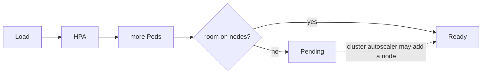

# VPA and capacity planning

*Stage 7 · Orbital Maneuvering*

**You will be able to:** read a VPA recommendation, pick an update mode, and explain why autoscalers need real node capacity.

## What VPA gives

| Output | Meaning |
|---|---|
| `lowerBound` | Minimum to avoid starving |
| `target` | Suggested steady-state request |
| `uncappedTarget` | Target ignoring min/max policy |
| `upperBound` | Headroom for spikes |


## Update modes

| Mode | Behaviour | Risk |
|---|---|---|
| **`Off`** (Apollo) | Recommend only | None |
| `Initial` | Set requests on new Pods | Low |
| `Auto` / `Recreate` | Evict Pods to apply | High: restarts, fights HPA |

- Apollo enables VPA in staging/prod (chart default) and disables it in dev. The admission webhook is intentionally omitted.
- Recommendations are empty until the recommender has collected samples.

## HPA vs VPA on CPU

1. Load rises → HPA adds replicas.
2. CPU per Pod drops → VPA lowers the request.
3. Lower request ⇒ higher utilisation % → HPA scales out again.
- **Never run both in `Auto` on the same CPU.** Use VPA `Off` to size, HPA to scale.

## Capacity is the real limit



- Impossible affinity, quota or zone constraints can block even a node autoscaler.

## Evidence

```bash
kubectl describe vpa search-vpa -n apollo-airlines-apps      # staging/prod
kubectl top pods -n apollo-airlines-apps -l app=search
kubectl get events -n apollo-airlines-apps --field-selector reason=EvictedByVPA   # expect none in Off
```

## Check yourself

<details>
<summary>Why run VPA in <code>Off</code> mode beside an HPA?</summary>

It advises on sizing without changing requests, so it cannot oscillate with the HPA.
</details>
