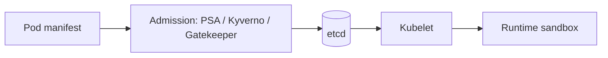

# Admission and runtime controls

*Command Module · Planned*

:::note[Conceptual chapter]
No runnable Stage 8 environment exists yet. Manifests below illustrate a future implementation.
:::

**You will be able to:** separate admission (before an object is stored) from runtime sandboxing (after a container starts), and list the baseline Pod security settings.

A manifest can be perfectly valid and still dangerous: a container running as root, with a writable filesystem and extra Linux privileges. If an attacker breaks into that process, those privileges are theirs. Two separate controls help: stop dangerous Pods from being *created*, and limit what a running process *can do* even if compromised.

## A gate at the entrance, limits inside

Airport security again: a **check at the entrance** turns away people carrying prohibited items (admission), and **restricted zones inside** limit where anyone can go even after entering (runtime sandbox). You want both, because neither is complete alone.



| | Admission | Runtime |
|---|---|---|
| When | Before the object is stored | After the container starts |
| Enforced by | The API server and webhooks | containerd and the Linux kernel |
| Effect | Rejects or mutates a non-compliant manifest | Limits what a compromised process can do |

A compliant manifest does not guarantee safe behaviour; it just ensures the safe settings are present.

## The baseline `securityContext`

| Setting | Effect |
|---|---|
| `runAsNonRoot: true` | The process cannot be UID 0 |
| `readOnlyRootFilesystem: true` | An attacker cannot drop tools or edit binaries; legitimate temp files go to `emptyDir` |
| `allowPrivilegeEscalation: false` | Blocks gaining privilege via setuid binaries |
| `capabilities.drop: [ALL]` | Removes kernel privileges such as `CAP_NET_RAW` and `CAP_SYS_ADMIN` |
| `seccompProfile.type: RuntimeDefault` | Filters the system calls the process may make |

```yaml
securityContext:
  runAsNonRoot: true
  runAsUser: 10001
  readOnlyRootFilesystem: true
  allowPrivilegeEscalation: false
  capabilities: {drop: [ALL]}
  seccompProfile: {type: RuntimeDefault}
```

**Where Apollo stands today:** Launchpad's Compose file already sets `read_only`, `cap_drop` and `no-new-privileges`, but the Kubernetes Deployments through Stage 7 do **not** set these fields. That is the planned Stage 8 gap.

## Evidence (future stage)

```bash
kubectl get events -n apollo-airlines-apps --field-selector reason=FailedCreate
kubectl get pod -l app=booking -n apollo-airlines-apps -o jsonpath='{.items[0].spec.containers[0].securityContext}'
kubectl exec -n apollo-airlines-apps deploy/booking -- touch /etc/x     # expect: Read-only file system
```

## Common misconceptions

- **"A secure image means a secure Pod."** Runtime settings matter independently.
- **"Admission policy hardens running containers."** It only gates creation.
- **"Read-only rootfs breaks apps."** They write to dedicated scratch volumes instead.

## Check yourself

<details>
<summary>Which control rejects a Pod that runs as root before it is stored?</summary>

An admission policy (PSA, Kyverno, Gatekeeper). Runtime settings only constrain the process after start.
</details>

## Where this leads

Controls on a single Pod are not enough if every Pod can talk to every other. The next chapter limits network traffic.
