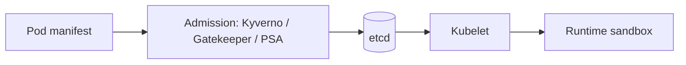

# Admission and runtime controls

*Command Module · Planned*

:::note[Conceptual chapter]
No runnable Stage 8 environment exists yet. Manifests below illustrate a future implementation.
:::

**You will be able to:** separate admission (before storage) from runtime sandboxing (after start) and list the baseline settings.

## Two enforcement points



| | Admission | Runtime |
|---|---|---|
| When | Before the object is stored | After the container starts |
| Enforced by | API server + webhooks | containerd + Linux kernel |
| Effect | Reject/mutate a non-compliant manifest | Limit what a compromised process can do |

- A compliant manifest cannot guarantee safe behaviour; root, writable rootfs and extra capabilities widen the damage of a breach.

## Baseline `securityContext`

| Setting | Effect |
|---|---|
| `runAsNonRoot: true` | Process cannot be UID 0 |
| `readOnlyRootFilesystem: true` | No dropped tools or edited binaries; writable paths via `emptyDir` |
| `allowPrivilegeEscalation: false` | No setuid gain |
| `capabilities.drop: [ALL]` | Strip kernel privileges (`CAP_NET_RAW`, `CAP_SYS_ADMIN`) |
| `seccompProfile.type: RuntimeDefault` | Filter syscalls |

```yaml
securityContext:
  runAsNonRoot: true
  runAsUser: 10001
  readOnlyRootFilesystem: true
  allowPrivilegeEscalation: false
  capabilities: {drop: [ALL]}
  seccompProfile: {type: RuntimeDefault}
```

- Today: Launchpad's Compose file has `read_only`, `cap_drop`, `no-new-privileges`; the Kubernetes Deployments through Stage 7 do **not**. This is the planned Stage 8 gap.

## Evidence (future lab)

```bash
kubectl get events -n apollo-airlines-apps --field-selector reason=FailedCreate
kubectl get pod -l app=booking -n apollo-airlines-apps -o jsonpath='{.items[0].spec.containers[0].securityContext}'
kubectl exec -n apollo-airlines-apps deploy/booking -- touch /etc/x     # expect: Read-only file system
```

## Check yourself

<details>
<summary>Which control rejects a Pod that runs as root before it is stored?</summary>

An admission policy (PSA, Kyverno, Gatekeeper). Runtime settings only constrain the process after start.
</details>
