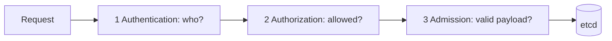

# Identity and authorization

*Command Module · Planned*

:::note[Conceptual chapter]
Apollo has no runnable security lab yet. Commands show the evidence a future lab should produce; they are not expected to behave this way on the Stage 7 cluster.
:::

**You will be able to:** name the three API gates, write a least-privilege Role, and test it with `kubectl auth can-i`.

## Three gates



| Gate | Question | Mechanism |
|---|---|---|
| AuthN | Who is calling? | x509 cert, OIDC token, ServiceAccount token |
| AuthZ | May this identity do this verb on this resource? | RBAC |
| Admission | Does the object satisfy policy? | Pod Security Admission, Kyverno, Gatekeeper |

- A request can pass one gate and fail the next. They are not substitutes.

## RBAC building blocks

| Scope | Permissions | Binding |
|---|---|---|
| Namespace | `Role` | `RoleBinding` |
| Cluster | `ClusterRole` | `ClusterRoleBinding` |

## Anti-patterns

| Don't | Do |
|---|---|
| Bind `cluster-admin` to a workload | Grant exact verbs on exact resources |
| `verbs: ["*"]` | `["get","list","watch"]` |
| Share the `default` ServiceAccount | One ServiceAccount per service so access is revocable separately |

- A ServiceAccount is an **identity**, not a guarantee. Apollo already sets `automountServiceAccountToken: false` since its services never call the API.

## Evidence (future lab)

```bash
kubectl auth can-i create pods --as=system:serviceaccount:apollo-airlines-apps:booking -n apollo-airlines-apps
kubectl get rolebindings,clusterrolebindings -A -o wide
kubectl describe rolebinding <name> -n apollo-airlines-apps
```

## Check yourself

<details>
<summary>A request is authenticated but returns <code>Forbidden</code>. Which gate?</summary>

Authorization (RBAC). Authentication succeeded.
</details>
