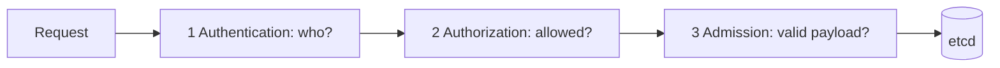

# Identity and authorization

*Command Module · Planned*

:::note[Conceptual chapter]
Apollo has no runnable security stage yet. Commands show the evidence Stage 8 should produce; they are not expected to behave this way on the Stage 7 cluster.
:::

**You will be able to:** name the three gates an API request passes, write a least-privilege Role, and test it with `kubectl auth can-i`.

The Kubernetes API can create, change and delete everything, including Secrets. Someone (or some Pod) must be allowed to do only what it needs, nothing more. If one compromised Pod can read every Secret or delete every Deployment, a small breach becomes total.

## Who are you, and what may you do?

Entering a secure building involves separate checks: the **front desk checks your ID** (who are you?), then **a pass list says which floors you may visit** (what may you do?), and finally **a bag inspection** (is what you are carrying acceptable?). Passing one does not imply the others.

Every API request goes through three gates in order:



| Gate | Question | Mechanism |
|---|---|---|
| **Authentication** | Who is calling? | x509 certificate, OIDC token, ServiceAccount token |
| **Authorization** | May this identity do this action on this resource? | RBAC |
| **Admission** | Does the object satisfy policy? | Pod Security Admission, Kyverno, Gatekeeper |

A request can pass one gate and fail the next. A `Forbidden` response to an authenticated user is an authorization failure.

## RBAC building blocks

**RBAC** (role-based access control) grants permission in two parts: a *role* listing allowed verbs on resources, and a *binding* attaching that role to an identity.

| Scope | Permissions | Binding |
|---|---|---|
| One namespace | `Role` | `RoleBinding` |
| Whole cluster | `ClusterRole` | `ClusterRoleBinding` |

Good practice is **least privilege**: grant only the exact verbs on the exact resources needed.

| Don't | Do |
|---|---|
| Bind `cluster-admin` to a workload | Grant specific verbs on specific resources |
| `verbs: ["*"]` | `["get","list","watch"]` |
| Share the `default` ServiceAccount | One ServiceAccount per service so access can be revoked separately |

A ServiceAccount is an **identity**, not a guarantee of safety. Apollo already sets `automountServiceAccountToken: false`, because its services never call the API; with no token, a compromised web process has no API credential at all.

## Evidence (future stage)

```bash
kubectl auth can-i create pods --as=system:serviceaccount:apollo-airlines-apps:booking -n apollo-airlines-apps
kubectl get rolebindings,clusterrolebindings -A -o wide
kubectl describe rolebinding <name> -n apollo-airlines-apps
```

`auth can-i` asks the authorizer directly, which is the quickest test of a role.

## Common misconceptions

- **"Authenticated means allowed."** That is the next gate.
- **"RBAC controls what a container can do on the node."** It controls API access only.
- **"Bind cluster-admin to be safe."** That removes all limits.

## Check yourself

<details>
<summary>A request is authenticated but returns <code>Forbidden</code>. Which gate?</summary>

Authorization (RBAC). Authentication succeeded.
</details>

## Where this leads

The API gates decide who can submit what. The next chapter covers how workload objects are checked (admission) and constrained once they run.
