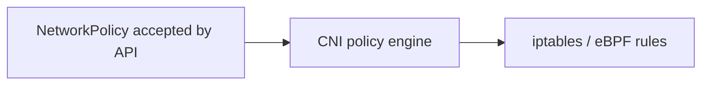

# NetworkPolicy

*Command Module · Planned*

:::note[Conceptual chapter]
Apollo's kind cluster uses kindnet, which does **not** enforce NetworkPolicy. Commands show how a policy-capable cluster would be checked.
:::

**You will be able to:** write a default-deny policy with a DNS exception, and check that enforcement is real.

## The problem

Recall the Pod network: every Pod can reach every other Pod. That is convenient and dangerous. If an attacker compromises the public-facing frontend, nothing stops it connecting straight to `booking-db`. Firewalls between workloads need to exist inside the cluster.

## The idea in plain words

A building with open corridors versus one with **locked doors where only listed people may pass**. The safest default is "locked unless explicitly allowed" (zero trust), then you open exactly the doors that legitimate traffic needs.

A **NetworkPolicy** is a stored rule saying which Pods may send or receive traffic from which others, by labels, namespaces and ports. But it is only a *rule on paper*: the **CNI plugin** must have a policy engine to enforce it.



- kindnet has no such engine: policies are accepted and ignored, so label them *reference only*.
- Calico or Cilium would enforce them (Stage 8 plans Calico).

## How it works: the zero-trust pattern

| Step | Policy |
|---|---|
| 1. Default deny | `podSelector: {}` with `policyTypes: [Ingress, Egress]` blocks everything for all Pods in the namespace |
| 2. Allow DNS | Egress to CoreDNS in `kube-system` on port 53 (UDP and TCP), otherwise name resolution stops and everything breaks |
| 3. Allow the documented flows | e.g. `frontend → gateway`, `booking → flight:8081`, `booking → booking-db:5432` |

```yaml
apiVersion: networking.k8s.io/v1
kind: NetworkPolicy
metadata: {name: default-deny-all, namespace: apollo-airlines-apps}
spec:
  podSelector: {}
  policyTypes: [Ingress, Egress]
```

## Evidence (future lab)

Always test **both** a path that should be blocked and one that should work:

```bash
kubectl get pods -n calico-system                                                                              # is an engine present?
kubectl exec -n apollo-airlines-ui curl-client -- curl --connect-timeout 3 http://booking-db.apollo-airlines-apps:5432   # must fail
kubectl exec -n apollo-airlines-apps deploy/booking -- curl -s http://flight:8081/readyz                       # must work
```

A policy that blocks everything proves nothing, and a policy that blocks nothing is not enforced.

## Common misconceptions

- **"I applied a policy, so I am protected."** Only with an enforcing CNI.
- **"Default-deny only needs ingress rules."** Egress matters too, and DNS must be allowed.
- **"NetworkPolicy replaces authentication."** It limits reachability only.

## Check yourself

<details>
<summary>You apply default-deny on kindnet and traffic still flows. Why?</summary>

kindnet has no policy engine; the object is accepted but never enforced.
</details>

## Where this leads

The last security chapter covers two supply problems: where secrets come from, and how you trust the images you run.
