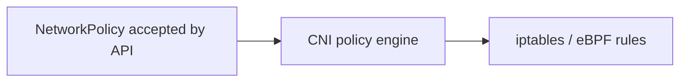

# NetworkPolicy

*Command Module · Planned*

:::note[Conceptual chapter]
Apollo's kind cluster uses kindnet, which does **not** enforce NetworkPolicy. Commands show how a policy-capable cluster would be checked.
:::

**You will be able to:** write a default-deny with a DNS exception, and check that enforcement is real.

## Key points

- By default the pod network is **flat and open**: any Pod can reach any Pod.
- A `NetworkPolicy` is a stored object; a **CNI with a policy engine** (Calico, Cilium) enforces it.
- With kindnet, an applied policy changes nothing: label it *reference only*.



## Zero-trust pattern

| Step | Policy |
|---|---|
| 1. Default deny | `podSelector: {}` + `policyTypes: [Ingress, Egress]` |
| 2. Allow DNS | Egress to CoreDNS on `kube-system`, port 53 UDP/TCP (otherwise names stop resolving) |
| 3. Allow documented flows | e.g. `frontend → gateway`, `booking → flight:8081`, `booking → booking-db:5432` |

```yaml
apiVersion: networking.k8s.io/v1
kind: NetworkPolicy
metadata: {name: default-deny-all, namespace: apollo-airlines-apps}
spec:
  podSelector: {}
  policyTypes: [Ingress, Egress]
```

## Evidence (future lab)

```bash
kubectl get pods -n calico-system                                                     # engine present?
kubectl exec -n apollo-airlines-ui curl-client -- curl --connect-timeout 3 http://booking-db.apollo-airlines-apps:5432   # must fail
kubectl exec -n apollo-airlines-apps deploy/booking -- curl -s http://flight:8081/readyz                                   # must work
```

- Always test **both** a blocked path and an allowed path.

## Check yourself

<details>
<summary>You apply default-deny on kindnet and traffic still flows. Why?</summary>

kindnet has no policy engine; the object is accepted but never enforced.
</details>
