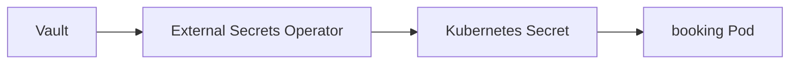
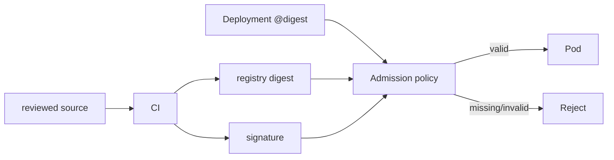

# Secrets and supply chain

*Command Module · Planned*

:::note[Conceptual chapter]
Vault, External Secrets Operator, signing and admission enforcement are planned architecture, not installed in the Apollo lab.
:::

**You will be able to:** explain what an external secret store changes, and why a tag is not provenance.

## Secrets

| Today (Stage 1–7) | Planned |
|---|---|
| Plain `Secret` YAML in the repo (base64, not encrypted) | Secrets live in **Vault** |
| Manual rotation | **External Secrets Operator** reconciles Vault → Kubernetes Secret |
| Anyone with Git read has the value | Rotation in Vault updates the Secret automatically |



- The cluster Secret still exists; protect it with RBAC and encryption at rest.

## Supply chain

| Problem | Control |
|---|---|
| Mutable tags (`:v1.2.0`, `:latest`) can be overwritten | Pin by **digest** `@sha256:…` |
| Who built this image? | CI **signs** it (Cosign / Sigstore) |
| Unsigned images still deployable | Admission policy (Kyverno) **verifies** signature + digest |



## Evidence (future lab)

```bash
kubectl get externalsecrets -n apollo-airlines-apps
cosign verify --key cosign.pub apollo11/booking@sha256:<digest>
kubectl get events -n apollo-airlines-apps | grep -i 'signature'
```

## Check yourself

<details>
<summary>Why is <code>booking:v1.2.0</code> weak provenance?</summary>

A registry compromise or mistake can overwrite the tag without any manifest diff. A digest plus a verified signature ties the running bytes to a build.
</details>
