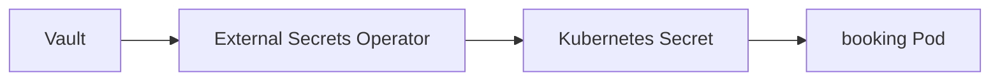
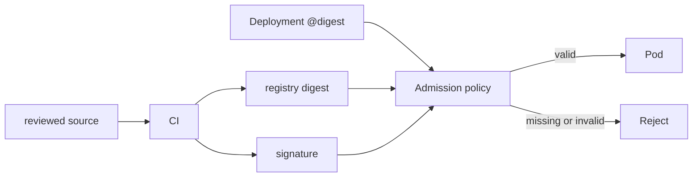

# Secrets and supply chain

*Command Module · Planned*

:::note[Conceptual chapter]
Vault, External Secrets Operator, signing and admission enforcement are planned architecture, not installed in the Apollo lab.
:::

**You will be able to:** explain what an external secret store changes, and why a tag is not provenance.

## The problem

Two quiet risks sit at either end of a deployment. **Secrets:** Apollo's passwords live in plain `Secret` YAML in the repository, so anyone with read access to Git holds production credentials, and rotating them means editing files. **Supply chain:** the cluster pulls `booking:v1.2.0` and runs it, but how do you know that image is what your CI built rather than something overwritten in the registry?

## The idea in plain words

**Secrets:** instead of keeping the safe's combination written on a note in the office, keep it in a *bank vault* (HashiCorp Vault) that logs access and can change the combination on schedule, and have a courier (the External Secrets Operator) deliver the current value to the cluster.

**Supply chain:** a **tamper-evident seal** on a parcel. A *digest* identifies the exact contents; a *signature* proves your CI sealed it; an *admission policy* refuses to accept unsealed parcels.

### Secrets

| Today (Stages 1–7) | Planned |
|---|---|
| Plain Secret YAML in the repo (base64, not encrypted) | Secrets live in **Vault** |
| Manual rotation | **External Secrets Operator** copies Vault values into Kubernetes Secrets and refreshes them |
| Anyone with Git read access has the value | Rotation in Vault updates the cluster automatically |



The Kubernetes Secret still exists inside the cluster, so you still need RBAC and encryption at rest to protect it.

### Supply chain

| Problem | Control |
|---|---|
| Tags (`:v1.2.0`, `:latest`) can be overwritten without any manifest change | Pin by **digest**: `@sha256:…` |
| Who built this image? | CI **signs** it (Cosign / Sigstore) |
| Unsigned images can still be deployed | An admission policy (Kyverno) **verifies** the signature and digest before admitting the Pod |



## Evidence (future lab)

```bash
kubectl get externalsecrets -n apollo-airlines-apps
cosign verify --key cosign.pub apollo11/booking@sha256:<digest>
kubectl get events -n apollo-airlines-apps | grep -i 'signature'
```

## Common misconceptions

- **"A private Git repo makes plain Secrets safe."** Leaks, forks and clones still spread the value.
- **"A signed image is a safe image."** Signing proves origin, not absence of bugs.
- **"A pinned tag is immutable."** Only a digest is.

## Check yourself

<details>
<summary>Why is <code>booking:v1.2.0</code> weak provenance?</summary>

A registry compromise or mistake can overwrite the tag without any manifest diff. A digest plus a verified signature ties the running bytes to a build.
</details>

## Where this leads

That ends the security concepts. The last conceptual mission asks what changes when Apollo leaves the local cluster for a cloud.
