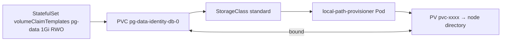

# Claims and provisioning

*Stage 3 · Mission Data*

**You will be able to:** trace a PVC to its PV, explain `Pending` claims, and read access modes correctly.

## Three objects

| Object | Scope | Role |
|---|---|---|
| **PersistentVolumeClaim** | Namespace | A request: size, access mode, class |
| **PersistentVolume** | Cluster | The actual storage (directory, EBS volume, NFS share) |
| **StorageClass** | Cluster | Provisioner + policy (`rancher.io/local-path`, reclaim, binding mode) |



## kind vs cloud

| | kind | Cloud |
|---|---|---|
| Provisioner | `rancher.io/local-path` | CSI driver (`ebs.csi.aws.com`, `pd.csi.storage.gke.io`) |
| Medium | Directory on one node | Network block storage |
| Node loss | **Data lost** | Volume detaches and reattaches elsewhere |

## `WaitForFirstConsumer`

- Binding waits until the scheduler has chosen a node for a Pod that uses the claim.
- Why: if the volume were created on node A first, the Pod might later be placed on B, unable to mount it.
- So a **`Pending` PVC with no Pod is normal**; a `Pending` PVC with `ProvisioningFailed` / `not found` events is broken.

```yaml
kind: StorageClass
metadata: {name: standard}
provisioner: rancher.io/local-path
reclaimPolicy: Delete
volumeBindingMode: WaitForFirstConsumer
```

## Access modes

| Mode | Meaning |
|---|---|
| `ReadWriteOnce` | Read-write on **one node** (several Pods on that node can still share it) |
| `ReadOnlyMany` | Read-only on many nodes |
| `ReadWriteMany` | Read-write on many nodes; needs NFS/EFS/Ceph |
| `ReadWriteOncePod` | One **Pod** only |

## Diagnose

```bash
kubectl get pvc -n apollo-airlines-apps
kubectl describe pvc pg-data-identity-db-0 -n apollo-airlines-apps | sed -n '/Events:/,$p'
kubectl logs -n local-path-storage -l app=local-path-provisioner --tail=20
```

## Gotchas

- `Bound` ≠ backed up or replicated.
- The requested capacity is not enforced for every provisioner (local-path does not quota).
- `storageClassName` on a PVC is immutable; recreate it to change.

## Check yourself

<details>
<summary>A PVC is <code>Pending</code> and no Pod uses it. Fault?</summary>

Not necessarily. With `WaitForFirstConsumer` it is waiting for a consumer. Read the PVC events.
</details>
