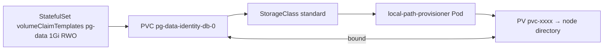

# Claims and provisioning

*Stage 3 · Mission Data*

**You will be able to:** trace a PVC to its PV, explain why a claim can sit in `Pending` normally, and read access modes correctly.

## The problem

A database needs a disk, but the developer writing the manifest should not need to know whether that disk is a directory on a laptop, an Amazon EBS volume or an NFS share. If manifests named real disks, they would only work in one place.

## The idea in plain words

Compare ordering a **taxi** with owning a particular car. You describe what you need ("a ride for two, now") and the system finds a car. Storage is requested the same way: you ask for "1 GiB, read-write", and something provides a matching disk.

That produces three cooperating objects:

| Object | Scope | Role |
|---|---|---|
| **PersistentVolumeClaim (PVC)** | A namespace | The *request*: size, access mode, class. Written by the workload's owner |
| **PersistentVolume (PV)** | The cluster | The actual storage that satisfies a request (a directory, an EBS volume…) |
| **StorageClass** | The cluster | The recipe for creating PVs on demand: which provisioner, what policies |

## How it works

When a PVC names (or defaults to) a StorageClass, a **provisioner** creates a matching PV and the two are **bound** one-to-one. This is *dynamic provisioning*: no administrator pre-creates disks.



The same manifest works in different places because the StorageClass changes:

| | kind | Cloud |
|---|---|---|
| Provisioner | `rancher.io/local-path` | A CSI driver (`ebs.csi.aws.com`, `pd.csi.storage.gke.io`) |
| Medium | A directory on one node | Network block storage |
| After node loss | **Data lost** | The volume detaches and reattaches elsewhere |

### `WaitForFirstConsumer`

If a PV were created before the Pod is scheduled, the scheduler might later place the Pod on a different node from the volume, making it unmountable. So Apollo's StorageClass uses `volumeBindingMode: WaitForFirstConsumer`: provisioning waits until a Pod using the claim has been assigned a node, then creates the volume where that Pod will run.

The consequence surprises people: **a `Pending` PVC with no Pod using it is normal**. It is waiting for a consumer. A `Pending` PVC with a `ProvisioningFailed` or "storageclass not found" event is the real problem.

```yaml
kind: StorageClass
metadata: {name: standard}
provisioner: rancher.io/local-path
reclaimPolicy: Delete
volumeBindingMode: WaitForFirstConsumer
```

### Access modes

Access modes describe how many **nodes** (not Pods) may mount the volume.

| Mode | Meaning |
|---|---|
| `ReadWriteOnce` | Read-write on one node (several Pods on that node can still share it) |
| `ReadOnlyMany` | Read-only on many nodes |
| `ReadWriteMany` | Read-write on many nodes; needs NFS, EFS or Ceph |
| `ReadWriteOncePod` | One *Pod* only |

## Diagnose

```bash
kubectl get pvc -n apollo-airlines-apps
kubectl describe pvc pg-data-identity-db-0 -n apollo-airlines-apps | sed -n '/Events:/,$p'
kubectl logs -n local-path-storage -l app=local-path-provisioner --tail=20
```

## Common misconceptions

- **"Bound means replicated or backed up."** It means a volume was matched.
- **"A requested size is enforced."** `local-path` records it but does not apply a quota.
- **"I can edit a PVC's `storageClassName`."** It is immutable; recreate the claim.

## Check yourself

<details>
<summary>A PVC is <code>Pending</code> and no Pod uses it. Fault?</summary>

Not necessarily. With `WaitForFirstConsumer` it is waiting for a consumer. Read the PVC events.
</details>

## Where this leads

A claim gives storage; databases also need a stable *identity* so replacements find their own data. That is a StatefulSet.
