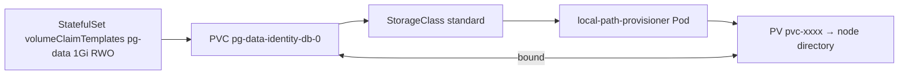

# Claims and provisioning

*Stage 3 · Mission Data*

**You will be able to:** trace a PVC to its PV, explain why a claim can sit in `Pending` normally, read access modes correctly, and say what changes when the same manifests run on EKS.

A database needs a disk, but the developer writing the manifest should not need to know whether that disk is a directory on a laptop, an Amazon EBS volume or an NFS share. If manifests named real disks, they would only work in one place.

There is also an ownership problem. The person who writes the database manifest is rarely the person who runs the storage system. The manifest author knows *what* is needed ("1 GiB, one writer"); the platform owner knows *how* it is supplied. Kubernetes needs a seam between them.

## Request storage, do not pick a disk

Compare ordering a **taxi** with owning a particular car. You describe what you need ("a ride for two, now") and the system finds a car. Storage is requested the same way: you ask for "1 GiB, read-write", and something provides a matching disk.

That produces three cooperating objects:

| Object | Scope | Role |
|---|---|---|
| **PersistentVolumeClaim (PVC)** | A namespace | The *request*: size, access mode, class. Written by the workload's owner |
| **PersistentVolume (PV)** | The cluster | The actual storage that satisfies a request (a directory, an EBS volume…) |
| **StorageClass** | The cluster | The recipe for creating PVs on demand: which provisioner, what policies |

A PV has no namespace, but a PVC does, and a Pod can only mount claims from its own namespace. That is why a claim is the right unit to hand to a workload: it is the namespaced handle to a cluster-wide resource.

## Dynamic provisioning

When a PVC names (or defaults to) a StorageClass, a **provisioner** creates a matching PV and the two are **bound** one-to-one. This is *dynamic provisioning*: no administrator pre-creates disks.



The lifecycle of a claim, step by step:

1. The StatefulSet controller creates a PVC from the template.
2. The PVC has no `storageClassName`, so the cluster's **default** StorageClass applies. (A class is the default if it carries the annotation `storageclass.kubernetes.io/is-default-class: "true"`.)
3. The PVC waits (see `WaitForFirstConsumer` below) until a Pod that uses it is scheduled.
4. The provisioner creates the storage and a PV describing it.
5. The control plane binds the PVC and PV to each other, and the kubelet mounts the volume into the Pod.

### What Apollo writes, and what it does not

*Source: `stages/stage3/k8s/apps/identity-db/identity-db-sts.yaml`*

```yaml
volumeClaimTemplates:
  - metadata:
      name: pg-data
    spec:
      accessModes: ["ReadWriteOnce"]
      resources:
        requests:
          storage: 1Gi
```

Notice what is *absent*: there is no `storageClassName`, no provisioner and no path. Apollo describes needs, not infrastructure. The class comes from the cluster, and Apollo's repository contains **no StorageClass manifest for kind**: kind installs one itself. The Helm chart makes the same choice on purpose (`storageClassName is intentionally omitted — kind's default local-path StorageClass is used`).

The same manifests work in different places because the StorageClass changes:

| | kind | EKS (Apollo's `stages/eks/`) |
|---|---|---|
| Class name | `standard` (built in, default) | `ebs-gp3` (written in `terraform/storage/storageclass.tf`) |
| Provisioner | `rancher.io/local-path` | `ebs.csi.aws.com` |
| Medium | A directory on one node | Network block storage (gp3, encrypted) |
| `allowVolumeExpansion` | No | Yes |
| After node loss | **Data lost** | The volume detaches and reattaches elsewhere in the same zone |

EKS has a trap worth knowing: a fresh EKS cluster has **no StorageClass at all**. The EBS driver add-on provides the *provisioner* but never creates the *class*, so without `ebs-gp3` every Stage 3 claim would stay `Pending` forever. Apollo's Terraform writes it and marks it default so the unchanged PVC templates bind.

### `WaitForFirstConsumer`

If a PV were created before the Pod is scheduled, the scheduler might later place the Pod on a different node from the volume, making it unmountable. So kind's `standard` class (and Apollo's `ebs-gp3`) uses `volumeBindingMode: WaitForFirstConsumer`: provisioning waits until a Pod using the claim has been assigned a node, then creates the volume where that Pod will run.

On EBS this matters even more, because an EBS volume lives in one availability zone and a Pod in another zone could never attach it.

The consequence surprises people: **a `Pending` PVC with no Pod using it is normal**. It is waiting for a consumer. A `Pending` PVC with a `ProvisioningFailed` or "storageclass not found" event is the real problem.

kind's built-in class looks like this (note: this is kind's, not a file in the Apollo repository):

```yaml
kind: StorageClass
metadata: {name: standard}
provisioner: rancher.io/local-path
reclaimPolicy: Delete
volumeBindingMode: WaitForFirstConsumer
```

`reclaimPolicy: Delete` is what makes deleting a claim destroy its data. See [Recovery boundaries](./recovery-boundaries).

### Access modes

Access modes describe how many **nodes** (not Pods) may mount the volume.

| Mode | Meaning |
|---|---|
| `ReadWriteOnce` | Read-write on one node (several Pods on that node can still share it) |
| `ReadOnlyMany` | Read-only on many nodes |
| `ReadWriteMany` | Read-write on many nodes; needs NFS, EFS or Ceph |
| `ReadWriteOncePod` | One *Pod* only |

Apollo uses `ReadWriteOnce` everywhere, which is right for a single-writer database. `verify.sh` even asserts it, checking each of the four PVCs for phase `Bound`, mode `ReadWriteOnce` and size `1Gi`.

An access mode is a *capability the volume offers*, not a lock the database obeys. Two Postgres processes mounting one directory on the same node would corrupt it; `ReadWriteOnce` does not stop that. This is one more reason a StatefulSet gives each member its own claim.

## Reading the objects

```bash
kubectl get pvc,pv -n apollo-airlines-apps
kubectl get pv -o wide
kubectl get pvc pg-data-flight-db-0 -n apollo-airlines-apps -o yaml
```

Find these fields and connect them:

| In the PVC | In the PV |
|---|---|
| `spec.volumeName: pvc-…` | `metadata.name: pvc-…` |
| `status.phase: Bound` | `status.phase: Bound` |
| (namespace/name) | `spec.claimRef` pointing back at the PVC |
| `spec.storageClassName: standard` | `spec.storageClassName: standard` |
| `spec.resources.requests.storage` | `spec.capacity.storage` |

Binding is a pair of pointers, one each way. If you ever see a `Released` PV, its `claimRef` still points at a claim that no longer exists.

## Diagnose

```bash
kubectl get pvc -n apollo-airlines-apps
kubectl describe pvc pg-data-identity-db-0 -n apollo-airlines-apps | sed -n '/Events:/,$p'
kubectl logs -n local-path-storage -l app=local-path-provisioner --tail=20
```

| Symptom | Likely cause |
|---|---|
| `Pending`, no Pod, event says `WaitForFirstConsumer` | Normal. Nothing has asked for it yet |
| `Pending` with the Pod also `Pending` | Pod cannot be scheduled; read the **Pod's** events |
| `Pending`, `ProvisioningFailed` | The provisioner failed; read its logs |
| `Pending`, "storageclass … not found" | The named class does not exist (the EKS trap above) |
| Pod `Pending`, volume node affinity conflict | The PV is pinned to a node the Pod cannot use |

Work from the Pod to the claim to the provisioner. The Pod is usually the first object that tells you something is wrong.

## Try breaking it

Predict first: what state is a claim in before its Pod exists? Create a claim by itself and watch it:

```bash
cat <<'EOF' | kubectl apply -n apollo-airlines-apps -f -
apiVersion: v1
kind: PersistentVolumeClaim
metadata:
  name: scratch-claim
spec:
  accessModes: ["ReadWriteOnce"]
  resources:
    requests:
      storage: 100Mi
EOF
kubectl get pvc scratch-claim -n apollo-airlines-apps
kubectl describe pvc scratch-claim -n apollo-airlines-apps | sed -n '/Events:/,$p'
kubectl delete pvc scratch-claim -n apollo-airlines-apps
```

This manifest is a minimal teaching example, not an Apollo file. Expect `Pending` and an event saying it is waiting for a consumer. That is the system working as designed. Deleting it needs no cleanup, since nothing was ever provisioned.

## Common misconceptions

- **"Bound means replicated or backed up."** It means a volume was matched.
- **"A requested size is enforced."** `local-path` records it but does not apply a quota.
- **"I can edit a PVC's `storageClassName`."** It is immutable; recreate the claim.
- **"Apollo defines a StorageClass."** On kind it relies on the built-in one. Only the EKS stage defines its own.
- **"`ReadWriteOnce` means one Pod."** It means one **node**. `ReadWriteOncePod` means one Pod.
- **"Deleting the Pod deletes the claim."** The claim has its own lifetime; that is the point.

## Check yourself

<details>
<summary>A PVC is <code>Pending</code> and no Pod uses it. Fault?</summary>

Not necessarily. With `WaitForFirstConsumer` it is waiting for a consumer. Read the PVC events.
</details>

<details>
<summary>The same StatefulSet YAML works on kind and on EKS. What actually differs?</summary>

The default StorageClass. The claim says only "1Gi, ReadWriteOnce"; the class decides whether that becomes a node directory or an encrypted gp3 EBS volume.
</details>

<details>
<summary>On a new EKS cluster every Stage 3 claim stays <code>Pending</code> forever, with no consumer problem. What is missing?</summary>

A StorageClass. EKS ships with none, and the EBS CSI add-on provides the provisioner but not the class. Without a default class a claim that names none has nothing to bind through.
</details>

<details>
<summary>Why is <code>ReadWriteOnce</code> not a guarantee that two Postgres processes cannot corrupt a volume?</summary>

It limits how many <em>nodes</em> may mount it. Two Pods on the same node can share it, and the mode says nothing about how the application locks its files.
</details>

## Where this leads

A claim gives storage; databases also need a stable *identity* so replacements find their own data. That is a StatefulSet.

## References

- [Persistent Volumes](https://kubernetes.io/docs/concepts/storage/persistent-volumes/) · [Storage Classes](https://kubernetes.io/docs/concepts/storage/storage-classes/) · [Volume binding mode](https://kubernetes.io/docs/concepts/storage/storage-classes/#volume-binding-mode) · [Amazon EBS CSI driver](https://github.com/kubernetes-sigs/aws-ebs-csi-driver)
