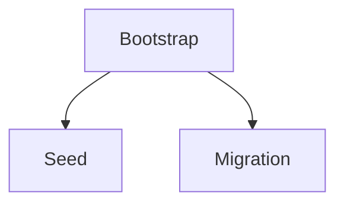

# Initialization and seeding

*Stage 3 · Mission Data*

**You will be able to:** classify a database task as bootstrap, seed or migration, and explain why Postgres' init directory runs only on a first start.

## The problem

A brand-new database volume is empty: no tables, no airports, no users. Something must prepare it. Teams often lump this under "startup scripts", but three quite different jobs hide there, with different risks. Treating them alike causes duplicate rows, broken schemas, or a seed that quietly hides data loss.

## The idea in plain words

Opening a new restaurant branch: first you **build the kitchen** (bootstrap: tables and constraints), then you **stock the pantry with standard ingredients** (seed: baseline reference data), and years later you **remodel** while it is open (migration: change a live schema without breaking it). Each needs different care, and remodelling an open kitchen is by far the riskiest.

| Task | Example | Retry rule | When |
|---|---|---|---|
| **Schema bootstrap** | `CREATE TABLE IF NOT EXISTS bookings …` | Must be idempotent | Once for each new database |
| **Seed data** | `INSERT INTO airports … ON CONFLICT DO NOTHING` | Idempotent with conflict clauses | Dev, test, QA; not production state |
| **Migration** | `ALTER TABLE bookings ADD COLUMN …` | Not always repeatable; needs versioning | Production; use a tracked tool such as Flyway or Liquibase |



## How it works: `docker-entrypoint-initdb.d`

The official Postgres image has a built-in rule: when it starts and its data directory is **empty**, it runs every script in `/docker-entrypoint-initdb.d/`. When the data directory already has data, it skips them entirely.

Apollo mounts the init SQL from a ConfigMap (`identity-db-init-script`) at that path. The effects:

1. **First start** (empty volume): scripts run; tables and seed rows appear.
2. **Any restart or Pod replacement** (volume kept): scripts are skipped, so there are no duplicate runs.
3. **After the PVC is deleted** (empty volume again): scripts run again, and the seed rows reappear.

Two limits follow:

- It is **inert for existing databases**: adding a table to the ConfigMap changes nothing on a database that already has data. That is a migration, not a seed.
- If a script fails halfway on the first run, the data directory is already marked initialised, so later starts skip it. You must repair by hand.

Why not an init container that waits for `pg_isready`? Init containers must **finish before** the main container starts, but Postgres cannot become ready until it starts. It would wait for itself forever.

## Apollo example

| Stage | Mechanism |
|---|---|
| 1 | Jobs run `init.sql` after Postgres is already up. They do not rerun if data is lost |
| 3 onward | Postgres' own init directory runs scripts from a ConfigMap on first start; seed Jobs are idempotent |

## Try it

```bash
kubectl logs -n apollo-airlines-apps identity-db-0 | grep -iE 'initdb|skipping initialization'
kubectl exec -n apollo-airlines-apps identity-db-0 -- psql -U postgres -d identity -c '\dt'
kubectl exec -n apollo-airlines-apps identity-db-0 -- psql -U postgres -d identity -tAc 'SELECT count(*) FROM users'
```

- `running /docker-entrypoint-initdb.d/…` means a first start. `Skipping initialization` means the volume already had data.

## Common misconceptions

- **"Seeded data means nothing was lost."** After a PVC deletion the app looks healthy because the seed reloads, while real data is gone. Seeds can *mask* loss.
- **"Editing the init ConfigMap updates the schema."** Existing databases ignore it.
- **"A Job and an init script are the same."** Different timing, different failure behaviour.

## Check yourself

<details>
<summary>You add a table to the init ConfigMap and restart the DB. Does it appear?</summary>

No. The data directory is already initialised, so the script is skipped. Use a migration.
</details>

## Where this leads

Everything so far survives Pod replacement. The last storage chapter asks what it does *not* survive, and what a real recovery needs.
