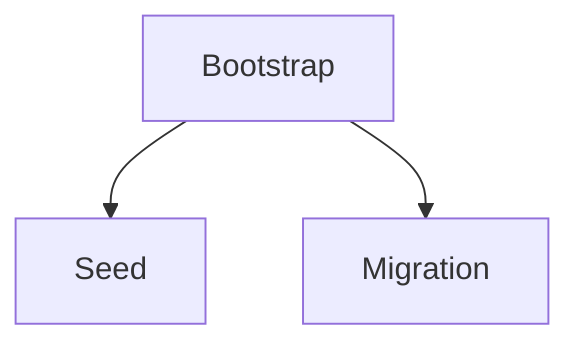

# Initialization and seeding

*Stage 3 · Mission Data*

**You will be able to:** classify a database task, and explain why `/docker-entrypoint-initdb.d` runs only once.

## Three different tasks

| Task | Example | Retry rule | Where |
|---|---|---|---|
| **Schema bootstrap** | `CREATE TABLE IF NOT EXISTS bookings …` | Must be idempotent | Once per new database |
| **Seed data** | `INSERT INTO airports … ON CONFLICT DO NOTHING` | Idempotent with conflict clauses | Dev/test/QA, not production state |
| **Migration** | `ALTER TABLE bookings ADD COLUMN …` | Not always repeatable; needs versioning | Production; use Flyway/Liquibase-style tracking |



## `docker-entrypoint-initdb.d`

- Apollo mounts the init SQL ConfigMap there (`identity-db-init-script`).
- Postgres runs it **only when the data directory is empty**: first start, or after the PVC is recreated.
- Restarts and Pod replacements skip it. That makes it safe (no duplicate runs) but also **inert for existing databases**: adding a table to the ConfigMap changes nothing.
- A partially failed first run still marks the directory initialised; repair by hand.
- An init **container** waiting for `pg_isready` would deadlock: init containers must finish before the main container starts.

## Apollo example

| Stage | Mechanism |
|---|---|
| 1 | Jobs run `init.sql` after Postgres starts (does not rerun after data loss) |
| 3+ | Entry-point init from ConfigMap; seed Jobs idempotent |

## Evidence

```bash
kubectl logs -n apollo-airlines-apps identity-db-0 | grep -iE 'initdb|skipping initialization'
kubectl exec -n apollo-airlines-apps identity-db-0 -- psql -U postgres -d identity -c '\dt'
kubectl exec -n apollo-airlines-apps identity-db-0 -- psql -U postgres -d identity -tAc 'SELECT count(*) FROM users'
```

- `running /docker-entrypoint-initdb.d/…` = first start. `Skipping initialization` = data dir already populated.

## Gotchas

- Seeds can **mask data loss**: after PVC deletion the app looks healthy with seeded users while real data is gone.

## Check yourself

<details>
<summary>You add a table to the init ConfigMap and restart the DB. Does it appear?</summary>

No. The data directory is already initialised, so the script is skipped. Use a migration.
</details>
