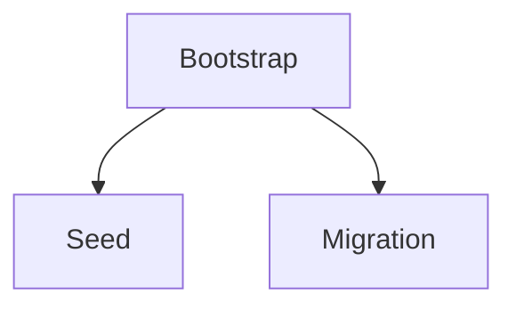

# Initialization and seeding

*Stage 3 · Mission Data*

**You will be able to:** classify a database task as bootstrap, seed or migration, explain why Postgres' init directory runs only on a first start, read Apollo's init ConfigMaps and seed Jobs, and recognise when a seed is hiding data loss.

## The problem

A brand-new database volume is empty: no tables, no airports, no users. Something must prepare it. Teams often lump this under "startup scripts", but three quite different jobs hide there, with different risks. Treating them alike causes duplicate rows, broken schemas, or a seed that quietly hides data loss.

Stage 3 makes the problem sharper than Stage 1 did. Once the volume outlives the Pod, "start the database" no longer means "start from empty". The same Pod start is sometimes a first run and sometimes a restart of a database full of real bookings, and the preparation code must behave correctly in both.

## The idea in plain words

Opening a new restaurant branch: first you **build the kitchen** (bootstrap: tables and constraints), then you **stock the pantry with standard ingredients** (seed: baseline reference data), and years later you **remodel** while it is open (migration: change a live schema without breaking it). Each needs different care, and remodelling an open kitchen is by far the riskiest.

| Task | Example | Retry rule | When |
|---|---|---|---|
| **Schema bootstrap** | `CREATE TABLE IF NOT EXISTS bookings …` | Must be idempotent | Once for each new database |
| **Seed data** | `INSERT INTO airports … ON CONFLICT DO NOTHING` | Idempotent with conflict clauses | Dev, test, QA; not production state |
| **Migration** | `ALTER TABLE bookings ADD COLUMN …` | Not always repeatable; needs versioning | Production; use a tracked tool such as Flyway or Liquibase |



**Idempotent** means running it twice leaves the same result as running it once. It is the property that lets you retry safely after a failure, and the reason both bootstrap and seed in Apollo are written with `IF NOT EXISTS` and `ON CONFLICT`.

## How it works: `docker-entrypoint-initdb.d`

The official Postgres image has a built-in rule: when it starts and its data directory is **empty**, it runs every script in `/docker-entrypoint-initdb.d/`. When the data directory already has data, it skips them entirely.

Apollo mounts the init SQL from a ConfigMap (`identity-db-init-script`) at that path. The effects:

1. **First start** (empty volume): scripts run; tables appear.
2. **Any restart or Pod replacement** (volume kept): scripts are skipped, so there are no duplicate runs.
3. **After the PVC is deleted** (empty volume again): scripts run again, and the tables are rebuilt, empty.

Two limits follow:

- It is **inert for existing databases**: adding a table to the ConfigMap changes nothing on a database that already has data. That is a migration, not a seed.
- If a script fails halfway on the first run, the data directory is already marked initialised, so later starts skip it. You must repair by hand.

### Why not an init container?

The obvious design is an init container that waits for `pg_isready` and then runs `psql`. Apollo's Stage 3 README records that this was tried and **deadlocks**: init containers must *finish* before the main container starts, but Postgres cannot become ready until it starts. The init container would wait for the main container, which waits for the init container. The fix is the one the image already provides: mount the SQL where the entrypoint looks.

The StatefulSet wires it together with two mounts:

*Source: `stages/stage3/k8s/apps/flight-db/flight-db-sts.yaml`*

```yaml
volumeMounts:
  - name: pg-data
    mountPath: /var/lib/postgresql/data
  - name: init-script
    mountPath: /docker-entrypoint-initdb.d
...
volumes:
  - name: init-script
    configMap:
      name: flight-db-init-script
```

One mount is the claim (state that survives), the other is a ConfigMap (configuration that comes from the manifest). They look similar in YAML and have opposite lifetimes.

## Apollo's two layers

### Layer 1 bootstrap: the init ConfigMap

*Source: `stages/stage3/k8s/apps/flight-db/flight-db-init-script.yaml`*

```sql
CREATE EXTENSION IF NOT EXISTS "uuid-ossp";

CREATE TABLE IF NOT EXISTS flights (
    id               UUID PRIMARY KEY DEFAULT gen_random_uuid(),
    flight_number    VARCHAR(20) NOT NULL,
    ...
    UNIQUE (flight_number, departure_time)
);
```

Two things to notice. Every statement is `IF NOT EXISTS`, so a rerun is harmless. And the unique key is `(flight_number, departure_time)`, not `flight_number` alone: the same flight number flies every day. Stage 3's README lists the original `flight_number UNIQUE` as a bug that was found and fixed, because it made the 31-day seed impossible.

### Layer 2 seed: ConfigMap plus a Job

The baseline data is *not* in the init directory. It lives in a separate ConfigMap (`flight-db-seed`) and is loaded by a one-shot Job once the database is already running:

*Source: `stages/stage3/k8s/jobs/seed-flight-db.yaml`*

```yaml
kind: Job
spec:
  backoffLimit: 3
  template:
    spec:
      restartPolicy: OnFailure
      containers:
        - name: seed
          image: postgres:15-alpine
          command:
            - sh
            - -c
            - |
              set -e
              until pg_isready -h flight-db -U postgres; do echo "Waiting for flight-db..."; sleep 2; done
              psql -h flight-db -U postgres -d flight -v ON_ERROR_STOP=1 -f /init/seed.sql
```

Read it as a small program:

- `until pg_isready …` makes the Job wait for the database *over the network* using the `flight-db` Service. This is safe here, unlike the init-container idea, because the Job is a separate Pod and the database does not wait for it.
- `ON_ERROR_STOP=1` makes `psql` exit non-zero on the first SQL error, so a failed seed fails the Job instead of printing an error and "succeeding".
- `backoffLimit: 3` and `restartPolicy: OnFailure` retry a few times, then give up and show `Failed`.
- `PGPASSWORD` comes from the `apollo-airlines-secrets` Secret, not from the manifest.

The seed SQL is idempotent by design: `airports` use `ON CONFLICT (code) DO NOTHING`, flights use `ON CONFLICT (flight_number, departure_time) DO NOTHING`, and identity users use `ON CONFLICT (id) DO NOTHING`. `apply.sh` also deletes and recreates the three seed Jobs on every run, because a Job's Pod template cannot be edited in place.

:::note
The header comment of `flight-db-seed` says the flight insert has "no ON CONFLICT" and warns that re-running adds rows. The statement itself ends in `ON CONFLICT (flight_number, departure_time) DO NOTHING`, so trust the SQL. Dates are generated from `CURRENT_DATE`, so a rerun on a later day correctly adds the *new* days and leaves existing days alone.
:::

## Why two layers

| | Bootstrap (init ConfigMap) | Seed (Job) |
|---|---|---|
| Runs | Inside the DB container, only on an empty data directory | As a separate Pod, every `apply.sh` |
| Content | Tables, constraints, extensions | Airports, flights, two demo users |
| Needs the DB up? | No, it runs during first start | Yes, it connects over the network |
| Failure shows up as | Database Pod failing to become Ready | A failed Job |
| Right for production? | Yes, as a first step | No; demo data does not belong there |

Keeping them separate means the schema is guaranteed present before anything connects, and demo data can be dropped for a real environment without touching the schema.

| Stage | Mechanism |
|---|---|
| 1 | Jobs run `init.sql` after Postgres is already up. They do not rerun if data is lost |
| 3 onward | Postgres' own init directory runs scripts from a ConfigMap on first start; seed Jobs are idempotent |

## Seeds can hide data loss

Here is the subtle part. Suppose someone deletes `pg-data-booking-db-0`. On the next apply the database re-initialises and the seed reloads: airports, flights and the demo users are back, the application works, and `verify.sh`-style checks on the seed data pass. But every **booking** made since is gone, and nothing looks broken.

This is why Stage 3's survival test creates a booking and looks for *that exact booking* afterwards. A row that the seed cannot recreate is the only honest witness.

## Try it

```bash
kubectl logs -n apollo-airlines-apps identity-db-0 | grep -iE 'initdb|skipping initialization'
kubectl exec -n apollo-airlines-apps identity-db-0 -- psql -U postgres -d identity -c '\dt'
kubectl exec -n apollo-airlines-apps identity-db-0 -- psql -U postgres -d identity -tAc 'SELECT count(*) FROM users'
kubectl get jobs -n apollo-airlines-apps
kubectl logs -n apollo-airlines-apps job/seed-flight-db
```

- `running /docker-entrypoint-initdb.d/…` means a first start. `Skipping initialization` means the volume already had data.
- The Job logs end with `flight DB seeded`. The first lines may show `Waiting for flight-db...`.

Compare what a restart does to each layer:

```bash
kubectl delete pod flight-db-0 -n apollo-airlines-apps
kubectl wait --for=condition=Ready pod/flight-db-0 -n apollo-airlines-apps --timeout=90s
kubectl logs -n apollo-airlines-apps flight-db-0 | grep -iE 'skipping|running /docker-entrypoint'
kubectl exec -n apollo-airlines-apps flight-db-0 -- psql -U postgres -d flight -tAc 'SELECT count(*) FROM flights'
```

- The log shows the init scripts were skipped, and the flight count is unchanged, since nothing re-seeded it.

## Try breaking it

Predict first: if the seed Job runs a second time, how many airports are there?

```bash
kubectl exec -n apollo-airlines-apps flight-db-0 -- psql -U postgres -d flight -tAc 'SELECT count(*) FROM airports'
kubectl delete job seed-flight-db -n apollo-airlines-apps
kubectl apply -f stages/stage3/k8s/jobs/seed-flight-db.yaml -f stages/stage3/k8s/jobs/flight-db-seed.yaml
kubectl wait --for=condition=Complete job/seed-flight-db -n apollo-airlines-apps --timeout=120s
kubectl exec -n apollo-airlines-apps flight-db-0 -- psql -U postgres -d flight -tAc 'SELECT count(*) FROM airports'
```

Both counts are 6. The `ON CONFLICT` clause is what makes the second run a no-op. Remove that clause in your head and the second run would fail on the unique constraint on `code`: idempotency is a property of the SQL, not of Kubernetes.

## Common misconceptions

- **"Seeded data means nothing was lost."** After a PVC deletion the app looks healthy because the seed reloads, while real data is gone. Seeds can *mask* loss.
- **"Editing the init ConfigMap updates the schema."** Existing databases ignore it.
- **"A Job and an init script are the same."** Different timing, different failure behaviour.
- **"Rerunning `apply.sh` reseeds from scratch."** It reruns idempotent inserts; existing rows are left alone.
- **"The seed Job proves the database is healthy."** It proves a connection and some inserts worked once.
- **"I can use an init container to wait for Postgres."** It deadlocks for a database in the same Pod.

## Check yourself

<details>
<summary>You add a table to the init ConfigMap and restart the DB. Does it appear?</summary>

No. The data directory is already initialised, so the script is skipped. Use a migration.
</details>

<details>
<summary>The <code>seed-booking-db</code> Job shows <code>Failed</code> after retries. Is the database broken?</summary>

Not necessarily. Read the Job's Pod logs. <code>ON_ERROR_STOP=1</code> makes any SQL error fail the Job, so the cause may be the seed SQL, a wrong password, or the database not being reachable. A Pod that never became Ready would show up on the StatefulSet instead.
</details>

<details>
<summary>After someone deletes <code>pg-data-booking-db-0</code> and re-applies, flights and users reappear. How would you know bookings were lost?</summary>

You would not, from the seed data. You need a record the seed cannot recreate, such as a booking you made earlier, or a backup to compare against.
</details>

<details>
<summary>Why can the seed Job safely wait for the database with <code>pg_isready</code> when an init container could not?</summary>

The Job runs as its own Pod, so the database does not depend on it finishing. An init container sits inside the database Pod and blocks the main container from starting.
</details>

## Where this leads

Everything so far survives Pod replacement. The last storage chapter asks what it does *not* survive, and what a real recovery needs.

## References

- [Postgres image: initialization scripts](https://hub.docker.com/_/postgres) · [Jobs](https://kubernetes.io/docs/concepts/workloads/controllers/job/) · [Init Containers](https://kubernetes.io/docs/concepts/workloads/pods/init-containers/)
