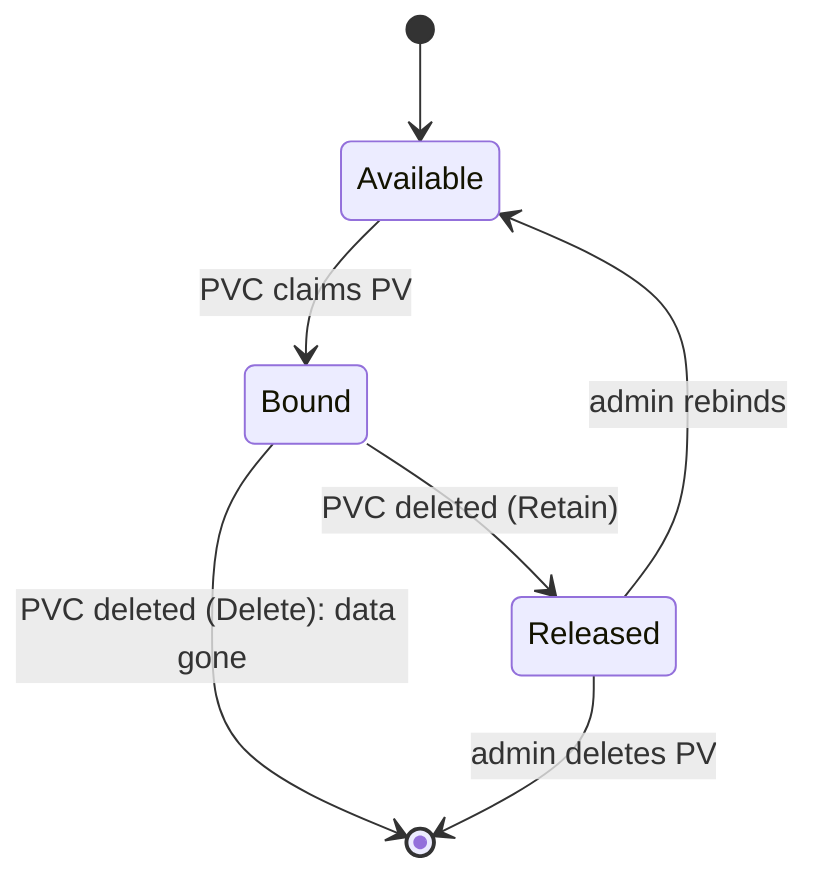

# Recovery boundaries

*Stage 3 · Mission Data*

**You will be able to:** state exactly which failure a surviving PVC rules out, and what you still need before claiming recovery.

## What survival of one test proves

- A PVC surviving a Pod restart proves **one** boundary. It says nothing about node loss, human error, corruption or cluster loss.

## Reclaim policy: what deleting a PVC does

| Policy | Result on PVC delete |
|---|---|
| `Delete` (dynamic default) | Volume and data **destroyed** |
| `Retain` | PV → `Released`, data intact; admin must clear `claimRef` to reuse |



## StatefulSet PVC retention

```yaml
persistentVolumeClaimRetentionPolicy:
  whenDeleted: Retain
  whenScaled: Delete   # example: delete volumes on scale-down
```

## Replication vs backup

| | Replication (HA) | Backup (DR) |
|---|---|---|
| Protects against | Node/hardware failure | Corruption, `DROP TABLE`, ransomware, region loss |
| Fails against | Bad writes (they replicate) | Nothing, **if the restore is rehearsed** |

- **A backup is not a recovery plan until a restore has been performed and the app verified.**

## Boundaries to test

| Event | Survived by | Needs |
|---|---|---|
| Container restart / Pod delete | PVC | Done in Stage 3 |
| PVC delete | `Retain` + backup | Backup you can restore |
| Node loss (kind) | Nothing | Replication or network storage |
| Logical corruption | Point-in-time backup | Restored copy |
| Cluster loss | Off-cluster backup | Rebuilt cluster + restore |

## Try it

```bash
kubectl get pv -o custom-columns=NAME:.metadata.name,RECLAIM:.spec.persistentVolumeReclaimPolicy,STATUS:.status.phase
kubectl scale sts/identity-db -n apollo-airlines-apps --replicas=0 && kubectl get pvc -n apollo-airlines-apps -l app=identity-db
kubectl scale sts/identity-db -n apollo-airlines-apps --replicas=1
```

## Check yourself

<details>
<summary>Replication is on. An engineer runs <code>DROP TABLE users</code>. Are you safe?</summary>

No. The drop replicates instantly. Only a point-in-time backup helps.
</details>
