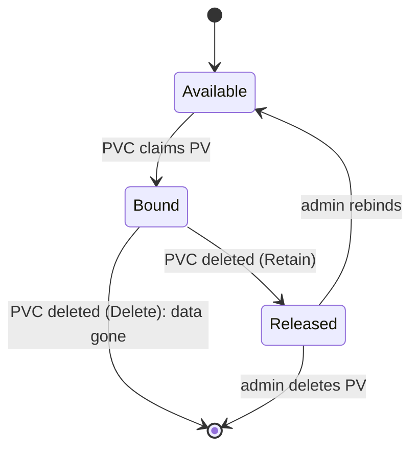
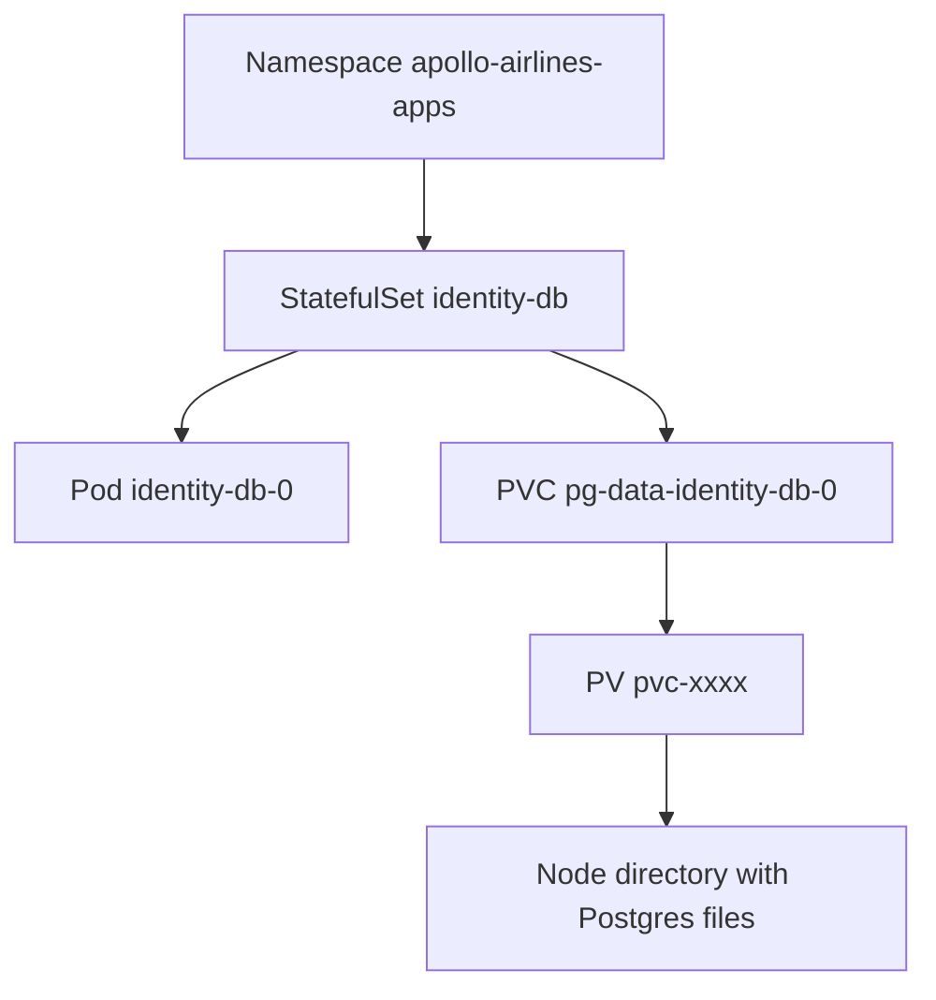

# Recovery boundaries

*Stage 3 · Mission Data*

**You will be able to:** state exactly which failure a surviving PVC rules out, predict what deleting each kind of object destroys, take and restore a logical backup of an Apollo database, and say what you still need before you can claim recovery.

## The problem

You deleted a database Pod, it came back, and the data was there. It is natural to say "the data is safe". That test proved **one** thing: a Pod can be replaced without losing its volume. It said nothing about the node dying, someone deleting the claim, a bad `DROP TABLE`, or the whole cluster disappearing.

The danger is not that the test was wrong. It is that a passing test gets remembered as a broader statement than it made. "We tested persistence" slowly becomes "we have backups", and nobody notices until the day they need one.

## The idea in plain words

A smoke alarm test proves the alarm works; it does not prove the building is fireproof. Each recovery claim needs its own test against its own failure.

Two ideas help you reason about this:

**Reclaim policy: what deleting a claim does.** A PVC is the request; the PV is the storage. When you delete the PVC, the PV's *reclaim policy* decides the storage's fate.

| Policy | Result when the PVC is deleted |
|---|---|
| `Delete` (default for dynamic provisioning) | The volume and its data are **destroyed** |
| `Retain` | The PV becomes `Released` with data intact; an administrator must clear its `claimRef` before it can be reused |



**Replication is not backup.** Replication copies every write to other members in real time, so it survives a failed machine. But it copies a mistaken `DROP TABLE` just as quickly. A backup is an isolated point-in-time copy, kept outside the system it protects.

| | Replication (availability) | Backup (disaster recovery) |
|---|---|---|
| Protects against | Node or hardware failure | Corruption, accidental deletion, ransomware, region loss |
| Fails against | Bad writes (they replicate) | Nothing, **if the restore is rehearsed** |

A backup is not a recovery plan until you have performed a restore and checked the application against it.

## How it works: what deleting each object destroys

Storage is a stack of objects, and each delete reaches a different depth. For Apollo's identity database, from the outside in:



| You delete… | Pod | PVC | PV and data |
|---|---|---|---|
| The Pod (`identity-db-0`) | Recreated | Kept | Kept |
| The StatefulSet | Gone | **Kept** (default retention) | Kept |
| The PVC | Next Pod cannot start until a new claim exists | Gone | **Destroyed** (`Delete`) |
| The PV directly | Pod keeps running; the volume is protected until released | Marked for deletion | Destroyed after release |
| The namespace | Gone | Gone | **Destroyed** |
| The kind node | Gone | Kept as an object | **Lost**: the directory lived on that node |
| The kind cluster | Gone | Gone | **Lost** |

Read the pattern: the data dies when the **claim** dies (with `Delete`) or when the **node's disk** dies. Everything above the claim is replaceable. This is why Apollo's `teardown.sh` removes Stage 3 simply by deleting the namespaces: that deletes the claims and therefore the data, which is exactly what you want when tearing down a lab.

## How it works: StatefulSet retention

The StatefulSet can also decide the fate of its claims:

```yaml
persistentVolumeClaimRetentionPolicy:
  whenDeleted: Retain
  whenScaled: Delete   # example: delete volumes on scale-down
```

Apollo does not set this; its StatefulSets keep both. That default is the safe choice for data and the untidy one for labs: scaling a StatefulSet to zero, or deleting it, leaves claims behind that you must remove yourself.

## Boundaries to test

| Event | Survived by | Needs |
|---|---|---|
| Container restart / Pod delete | The PVC | Shown in Stage 3 |
| PVC deleted | `Retain` plus a backup | A backup you can restore |
| Node lost (kind) | Nothing | Replication or network storage |
| Logical corruption | A point-in-time backup | A restored copy |
| Cluster lost | An off-cluster backup | A rebuilt cluster and a restore |

On EKS (Apollo's `stages/eks/`) the node-loss row improves: an EBS volume survives its node and reattaches elsewhere in the same availability zone. The other rows do not change at all. A gp3 volume still faithfully stores a mistaken `DROP TABLE`, and it still disappears with a deleted claim because the `ebs-gp3` class also uses `reclaimPolicy: Delete`.

## A rehearsed backup: logical dump and restore

A **logical backup** is a file of SQL produced by the database itself (`pg_dump`). It is portable (it restores into any Postgres), small, and independent of the volume. It is not the only kind of backup, but it is the simplest one to rehearse on kind.

This is an illustrative recipe built on Apollo's `identity-db`, not an Apollo manifest:

```bash
# 1. Back up: stream a dump out of the Pod to your own machine
kubectl exec -n apollo-airlines-apps identity-db-0 -- \
  pg_dump -U postgres -d identity --clean --if-exists > identity-backup.sql

# 2. Look at it: a backup you have not inspected is a hope
wc -l identity-backup.sql
grep -c 'INSERT\|COPY' identity-backup.sql
```

The file lives outside the cluster, which is the point. Now rehearse the failure and the restore:

```bash
# 3. Cause the failure: remove the data (this is the destructive step)
kubectl exec -n apollo-airlines-apps identity-db-0 -- \
  psql -U postgres -d identity -c 'DROP TABLE users CASCADE'

# 4. Confirm the failure is real
kubectl exec -n apollo-airlines-apps identity-db-0 -- \
  psql -U postgres -d identity -tAc 'SELECT count(*) FROM users'    # errors: relation does not exist

# 5. Restore from the file
kubectl exec -i -n apollo-airlines-apps identity-db-0 -- \
  psql -U postgres -d identity < identity-backup.sql

# 6. Verify through the application, not just the table
kubectl exec -n apollo-airlines-apps identity-db-0 -- \
  psql -U postgres -d identity -tAc 'SELECT count(*) FROM users'    # 2
```

Do this only on a throwaway lab cluster. Then log in through the API as `passenger@apolloairlines.com` to confirm the *application* works against the restored data, because that is the check that matters to a passenger.

Notice what this rehearsal proves, and what it does not:

| Proves | Does not prove |
|---|---|
| The dump contains the data | A schedule exists that takes dumps |
| The dump restores into a live database | The dump is stored somewhere that survives the cluster |
| You know the procedure and its commands | A restore works under pressure, at 3 a.m., on a larger database |
| The app works afterwards | Point-in-time recovery between two dumps |

A real plan adds a schedule (for example a CronJob), off-cluster storage with its own access control, retention, monitoring that a dump actually ran, and a **periodic** restore test. Without the last item, you only know the backup *step* worked.

## The seed is not a backup

It bears repeating from [Initialization and seeding](./initialization-and-seeding): after a total loss, Apollo's seed Jobs restore the demo airports, flights and two users. They cannot restore a single booking. If your recovery test only checks seed data, it will pass even when the real data is gone.

## Try it

```bash
kubectl get pv -o custom-columns=NAME:.metadata.name,RECLAIM:.spec.persistentVolumeReclaimPolicy,STATUS:.status.phase,CLAIM:.spec.claimRef.name
kubectl scale sts/identity-db -n apollo-airlines-apps --replicas=0 && kubectl get pvc -n apollo-airlines-apps -l app=identity-db
kubectl scale sts/identity-db -n apollo-airlines-apps --replicas=1
```

- The first shows each volume's fate on claim deletion and which claim owns it; the next shows the claim outliving the Pod, then the Pod returning to it.
- While the StatefulSet is at zero replicas the identity service has no database, so logins fail until it is back. That outage is real, just brief.

## Try breaking it

This one is for a throwaway cluster. Predict first, then look at everything you predicted:

```bash
kubectl scale sts/flight-db -n apollo-airlines-apps --replicas=0
kubectl delete pvc pg-data-flight-db-0 -n apollo-airlines-apps
kubectl get pv                       # the flight PV is gone (reclaim policy Delete)
kubectl scale sts/flight-db -n apollo-airlines-apps --replicas=1
kubectl wait --for=condition=Ready pod/flight-db-0 -n apollo-airlines-apps --timeout=120s
kubectl exec -n apollo-airlines-apps flight-db-0 -- psql -U postgres -d flight -tAc 'SELECT count(*) FROM flights'
```

The StatefulSet controller creates a **new, empty** claim for `flight-db-0`. Postgres sees an empty data directory and runs the init script, so the tables exist but hold no rows: the flights count is `0`. The Pod is `Ready`, the Service answers, and the flight service is "up" with nothing to show.

Recovery here is to re-run the seed Job, and that is a good moment to notice the limit of what you just did: it restores flights because the seed *can* regenerate flights. Had `flight-db` held anything else, it would be gone.

```bash
kubectl delete job seed-flight-db -n apollo-airlines-apps --ignore-not-found
kubectl apply -f stages/stage3/k8s/jobs/seed-flight-db.yaml -f stages/stage3/k8s/jobs/flight-db-seed.yaml
```

## Common misconceptions

- **"My data survived once, so it is safe."** It survived *that* failure.
- **"Replication means I don't need backups."** Bad writes replicate.
- **"A backup job that reports success is a recovery plan."** Only a rehearsed restore is.
- **"Deleting the StatefulSet deletes the data."** It keeps the claims; deleting the claim or namespace is what destroys data.
- **"`Ready` after recovery means the data is back."** An empty database is perfectly Ready.
- **"A cloud disk makes backups unnecessary."** It improves the node-loss row only.
- **"A `Retain` policy is a backup."** It preserves one copy of whatever is there, corruption included.

## Check yourself

<details>
<summary>Replication is on. An engineer runs <code>DROP TABLE users</code>. Are you safe?</summary>

No. The drop replicates instantly. Only a point-in-time backup helps.
</details>

<details>
<summary>You delete the <code>pg-data-flight-db-0</code> claim and the Pod restarts <code>Ready</code> with the tables present. Where did the tables come from, and is the data back?</summary>

From the init ConfigMap, which runs on the new empty volume. The data is not back; only the schema is. The seed Job can restore the demo rows, but nothing restores anything the system created since.
</details>

<details>
<summary>What is the difference between deleting the StatefulSet and deleting its namespace?</summary>

The StatefulSet delete leaves its PVCs, and therefore the volumes, in place under default retention. A namespace delete removes the claims too, and with reclaim policy <code>Delete</code> the data is destroyed.
</details>

<details>
<summary>You back up with <code>pg_dump</code> every night to a folder on the same node as the database. What boundary is still uncovered?</summary>

Node loss. The backup lives on the same disk as the data it protects, so one failure takes both. A backup must live outside the failure domain you are protecting against.
</details>

## Where this leads

The data now survives replacement. Stage 4 asks how Pods start, stop and move without hurting passengers, beginning with probes.

## References

- [Reclaiming a PersistentVolume](https://kubernetes.io/docs/concepts/storage/persistent-volumes/#reclaiming) · [PVC retention for StatefulSets](https://kubernetes.io/docs/concepts/workloads/controllers/statefulset/#persistentvolumeclaim-retention) · [PostgreSQL: backup and restore](https://www.postgresql.org/docs/15/backup.html) · [Volume Snapshots](https://kubernetes.io/docs/concepts/storage/volume-snapshots/)
