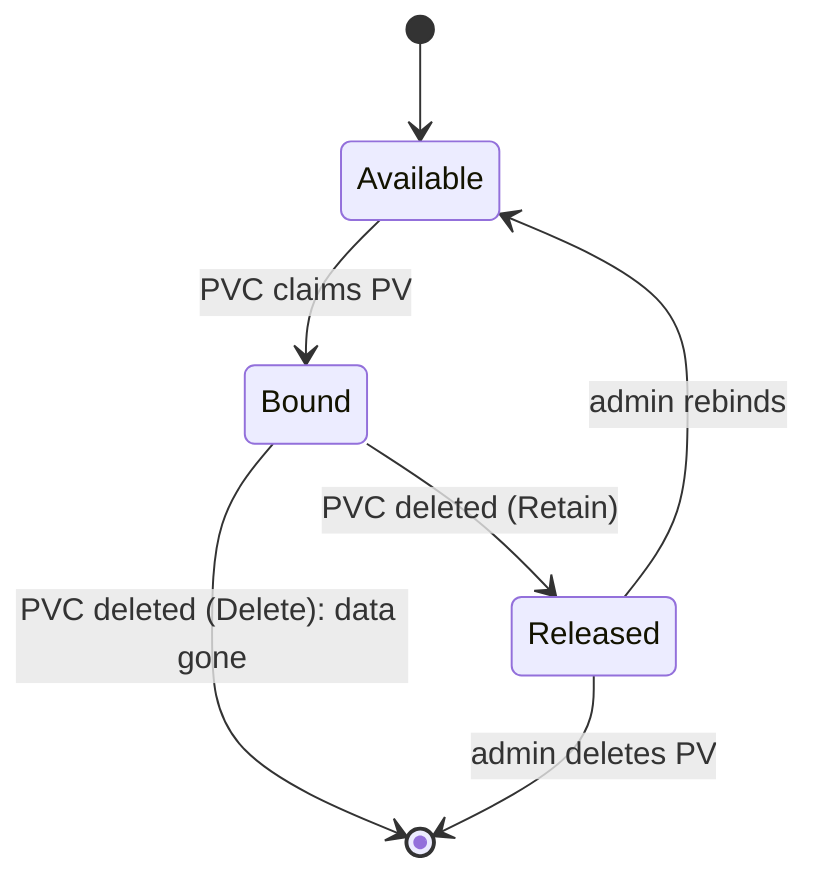

# Recovery boundaries

*Stage 3 · Mission Data*

**You will be able to:** state exactly which failure a surviving PVC rules out, and what you still need before you can claim recovery.

## The problem

You deleted a database Pod, it came back, and the data was there. It is natural to say "the data is safe". That test proved **one** thing: a Pod can be replaced without losing its volume. It said nothing about the node dying, someone deleting the claim, a bad `DROP TABLE`, or the whole cluster disappearing.

## The idea in plain words

A smoke alarm test proves the alarm works; it does not prove the building is fireproof. Each recovery claim needs its own test against its own failure.

Two ideas help you reason about this:

**Reclaim policy: what deleting a claim does.** A PVC is the request; the PV is the storage. When you delete the PVC, the PV's *reclaim policy* decides the storage's fate.

| Policy | Result when the PVC is deleted |
|---|---|
| `Delete` (default for dynamic provisioning) | The volume and its data are **destroyed** |
| `Retain` | The PV becomes `Released` with data intact; an administrator must clear its `claimRef` before it can be reused |



**Replication is not backup.** Replication copies every write to other members in real time, so it survives a failed machine. But it copies a mistaken `DROP TABLE` just as quickly. A backup is an isolated point-in-time copy, kept outside the system it protects.

| | Replication (availability) | Backup (disaster recovery) |
|---|---|---|
| Protects against | Node or hardware failure | Corruption, accidental deletion, ransomware, region loss |
| Fails against | Bad writes (they replicate) | Nothing, **if the restore is rehearsed** |

A backup is not a recovery plan until you have performed a restore and checked the application against it.

## How it works: StatefulSet retention

The StatefulSet can also decide the fate of its claims:

```yaml
persistentVolumeClaimRetentionPolicy:
  whenDeleted: Retain
  whenScaled: Delete   # example: delete volumes on scale-down
```

## Boundaries to test

| Event | Survived by | Needs |
|---|---|---|
| Container restart / Pod delete | The PVC | Done in the Stage 3 lab |
| PVC deleted | `Retain` plus a backup | A backup you can restore |
| Node lost (kind) | Nothing | Replication or network storage |
| Logical corruption | A point-in-time backup | A restored copy |
| Cluster lost | An off-cluster backup | A rebuilt cluster and a restore |

## Try it

```bash
kubectl get pv -o custom-columns=NAME:.metadata.name,RECLAIM:.spec.persistentVolumeReclaimPolicy,STATUS:.status.phase
kubectl scale sts/identity-db -n apollo-airlines-apps --replicas=0 && kubectl get pvc -n apollo-airlines-apps -l app=identity-db
kubectl scale sts/identity-db -n apollo-airlines-apps --replicas=1
```

- The first shows each volume's fate on claim deletion; the next shows the claim outliving the Pod, then the Pod returning to it.

## Common misconceptions

- **"My data survived once, so it is safe."** It survived *that* failure.
- **"Replication means I don't need backups."** Bad writes replicate.
- **"A backup job that reports success is a recovery plan."** Only a rehearsed restore is.

## Check yourself

<details>
<summary>Replication is on. An engineer runs <code>DROP TABLE users</code>. Are you safe?</summary>

No. The drop replicates instantly. Only a point-in-time backup helps.
</details>

## Where this leads

The data now survives replacement. Stage 4 asks how Pods start, stop and move without hurting passengers, beginning with probes.
