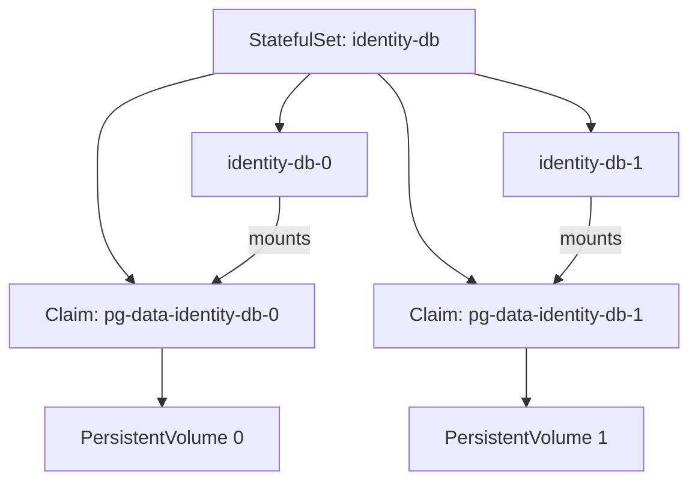

# StatefulSet storage and operations

*Stage 3 · Mission Data*

The stable name `identity-db-0` helps peers find one database member, but a name
does not preserve its bytes. The replacement Pod must also reconnect to the
claim that belongs to ordinal 0.

StatefulSets can create one PersistentVolumeClaim for each ordinal. This is
useful when replicas require separate storage, but it does not create database
replication or a backup.

## One claim for each ordinal

A `volumeClaimTemplates` entry is a template for claims, not one claim shared by
every Pod. For a template named `pg-data`, the StatefulSet creates names such as
`pg-data-identity-db-0` and `pg-data-identity-db-1`.

```yaml
spec:
  volumeClaimTemplates:
    - metadata:
        name: pg-data
      spec:
        accessModes: ["ReadWriteOnce"]
        storageClassName: standard
        resources:
          requests:
            storage: 1Gi
```



*Diagram ST-04 — each ordinal mounts its own claim; replacing the Pod does not
mean creating a new claim.*

When `identity-db-0` is replaced, Kubernetes can attach
`pg-data-identity-db-0` to the new Pod. Whether the bytes survive node or cluster
loss still depends on the StorageClass, volume backend, reclaim policy, and
recovery plan.

## Ordering controls controller actions

With the default `OrderedReady` policy, a StatefulSet creates lower ordinals
before higher ones and waits for readiness as it proceeds. Scale-down happens in
reverse ordinal order. `Parallel` allows the controller to create or remove Pods
without that ordinal sequence.

This ordering is useful only when it matches the application’s needs. Readiness
does not prove that a database primary has been elected, a replica has caught up,
or a schema is compatible. Those are application-level conditions that need
their own evidence.

## Updates retain ordinal identity

During a rolling update, a StatefulSet normally replaces Pods in reverse ordinal
order. It does not create an extra copy of an ordinal as surge capacity because
two Pods cannot simultaneously be the same member.

The optional rolling-update `partition` leaves ordinals below a chosen number on
the old template. For three replicas, a partition of `2` updates only ordinal 2.
This can stage an update, but an operator must still verify database compatibility
and health before continuing.

## Retention must be explicit

Claims commonly outlive Pod replacement. What happens when the StatefulSet is
deleted or scaled down depends on its PVC retention policy and the underlying
volume’s reclaim policy.

```yaml
spec:
  persistentVolumeClaimRetentionPolicy:
    whenDeleted: Retain
    whenScaled: Retain
```

Retention protects against one deletion path; it is not a backup. A retained
claim can contain corrupted data, and a node-local volume can remain unavailable
after node loss. The recovery-boundaries chapter follows those cases.

## When a StatefulSet is the wrong tool

Use a Deployment for an HTTP service whose replicas are interchangeable. A
managed database also has its own identity, replication, and storage system
outside Kubernetes. Choose a StatefulSet because the workload needs its
identity or claim behavior, not simply because the workload stores data.

## Evidence and limits

To establish the relationship, inspect the StatefulSet ordinals, their claim
names, and the bound volumes. Replace one Pod and verify that the same ordinal
mounts the same claim. Then verify the data through the database rather than
inferring success from a `Bound` claim or a `Ready` Pod.

The [Mission Data lab](../../stage-3) provides the runnable persistence drill.
