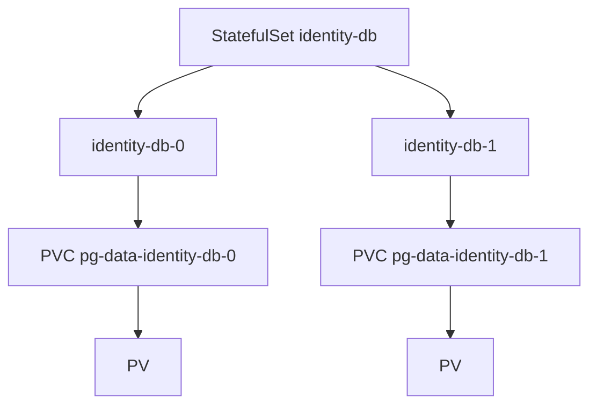

# StatefulSet storage and operations

*Stage 3 · Mission Data*

**You will be able to:** follow an ordinal to its claim, and say what ordering, partition and retention policies do.

## One claim per ordinal

```yaml
volumeClaimTemplates:
  - metadata: {name: pg-data}
    spec:
      accessModes: ["ReadWriteOnce"]
      resources: {requests: {storage: 1Gi}}
```


```mermaid
flowchart TB
  STS[StatefulSet identity-db] --> P0[identity-db-0] --> C0[PVC pg-data-identity-db-0] --> V0[PV]
  STS --> P1[identity-db-1] --> C1[PVC pg-data-identity-db-1] --> V1[PV]
```

- Claim name = `<template>-<statefulset>-<ordinal>`. A replacement Pod remounts its own ordinal's claim.
- This gives separate storage, **not** replication or backup.

## Operations

| Topic | Behaviour |
|---|---|
| `podManagementPolicy: OrderedReady` (default) | Create `-0` first, wait Ready, then `-1`; scale down in reverse |
| `Parallel` | No ordering |
| Rolling update | Reverse ordinal order, no extra surge Pod |
| `partition: N` | Only ordinals ≥ N get the new template (stage an update) |
| Readiness | Does **not** prove a primary is elected or a replica caught up |

## Retention

```yaml
persistentVolumeClaimRetentionPolicy:
  whenDeleted: Retain
  whenScaled: Retain
```

| Event | Default |
|---|---|
| Delete StatefulSet | PVCs kept |
| Scale down | PVCs kept (must delete by hand) |
| Delete PVC | Depends on PV reclaim policy (`Delete` on kind) → data gone |

- Retention protects one deletion path; it is not a backup. A retained claim can hold corrupted data.

## When it is the wrong tool

- Interchangeable HTTP replicas → Deployment.
- A managed database already provides identity, replication and storage outside Kubernetes.

## Try it

```bash
kubectl get sts,pvc -n apollo-airlines-apps
kubectl get pod identity-db-0 -n apollo-airlines-apps -o jsonpath='{.spec.volumes[?(@.name=="pg-data")].persistentVolumeClaim.claimName}{"\n"}'
```

- Replace the Pod and re-run: same claim name. Then check the data **through the database**, not via `Bound`.

## Check yourself

<details>
<summary>You scale the StatefulSet from 2 to 1. What happens to <code>pg-data-…-1</code>?</summary>

It stays (default retention). Delete it manually if it is no longer needed.
</details>
