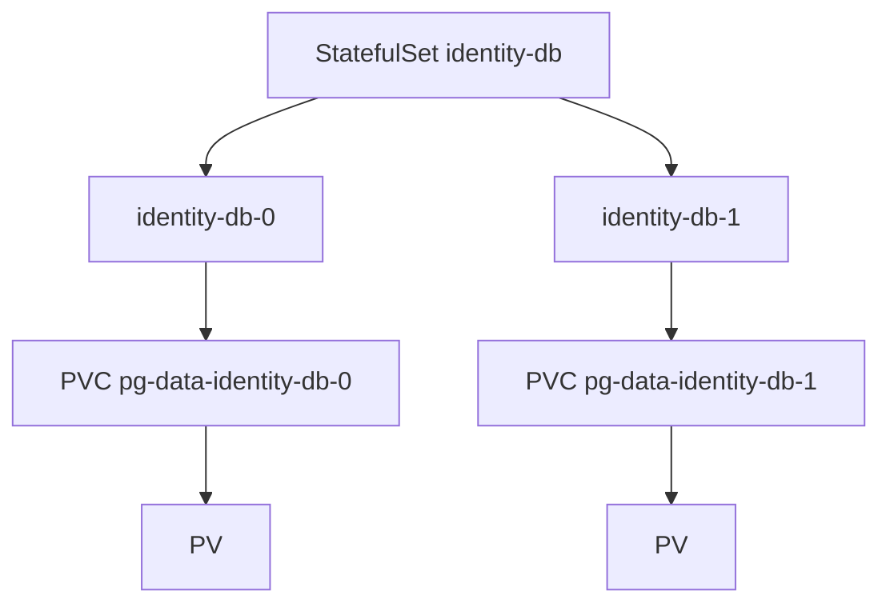

# StatefulSet storage and operations

*Stage 3 · Mission Data*

**You will be able to:** follow a StatefulSet ordinal to its dedicated claim, say what ordering, partitioning and retention settings do and do not guarantee, and explain why Redis needed extra flags for its volume to be worth having.

The stable name `identity-db-0` helps others find one member, but a name does not hold data. For a replacement Pod to be *the same database member*, it must also reconnect to the same storage. If the replacement mounted a fresh empty disk, the name would be stable and the database still lost.

And once storage lives longer than the Pod, a new set of questions appears. What happens to the disk when you scale down? When you delete the whole StatefulSet? When you push a new image, in what order do members change? Each of those is a way to lose data by accident, so each needs a deliberate answer.

## One claim per member

A StatefulSet's volume section works like a **rubber stamp**. Instead of naming one shared claim (which every replica would fight over), you give a *template*, and the controller stamps out a separate claim for each ordinal, named after it. Locker 0 always gets key 0; locker 1 gets key 1.

```yaml
volumeClaimTemplates:
  - metadata: {name: pg-data}
    spec:
      accessModes: ["ReadWriteOnce"]
      resources: {requests: {storage: 1Gi}}
```

The claim name is `<template>-<statefulset>-<ordinal>`: `pg-data-identity-db-0`, then `pg-data-identity-db-1` if you scale up.


```mermaid
flowchart TB
  STS[StatefulSet identity-db] --> P0[identity-db-0] --> C0[PVC pg-data-identity-db-0] --> V0[PV]
  STS --> P1[identity-db-1] --> C1[PVC pg-data-identity-db-1] --> V1[PV]
```

When `identity-db-0` is replaced, the new Pod mounts `pg-data-identity-db-0` again. That gives each member separate storage; it does **not** make the members replicas of each other, and it is not a backup. Whether the bytes survive a node or cluster loss still depends on the StorageClass, the volume backend and your recovery plan.

## The template, the mount and the claim

*Source: `stages/stage3/k8s/apps/booking-db/booking-db-sts.yaml`*

There are three places a volume is mentioned, and they link by **name**:

```yaml
volumeMounts:
  - name: pg-data                       # 1. which volume to mount...
    mountPath: /var/lib/postgresql/data #    ...and where inside the container
volumeClaimTemplates:
  - metadata:
      name: pg-data                     # 2. the template that creates the claim
```

The claim the controller creates, `pg-data-booking-db-0`, is then the actual object (3). Apollo's four workloads:

| StatefulSet | Template name | Mount path | Resulting claim |
|---|---|---|---|
| `identity-db`, `flight-db`, `booking-db` | `pg-data` | `/var/lib/postgresql/data` | `pg-data-<db>-0` |
| `redis` | `redis-data` | `/data` | `redis-data-redis-0` |

Notice the template name appears in the claim name. That is why `verify.sh` can check exactly `pg-data-identity-db-0 pg-data-flight-db-0 pg-data-booking-db-0 redis-data-redis-0`, and why changing a template name later orphans the old claims instead of renaming them.

## Ordering, updates and retention

**Ordering.** By default (`OrderedReady`) the controller creates `-0` first, waits until it is Ready, then creates `-1`, and removes them in reverse order when scaling down. `Parallel` skips the ordering. Ordering helps only if your application needs it. Readiness never proves that a primary has been elected, a replica has caught up, or a schema is compatible; those need their own checks.

**Updates.** A rolling update replaces Pods in reverse ordinal order. It never creates a surge copy, because two Pods cannot both be the same member. The optional `partition: N` leaves ordinals below N on the old template, so you can update one member at a time and check it before continuing.

| Topic | Behaviour |
|---|---|
| `podManagementPolicy: OrderedReady` (default) | Create `-0`, wait Ready, then `-1`; scale down in reverse |
| `Parallel` | No ordering |
| Rolling update | Reverse ordinal order, no surge |
| `partition: N` | Only ordinals ≥ N receive the new template |

With one replica, an update to `identity-db` means a short real outage: the old Pod is stopped, and only then is the new one started. There is no "second copy" to carry traffic meanwhile. The readiness probe (`pg_isready`) is what tells the identity app the database is back.

**Retention.** Claims usually outlive Pods, so what happens on deletion or scale-down must be explicit.

```yaml
persistentVolumeClaimRetentionPolicy:
  whenDeleted: Retain
  whenScaled: Retain
```

Apollo's StatefulSets do not set this field, so they get the default, which is exactly the block above: keep everything.

| Event | Default result |
|---|---|
| Delete the StatefulSet | PVCs are kept |
| Scale down | PVCs are kept (delete by hand if unwanted) |
| Delete a PVC | Depends on the PV's reclaim policy (`Delete` on kind): the data is gone |
| Delete the *namespace* | Everything in it goes, including the PVCs |

That last row is how Apollo's `teardown.sh` cleans up: it deletes the namespaces, which also removes the claims, and the `Delete` reclaim policy then removes the data. Deleting the StatefulSet alone would have left the claims behind.

Retention protects one path to data loss; it is not a backup. A retained claim can hold corrupted data, and a node-local volume can be unreachable after node loss.

## A volume only keeps what the app writes to it

A PVC keeps bytes. Whether the *right* bytes are there depends on the app:

- **Postgres** writes every committed transaction to disk before replying, so its PVC has the data.
- **Redis** keeps data in memory. By default it only saves a snapshot now and then, so a crash loses everything since the last snapshot. Apollo's Redis StatefulSet changes that explicitly.
- **Lesson:** a StatefulSet and a PVC give the app a place that survives. The app's own settings decide how much of its state actually reaches that place.

*Source: `stages/stage3/k8s/apps/redis/redis-sts.yaml`*

```yaml
command:
  - redis-server
  - --appendonly yes
  - --appendfsync everysec
  - --save 60 100
```

| Flag | What it does | What you accept |
|---|---|---|
| `--appendonly yes` | Appends every write to a log file in `/data` (the AOF) and replays it on restart | Slightly slower writes |
| `--appendfsync everysec` | Flushes that log to disk once a second | A crash can lose up to about a second of writes |
| `--save 60 100` | Also takes a snapshot if 100 keys changed in 60 seconds | Extra disk writes |

Read `everysec` carefully. It is a deliberate trade-off between speed and durability, not a guarantee: "the data survives" really means "all but the last moment survives". Choosing `always` would close the gap and cost throughput. Apollo's Redis holds the notification fan-out queue, where losing a second of events is acceptable; for a ledger it would not be.

## When a StatefulSet is the wrong tool

Use a Deployment for interchangeable HTTP replicas. A managed database service provides its own identity, replication and storage outside Kubernetes. Choose a StatefulSet because the workload needs stable identity or per-member claims.

## Try it

```bash
kubectl get sts,pvc -n apollo-airlines-apps
kubectl get pod identity-db-0 -n apollo-airlines-apps -o jsonpath='{.spec.volumes[?(@.name=="pg-data")].persistentVolumeClaim.claimName}{"\n"}'
kubectl get sts identity-db -n apollo-airlines-apps -o jsonpath='{.spec.podManagementPolicy} {.spec.updateStrategy.type} {.spec.persistentVolumeClaimRetentionPolicy}{"\n"}'
```

- Replace the Pod and run the second command again: same claim name. Then verify the data **through the database**, not by seeing `Bound`.
- The third shows the defaults Apollo relies on (`OrderedReady`, `RollingUpdate`) and the retention policy, which prints the effective default.

Check the Redis setting on the live server, not just the manifest:

```bash
kubectl exec -n apollo-airlines-apps redis-0 -- redis-cli config get appendonly
kubectl exec -n apollo-airlines-apps redis-0 -- redis-cli config get appendfsync
kubectl exec -n apollo-airlines-apps redis-0 -- ls -l /data
```

- `appendonly yes` confirms the flag took effect. `/data` shows the files that actually live on the volume.

## Try breaking it

Predict what is lost, then prove it with something distinctive:

```bash
kubectl exec -n apollo-airlines-apps redis-0 -- redis-cli set apollo:probe "survived"
kubectl delete pod redis-0 -n apollo-airlines-apps
kubectl wait --for=condition=Ready pod/redis-0 -n apollo-airlines-apps --timeout=90s
kubectl exec -n apollo-airlines-apps redis-0 -- redis-cli get apollo:probe
kubectl exec -n apollo-airlines-apps redis-0 -- redis-cli del apollo:probe
```

With the append-only file on the claim, the key comes back. To feel the difference, ask yourself what would happen if the Pod had no claim: the replacement would start with an empty keyspace and `get` would return nothing. The last command removes the probe key so nothing is left behind.

## Common misconceptions

- **"Scaling down deletes the extra disks."** By default it keeps them.
- **"Ready means the database has the right data."** It means the readiness check passed.
- **"A StatefulSet gives me replication."** It gives identity and per-member storage.
- **"Mounting a volume makes the app use it."** Redis needed explicit flags to write its data to `/data` at all in a durable form.
- **"Rolling updates keep a database up."** With one replica there is a gap, because a StatefulSet never runs two copies of one member.
- **"Deleting the StatefulSet deletes its data."** The claims remain until you delete them or their namespace.

## Check yourself

<details>
<summary>You scale the StatefulSet from 2 to 1. What happens to <code>pg-data-…-1</code>?</summary>

It stays (default retention). Delete it manually if it is no longer needed.
</details>

<details>
<summary>Why does <code>redis-data-redis-0</code> have that name?</summary>

Claims are named <code>&lt;template&gt;-&lt;statefulset&gt;-&lt;ordinal&gt;</code>: template <code>redis-data</code>, StatefulSet <code>redis</code>, ordinal <code>0</code>.
</details>

<details>
<summary>Redis restarts in the middle of a burst of writes with <code>appendfsync everysec</code>. What can be lost?</summary>

Roughly the last second of writes that had not yet been flushed to the append-only file. Everything flushed before that is replayed on restart.
</details>

<details>
<summary>You delete the <code>booking-db</code> StatefulSet but not its namespace. Is the booking data gone?</summary>

No. The default retention keeps the claim, and the claim keeps the volume. Re-applying the StatefulSet would reattach <code>pg-data-booking-db-0</code>.
</details>

## Where this leads

A fresh volume is empty. How tables and seed data get into it, exactly once, is the next chapter.

## References

- [StatefulSet basics](https://kubernetes.io/docs/tutorials/stateful-application/basic-stateful-set/) · [PVC retention policy](https://kubernetes.io/docs/concepts/workloads/controllers/statefulset/#persistentvolumeclaim-retention) · [Redis persistence](https://redis.io/docs/latest/operate/oss_and_stack/management/persistence/)
