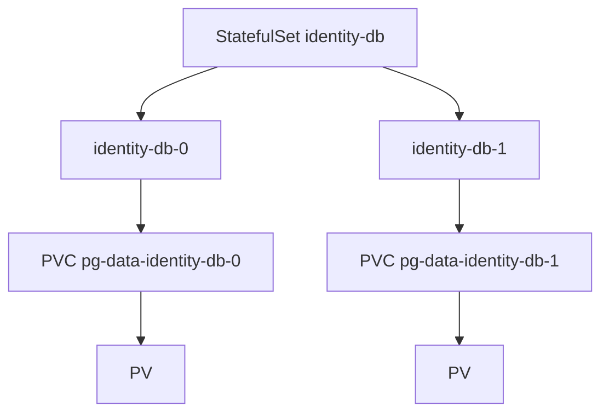

# StatefulSet storage and operations

*Stage 3 · Mission Data*

**You will be able to:** follow a StatefulSet ordinal to its dedicated claim, and say what ordering, partitioning and retention settings do and do not guarantee.

## The problem

The stable name `identity-db-0` helps others find one member, but a name does not hold data. For a replacement Pod to be *the same database member*, it must also reconnect to the same storage. If the replacement mounted a fresh empty disk, the name would be stable and the database still lost.

## The idea in plain words

A StatefulSet's volume section works like a **rubber stamp**. Instead of naming one shared claim (which every replica would fight over), you give a *template*, and the controller stamps out a separate claim for each ordinal, named after it. Locker 0 always gets key 0; locker 1 gets key 1.

```yaml
volumeClaimTemplates:
  - metadata: {name: pg-data}
    spec:
      accessModes: ["ReadWriteOnce"]
      resources: {requests: {storage: 1Gi}}
```

The claim name is `<template>-<statefulset>-<ordinal>`: `pg-data-identity-db-0`, then `pg-data-identity-db-1` if you scale up.


```mermaid
flowchart TB
  STS[StatefulSet identity-db] --> P0[identity-db-0] --> C0[PVC pg-data-identity-db-0] --> V0[PV]
  STS --> P1[identity-db-1] --> C1[PVC pg-data-identity-db-1] --> V1[PV]
```

When `identity-db-0` is replaced, the new Pod mounts `pg-data-identity-db-0` again. That gives each member separate storage; it does **not** make the members replicas of each other, and it is not a backup. Whether the bytes survive a node or cluster loss still depends on the StorageClass, the volume backend and your recovery plan.

## How it works: ordering, updates and retention

**Ordering.** By default (`OrderedReady`) the controller creates `-0` first, waits until it is Ready, then creates `-1`, and removes them in reverse order when scaling down. `Parallel` skips the ordering. Ordering helps only if your application needs it. Readiness never proves that a primary has been elected, a replica has caught up, or a schema is compatible; those need their own checks.

**Updates.** A rolling update replaces Pods in reverse ordinal order. It never creates a surge copy, because two Pods cannot both be the same member. The optional `partition: N` leaves ordinals below N on the old template, so you can update one member at a time and check it before continuing.

| Topic | Behaviour |
|---|---|
| `podManagementPolicy: OrderedReady` (default) | Create `-0`, wait Ready, then `-1`; scale down in reverse |
| `Parallel` | No ordering |
| Rolling update | Reverse ordinal order, no surge |
| `partition: N` | Only ordinals ≥ N receive the new template |

**Retention.** Claims usually outlive Pods, so what happens on deletion or scale-down must be explicit.

```yaml
persistentVolumeClaimRetentionPolicy:
  whenDeleted: Retain
  whenScaled: Retain
```

| Event | Default result |
|---|---|
| Delete the StatefulSet | PVCs are kept |
| Scale down | PVCs are kept (delete by hand if unwanted) |
| Delete a PVC | Depends on the PV's reclaim policy (`Delete` on kind): the data is gone |

Retention protects one path to data loss; it is not a backup. A retained claim can hold corrupted data, and a node-local volume can be unreachable after node loss.

## A volume only keeps what the app writes to it

A PVC keeps bytes. Whether the *right* bytes are there depends on the app:

- **Postgres** writes every committed transaction to disk before replying, so its PVC has the data.
- **Redis** keeps data in memory. By default it only saves a snapshot now and then, so a crash loses everything since the last snapshot. Stage 3 starts Redis with `--appendonly yes`: every write is appended to a log file on the PVC, and on restart Redis replays it.
- **Lesson:** a StatefulSet and a PVC give the app a place that survives. The app's own settings decide how much of its state actually reaches that place.

## When a StatefulSet is the wrong tool

Use a Deployment for interchangeable HTTP replicas. A managed database service provides its own identity, replication and storage outside Kubernetes. Choose a StatefulSet because the workload needs stable identity or per-member claims.

## Try it

```bash
kubectl get sts,pvc -n apollo-airlines-apps
kubectl get pod identity-db-0 -n apollo-airlines-apps -o jsonpath='{.spec.volumes[?(@.name=="pg-data")].persistentVolumeClaim.claimName}{"\n"}'
```

- Replace the Pod and run the second command again: same claim name. Then verify the data **through the database**, not by seeing `Bound`.

## Common misconceptions

- **"Scaling down deletes the extra disks."** By default it keeps them.
- **"Ready means the database has the right data."** It means the readiness check passed.
- **"A StatefulSet gives me replication."** It gives identity and per-member storage.

## Check yourself

<details>
<summary>You scale the StatefulSet from 2 to 1. What happens to <code>pg-data-…-1</code>?</summary>

It stays (default retention). Delete it manually if it is no longer needed.
</details>

## Where this leads

A fresh volume is empty. How tables and seed data get into it, exactly once, is the next chapter.
