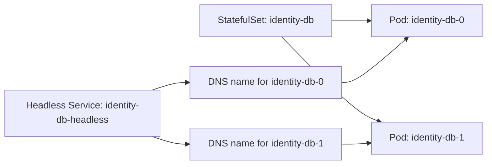

# StatefulSets and headless DNS

*Stage 3 · Mission Data*

Apollo’s booking API does not care which ready booking Pod receives a request.
Its replicas are interchangeable behind one Service. A database member can have
a different requirement: another member may need to reconnect to that same
member after its Pod is replaced.

That is an identity problem, not merely a storage problem. A **StatefulSet**
provides stable ordinal names such as `identity-db-0`. A companion **headless
Service** publishes addresses for those individual Pods instead of hiding them
behind one virtual Service address.

Not every database needs this arrangement. Use it only when the application
needs stable per-replica identity, dedicated storage, or controlled ordering.

## A stable name survives a replaceable Pod

A Deployment creates interchangeable Pod names such as
`booking-7d6f5c8b-v2k8w`. A replacement normally receives a different name and
IP. Callers therefore use the booking Service rather than a particular Pod.

A StatefulSet creates Pods from a predictable sequence:
`identity-db-0`, `identity-db-1`, and so on. If `identity-db-0` is deleted, the
replacement uses the same ordinal name, although it is still a new Pod with a
new UID and possibly a new IP.

| Question | Deployment | StatefulSet |
| --- | --- | --- |
| Are replicas interchangeable? | Usually yes | Not necessarily |
| Pod names | Generated names | Stable ordinal names |
| Direct address for one replica | Usually unnecessary | Available through headless DNS |
| Storage | Referenced by the Pod template | Can create one claim per ordinal |

The table describes controller behavior, not a promise that the application is
correctly replicated. Kubernetes does not choose a database primary or copy
records between replicas unless another application or operator implements that
logic.

## Why a single-replica database uses a StatefulSet instead of a Deployment

In Apollo Airlines, `identity-db`, `flight-db`, and `booking-db` run with a replica count of 1 (`replicas: 1`). A sharp learner naturally asks:

> *"If there is only one replica, why not just use a simple Deployment attached to a PersistentVolumeClaim?"*

While technically possible, running databases inside Deployments creates three dangerous operational traps:

### 1. The Rolling Update Multi-Attach Deadlock
Deployments default to a `RollingUpdate` strategy. When you update the database image (e.g. from Postgres 15 to 15.1), the Deployment controller creates the **new Pod before terminating the old Pod**.
Because standard volumes are formatted with `ReadWriteOnce` (RWO), they can only be attached to one node at a time. The new Pod cannot attach the volume because the old Pod is still actively using it! Both Pods hang in a deadlock (`Multi-Attach error for volume`), halting the rollout.
In contrast, a StatefulSet defaults to a `RollingUpdate` with strict reverse-ordinal termination: it gracefully terminates `identity-db-0` and releases its volume lock *before* starting the replacement!

### 2. Sticky Storage Automation (`volumeClaimTemplates`)
In a Deployment, storage must reference a single pre-existing claim name (`claimName: pg-data`). If an operator ever scales the Deployment to 2 replicas, both replicas attempt to mount that exact same PVC, causing corrupt writes or filesystem lock failures.
A StatefulSet manages storage using `volumeClaimTemplates`. The StatefulSet controller automatically stamps out a dedicated, sticky PVC for each ordinal (`pg-data-identity-db-0`). If scaled up, `identity-db-1` automatically gets its own isolated volume `pg-data-identity-db-1`.

### 3. Predictable Network Identity
A Deployment creates random Pod names (like `identity-db-7d8b9f-x4k21`), meaning callers must connect through the virtual ClusterIP Service.
A StatefulSet guarantees the Pod is always `identity-db-0`. When paired with a headless Service, clients (or future replication tools like pgpool or streaming replication followers) can address the primary directly at `identity-db-0.identity-db-headless`.

## Headless DNS exposes each replica

A normal Service gives callers one stable virtual address and selects among
ready backends. Sometimes a peer must reach one specific database member. A
headless Service sets `clusterIP: None`, so DNS can return Pod addresses rather
than one virtual Service IP.

When a StatefulSet named `identity-db` uses the Service
`identity-db-headless`, its first Pod can be reached by a name like:

```text
identity-db-0.identity-db-headless.apollo-airlines-apps.svc.cluster.local
```

If the replacement Pod receives a new IP, DNS can publish the new address under
the same stable name. Clients must still reconnect and handle the period while
the old address expires or the new Pod is not ready.



*Diagram ST-03 — the StatefulSet supplies stable ordinal names; the headless
Service makes each ordinal addressable.*

## Read the relationship in the manifest

This **abridged example** shows only the fields that connect the objects:

```yaml
apiVersion: apps/v1
kind: StatefulSet
metadata:
  name: identity-db
spec:
  serviceName: identity-db-headless
  replicas: 2
  selector:
    matchLabels:
      app: identity-db
  template:
    metadata:
      labels:
        app: identity-db
    spec:
      containers:
        - name: postgres
          image: postgres:15-alpine
```

The selector and template labels identify the StatefulSet’s Pods.
`serviceName` links their network identity to the headless Service. The ordinal
belongs to the Pod name; it is not the Pod UID and does not preserve process
memory.

## Evidence and limits

Inspect the Pod names, UIDs, Service configuration, and DNS answers. Deleting a
Pod and seeing the same ordinal return demonstrates stable naming. It does not
demonstrate data persistence, replication, or successful recovery.

The next chapter follows the separate storage relationship: how each ordinal
gets its own claim and what ordering and retention settings change.
