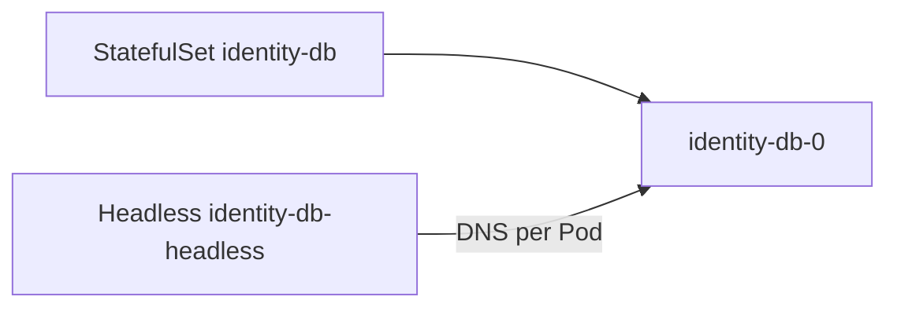

# StatefulSets and headless DNS

*Stage 3 · Mission Data*

**You will be able to:** decide between a Deployment and a StatefulSet, and resolve one specific Pod by its stable DNS name.

## The problem

Booking Pods are interchangeable: any ready copy can serve any request, so their random names do not matter. A database member is different. A replica may need to reconnect to *that particular* member, and the member needs to find its *own* storage again after replacement. That is an **identity** problem, not just a storage one.

## The idea in plain words

A Deployment is a pool of taxis: whichever arrives will do. A StatefulSet is a set of **numbered lockers** (`locker-0`, `locker-1`): if locker 0 is rebuilt, it is still locker 0 and gets its own key back.

A **StatefulSet** creates Pods with predictable ordinal names (`identity-db-0`, `identity-db-1`). If `identity-db-0` is deleted, the replacement is again `identity-db-0` (a new Pod with a new UID and possibly a new IP, but the same name and the same claim).

| Question | Deployment | StatefulSet |
|---|---|---|
| Are replicas interchangeable? | Usually yes | Not necessarily |
| Pod names | Generated (`booking-7d6f5c8b-v2k8w`) | Ordinal (`identity-db-0`) |
| Replacement name | New | **Same ordinal** |
| Storage | One claim referenced by the template | One claim **per ordinal** |
| Update behaviour | Surge: new Pod before the old is gone | One at a time, reverse order, **no surge** |

Kubernetes does not elect a database primary or copy data between members. A StatefulSet gives identity and storage; replication needs an operator or the database's own tooling. Use one because the workload needs those properties, not merely because it stores data.

## Why a single-replica database still uses one

Apollo's databases have `replicas: 1`. A reasonable question: why not a Deployment plus a PVC? Three traps:

| Trap with Deployment + one PVC | StatefulSet behaviour |
|---|---|
| Rolling update starts the new Pod **before** stopping the old one; a `ReadWriteOnce` volume on another node cannot attach at once (a `Multi-Attach` stall) | Stops `-0`, releases the volume, then starts the replacement |
| Scaling to 2 makes both Pods mount the **same** claim | Each ordinal gets its own PVC |
| Random Pod names; reachable only through the ClusterIP | Stable `identity-db-0.identity-db-headless` |

## How it works: headless DNS

A normal Service gives callers one virtual address and load-balances. Sometimes a peer must reach one specific member. A **headless Service** sets `clusterIP: None`; DNS then returns the Pod IP(s) directly. For StatefulSet Pods that gives each one a stable name:

```text
identity-db-0.identity-db-headless.apollo-airlines-apps.svc.cluster.local
```

If the replacement gets a new IP, that same name publishes the new address. Clients must still reconnect and tolerate the moment the old address expires.


```mermaid
flowchart LR
  STS[StatefulSet identity-db] --> P0[identity-db-0]
  HS[Headless identity-db-headless] -->|DNS per Pod| P0
```

## Apollo manifests

*Source: `stages/stage3/k8s/apps/identity-db/`*

| Field or object | Meaning |
|---|---|
| `serviceName: identity-db-headless` | Ties Pod DNS identity to the headless Service |
| `selector` + template labels | Which Pods the StatefulSet owns |
| `identity-db` (normal Service) | What the identity app uses to connect |
| `identity-db-headless` | Per-Pod names for peers and operators |

## Try it

```bash
kubectl exec -n apollo-airlines-apps deploy/identity -- getent hosts identity-db                         # ClusterIP
kubectl exec -n apollo-airlines-apps deploy/identity -- getent hosts identity-db-0.identity-db-headless  # Pod IP
```

## Common misconceptions

- **"A StatefulSet replicates my database."** It provides names and claims only.
- **"The same ordinal means the same Pod."** It is a new Pod with the same name.
- **"Same name proves the data survived."** Only the claim and the database prove that.

## Check yourself

<details>
<summary>Deleting <code>identity-db-0</code> returns the same name. Does that prove the data survived?</summary>

No. It shows stable naming. Data survival depends on the claim and the database.
</details>

## Where this leads

The name is stable; the next chapter follows the storage relationship per ordinal, and what ordering and retention settings guarantee.
