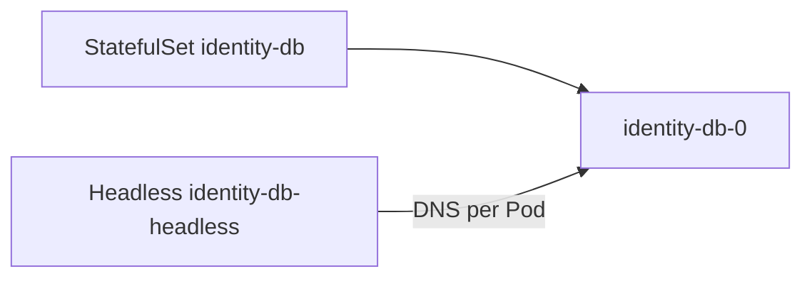

# StatefulSets and headless DNS

*Stage 3 · Mission Data*

**You will be able to:** decide Deployment vs StatefulSet, and resolve a Pod by its stable DNS name.

## Deployment vs StatefulSet

| Question | Deployment | StatefulSet |
|---|---|---|
| Replicas interchangeable? | Usually yes | Not necessarily |
| Pod names | Generated (`booking-7d6f5c8b-v2k8w`) | Ordinal (`identity-db-0`, `-1`) |
| Replacement Pod name | New | **Same ordinal** (new UID, maybe new IP) |
| Storage | One claim referenced by the template | One claim **per ordinal** (`volumeClaimTemplates`) |
| Direct address per replica | Rarely | Headless DNS |
| Rolling update | Surge: new Pod before old is gone | One ordinal at a time, reverse order, **no surge** |

- Kubernetes does **not** elect a primary or replicate data. That needs an operator or tooling.
- Use a StatefulSet because the workload needs identity/claim behaviour, not just because it stores data.

## Why a single-replica DB still uses one

| Trap with a Deployment + one PVC | StatefulSet behaviour |
|---|---|
| Rolling update starts the new Pod **before** stopping the old; an RWO volume on a different node cannot attach → `Multi-Attach` stall | Stops `-0`, releases the volume, then starts the replacement |
| Scaling to 2 makes both Pods mount the **same** claim | Each ordinal gets its own PVC |
| Random Pod names; reach it only via the ClusterIP | Stable `identity-db-0.identity-db-headless` |

## Headless Service

- `clusterIP: None`: DNS returns the **Pod IP(s)**, not a virtual IP.

```text
identity-db-0.identity-db-headless.apollo-airlines-apps.svc.cluster.local
```

- Replacement with a new IP: the same name publishes the new address. Clients must reconnect.


```mermaid
flowchart LR
  STS[StatefulSet identity-db] --> P0[identity-db-0]
  HS[Headless identity-db-headless] -->|DNS per Pod| P0
```

## Apollo manifests

*Source: `stages/stage3/k8s/apps/identity-db/`*

| Field | Meaning |
|---|---|
| `serviceName: identity-db-headless` | Links Pod DNS identity to the headless Service |
| `selector` + template labels | Which Pods the StatefulSet owns |
| `identity-db` (normal Service) | What the app actually uses to connect |
| `identity-db-headless` | Per-Pod names; for peers/operators |

## Try it

```bash
kubectl exec -n apollo-airlines-apps deploy/identity -- getent hosts identity-db                    # ClusterIP
kubectl exec -n apollo-airlines-apps deploy/identity -- getent hosts identity-db-0.identity-db-headless   # Pod IP
```

## Check yourself

<details>
<summary>Deleting <code>identity-db-0</code> returns the same name. Does that prove the data survived?</summary>

No. It shows stable naming only. Data survival depends on the claim and the database.
</details>
