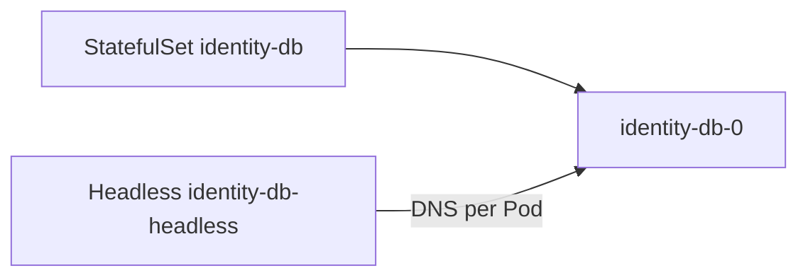

# StatefulSets and headless DNS

*Stage 3 · Mission Data*

**You will be able to:** decide between a Deployment and a StatefulSet, read Apollo's StatefulSet and its two Services, resolve one specific Pod by its stable DNS name, and predict what changes (and what does not) when that Pod is replaced.

Booking Pods are interchangeable: any ready copy can serve any request, so their random names do not matter. A database member is different. A replica may need to reconnect to *that particular* member, and the member needs to find its *own* storage again after replacement. That is an **identity** problem, not just a storage one.

A Deployment cannot express this. Its Pods get a random suffix, and when one is replaced the new one has a different name, so nothing outside can say "I mean the same one as before".

## Stable identity for each member

A Deployment is a pool of taxis: whichever arrives will do. A StatefulSet is a set of **numbered lockers** (`locker-0`, `locker-1`): if locker 0 is rebuilt, it is still locker 0 and gets its own key back.

A **StatefulSet** creates Pods with predictable ordinal names (`identity-db-0`, `identity-db-1`). If `identity-db-0` is deleted, the replacement is again `identity-db-0` (a new Pod with a new UID and possibly a new IP, but the same name and the same claim).

| Question | Deployment | StatefulSet |
|---|---|---|
| Are replicas interchangeable? | Usually yes | Not necessarily |
| Pod names | Generated (`booking-7d6f5c8b-v2k8w`) | Ordinal (`identity-db-0`) |
| Replacement name | New | **Same ordinal** |
| Storage | One claim referenced by the template | One claim **per ordinal** |
| Update behaviour | Surge: new Pod before the old is gone | One at a time, reverse order, **no surge** |

Kubernetes does not elect a database primary or copy data between members. A StatefulSet gives identity and storage; replication needs an operator or the database's own tooling. Use one because the workload needs those properties, not merely because it stores data.

## Why a single-replica database still uses one

Apollo's databases have `replicas: 1`. A reasonable question: why not a Deployment plus a PVC? Three traps:

| Trap with Deployment + one PVC | StatefulSet behaviour |
|---|---|
| Rolling update starts the new Pod **before** stopping the old one; a `ReadWriteOnce` volume on another node cannot attach at once (a `Multi-Attach` stall) | Stops `-0`, releases the volume, then starts the replacement |
| Scaling to 2 makes both Pods mount the **same** claim | Each ordinal gets its own PVC |
| Random Pod names; reachable only through the ClusterIP | Stable `identity-db-0.identity-db-headless` |

A fourth, more practical reason: the replacement logic is *the same code path* whether you run one member or three. Learning the single-replica shape is learning the shape that scales.

## Headless DNS

A normal Service gives callers one virtual address and load-balances. Sometimes a peer must reach one specific member. A **headless Service** sets `clusterIP: None`; DNS then returns the Pod IP(s) directly. For StatefulSet Pods that gives each one a stable name:

```text
identity-db-0.identity-db-headless.apollo-airlines-apps.svc.cluster.local
```

If the replacement gets a new IP, that same name publishes the new address. Clients must still reconnect and tolerate the moment the old address expires.


```mermaid
flowchart LR
  STS[StatefulSet identity-db] --> P0[identity-db-0]
  HS[Headless identity-db-headless] -->|DNS per Pod| P0
```

The name is built from three parts: **Pod name** (`identity-db-0`) + **governing Service** (`identity-db-headless`, from `serviceName` in the StatefulSet) + the usual namespace and cluster domain. The per-Pod record exists *only* when the Service named in `serviceName` is headless. This is why a StatefulSet nearly always ships with a headless Service next to it.

## Apollo manifests

*Source: `stages/stage3/k8s/apps/identity-db/`*

Every stateful workload ships with the same trio. For `flight-db`:

```yaml
# flight-db-sts.yaml (excerpt)
kind: StatefulSet
metadata:
  name: flight-db
spec:
  serviceName: flight-db-headless
  replicas: 1
  selector:
    matchLabels:
      app: flight-db
```

```yaml
# flight-db-svc-headless.yaml
kind: Service
metadata:
  name: flight-db-headless
spec:
  type: ClusterIP
  clusterIP: None        # the only difference
  selector:
    app: flight-db
  ports:
    - port: 5432
      targetPort: 5432
```

```yaml
# flight-db-svc.yaml
kind: Service
metadata:
  name: flight-db
spec:
  type: ClusterIP        # gets a virtual ClusterIP
  selector:
    app: flight-db
  ports:
    - port: 5432
      targetPort: 5432
```

| Field or object | Meaning |
|---|---|
| `serviceName: flight-db-headless` | Ties Pod DNS identity to the headless Service |
| `selector` + template labels | Which Pods the StatefulSet owns |
| `flight-db` (normal Service) | What the flight app uses to connect |
| `flight-db-headless` | Per-Pod names for peers and operators |

The two Services select the **same Pods** and differ in one field. The normal one is for *clients* who just want a database; the headless one is for anyone who needs to name a particular member. The flight Deployment connects to `flight-db`, never to the headless name, since a single-member database gives it nothing to choose between.

Redis follows the identical pattern with `redis` (6379) and `redis-headless`.

## Four workloads, one shape

| StatefulSet | Headless Service | Normal Service | Port | ServiceAccount |
|---|---|---|---|---|
| `identity-db` | `identity-db-headless` | `identity-db` | 5432 | `identity-db` |
| `flight-db` | `flight-db-headless` | `flight-db` | 5432 | `flight-db` |
| `booking-db` | `booking-db-headless` | `booking-db` | 5432 | `booking-db` |
| `redis` | `redis-headless` | `redis` | 6379 | `redis` |

Each database has its own ServiceAccount with `automountServiceAccountToken: false`, and `verify.sh` checks it. A database never calls the Kubernetes API, so it is given no token to leak.

## Try it

```bash
kubectl exec -n apollo-airlines-apps deploy/identity -- getent hosts identity-db                         # ClusterIP
kubectl exec -n apollo-airlines-apps deploy/identity -- getent hosts identity-db-0.identity-db-headless  # Pod IP
kubectl get pod identity-db-0 -n apollo-airlines-apps -o wide
kubectl get endpointslice -n apollo-airlines-apps -l kubernetes.io/service-name=identity-db-headless
```

- The first returns a virtual ClusterIP. The second returns the Pod's own IP. Compare it with the `IP` column of the third command: they match.
- `verify.sh` runs `getent hosts <db>-headless` and requires the answer to be a Pod-network address (`10.244.…`), which is the quickest proof that a Service is truly headless. It uses `getent` rather than `nslookup` because the identity image is minimal and has no `nslookup`.

## Try breaking it

Predict, then check each fact separately:

```bash
OLD_UID=$(kubectl get pod identity-db-0 -n apollo-airlines-apps -o jsonpath='{.metadata.uid}')
OLD_IP=$(kubectl get pod identity-db-0 -n apollo-airlines-apps -o jsonpath='{.status.podIP}')
kubectl delete pod identity-db-0 -n apollo-airlines-apps
kubectl wait --for=condition=Ready pod/identity-db-0 -n apollo-airlines-apps --timeout=90s
kubectl get pod identity-db-0 -n apollo-airlines-apps -o jsonpath='{.metadata.uid} {.status.podIP}{"\n"}'
echo "before: $OLD_UID $OLD_IP"
```

You should see the **same name**, a **different UID**, and quite possibly a **different IP**. The name is stable; the object behind it is not. That is exactly why other things must find it by name through DNS and never by remembering an IP.

## Common misconceptions

- **"A StatefulSet replicates my database."** It provides names and claims only.
- **"The same ordinal means the same Pod."** It is a new Pod with the same name.
- **"Same name proves the data survived."** Only the claim and the database prove that.
- **"A headless Service is a different kind of Service."** It is a normal Service with `clusterIP: None`, so DNS returns Pod addresses instead of one virtual one.
- **"The app should connect to the headless name."** It connects to `identity-db`; the headless name is for addressing individual members.
- **"A StatefulSet is required for any database."** It is required when the workload needs stable identity or per-member storage.

## Check yourself

<details>
<summary>Deleting <code>identity-db-0</code> returns the same name. Does that prove the data survived?</summary>

No. It shows stable naming. Data survival depends on the claim and the database.
</details>

<details>
<summary>Why does <code>identity-db-0.identity-db-headless</code> not resolve if <code>serviceName</code> points at a normal Service?</summary>

Per-Pod DNS records are published only for the Service named in <code>serviceName</code>, and only when that Service is headless. A normal Service gives one virtual address and no per-Pod names.
</details>

<details>
<summary>Which of the two Services does the identity application use to reach its database, and why?</summary>

<code>identity-db</code>, the normal Service. The app wants a database, not a specific member, and a single stable ClusterIP is simpler and survives Pod IP changes.
</details>

<details>
<summary>A replacement <code>identity-db-0</code> has a different IP. What must a client do?</summary>

Reconnect by name. Any connection to the old address is gone, and DNS now publishes the new one. Clients should retry rather than cache an address.
</details>

## Where this leads

The name is stable; the next chapter follows the storage relationship per ordinal, and what ordering and retention settings guarantee.

## References

- [StatefulSets](https://kubernetes.io/docs/concepts/workloads/controllers/statefulset/) · [Headless Services](https://kubernetes.io/docs/concepts/services-networking/service/#headless-services) · [DNS for Services and Pods](https://kubernetes.io/docs/concepts/services-networking/dns-pod-service/)
