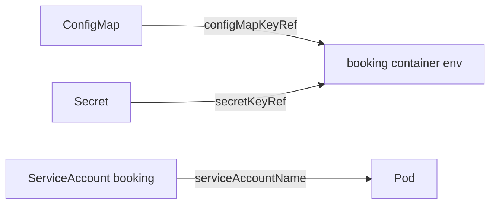

# Configuration and identity

*Stage 1 · Liftoff*

**You will be able to:** choose between a ConfigMap and a Secret, predict when a configuration change takes effect, and explain what a ServiceAccount is for.

## The problem

Launchpad taught that an image should not hard-code environment facts. In Kubernetes the same booking image runs in development, staging and production, needing different database addresses and passwords each time. Pasting those values into every Deployment makes them hard to audit and easy to leak. We need a place to keep configuration separate from the workload, and a way to say **who a Pod is** when it talks to the Kubernetes API.

## The idea in plain words

Imagine an office employee. Their **job description** is the same everywhere, but the **address book** (non-sensitive settings), the **safe combination** (sensitive values) and their **ID badge** (who they are to building security) are issued separately.

| Object | Holds | Apollo example |
|---|---|---|
| **ConfigMap** | Non-sensitive settings as key/value pairs | `apollo-airlines-config`: ports, service URLs |
| **Secret** | Sensitive values | `apollo-airlines-secrets`: `JWT_SECRET`, `POSTGRES_PASSWORD` |
| **ServiceAccount** | The Pod's identity to the **Kubernetes API** | `booking`, `init-booking-db`, … (13 in total) |



## How it works: delivery and timing

A Pod receives a ConfigMap or Secret in one of two ways, and the way decides when a change is noticed:

| Delivery | Updated in a running Pod? | To apply a change |
|---|---|---|
| Environment variable (`valueFrom`) | **Never.** Copied once at container start | Start new Pods: `kubectl rollout restart` |
| Mounted file (volume) | Eventually, as the kubelet syncs | The app must reload the file itself |

Two consequences follow. A missing ConfigMap, Secret or key stops the container from starting at all (`CreateContainerConfigError`). And `rollout undo` does **not** revert a ConfigMap edit, because the data is not part of the Pod template: an undo restores the old template, but new Pods still read today's ConfigMap.

## Secrets: what they are and are not

A Secret is a separate object so access can be controlled separately from ConfigMaps (using RBAC, introduced in Stage 8). That is its real benefit. It is **not** encryption:

- The value is stored base64-encoded, and `base64 -d` reverses it. Anyone allowed to read the Secret can read the value.
- By default it is not encrypted at rest, rotated automatically, or protected from an application that prints it to its logs.

Treat "use a Secret" as a necessary step, not a complete security design.

## ServiceAccounts: identity to the API

Every Pod runs as a ServiceAccount. By default, Kubernetes mounts a token for it at `/var/run/secrets/kubernetes.io/serviceaccount/`, which lets processes in the Pod call the Kubernetes API.

Apollo's services only need databases and peer services; none ever calls the Kubernetes API. Handing a web-facing process an API credential would widen the damage if it were compromised. So Stage 1 sets `automountServiceAccountToken: false`. The ServiceAccount still exists as a named identity that RBAC can use later.

Labels are not identity. A label such as `app: booking` is mutable metadata used for selection. A ServiceAccount is what the API's authorization layer evaluates.

## Try it

```bash
kubectl get deploy booking -n apollo-airlines -o jsonpath='{range .spec.template.spec.containers[0].env[*]}{.name}{" <- "}{.valueFrom}{"\n"}{end}'
kubectl exec -n apollo-airlines deploy/booking -- printenv FLIGHT_SERVICE_URL
kubectl exec -n apollo-airlines deploy/booking -- ls /var/run/secrets/kubernetes.io/serviceaccount
```

- The first line shows where each variable comes from; the second shows what the process actually received; the third fails with "No such file", proving no token is mounted.

## Common misconceptions

- **"Editing the ConfigMap updates my running Pods."** Environment variables are fixed at start.
- **"A Secret is encrypted."** It is encoded.
- **"The ServiceAccount token is how my app authenticates to the database."** It authenticates to the Kubernetes API only.

## Check yourself

<details>
<summary>You edit a ConfigMap. Does a running booking Pod see the new env value?</summary>

No. Environment variables are copied at container start; restart the rollout.
</details>

<details>
<summary>Does a Secret encrypt its data?</summary>

No. It is base64-encoded; protection depends on RBAC, encryption at rest and how applications handle it.
</details>

## Where this leads

Some work must run once rather than forever, such as creating database tables. That is a different kind of workload.
