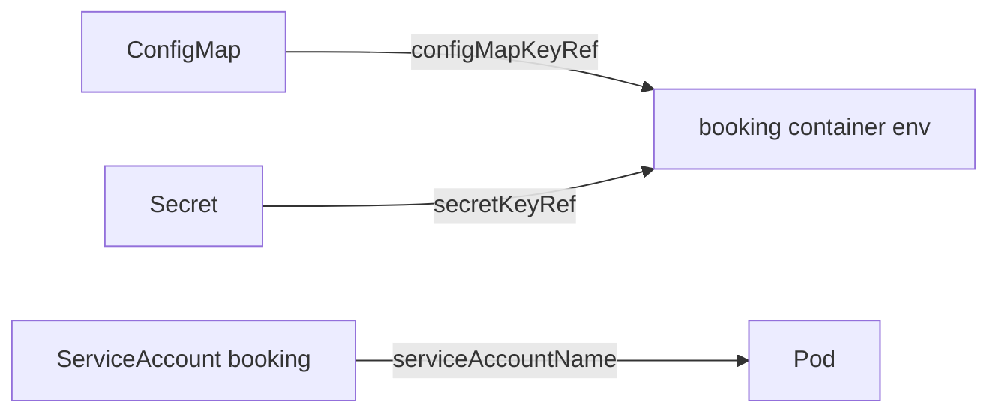

# Configuration and identity

*Stage 1 · Liftoff*

**You will be able to:** choose between ConfigMap and Secret, predict when a change takes effect, and explain what a ServiceAccount token is for.

## Three objects, three jobs

| Object | Holds | Reaches the Pod via | Apollo example |
|---|---|---|---|
| **ConfigMap** | Non-sensitive settings | `env.valueFrom.configMapKeyRef` or a mounted volume | `apollo-airlines-config`: ports, service URLs |
| **Secret** | Sensitive values | `env.valueFrom.secretKeyRef` or volume | `apollo-airlines-secrets`: `JWT_SECRET`, `POSTGRES_PASSWORD` |
| **ServiceAccount** | Pod's identity to the **Kubernetes API** | `spec.serviceAccountName` | `booking`, `init-booking-db`, … (13) |



## When does a change take effect?

| Delivery | Updated in running Pod? | To apply |
|---|---|---|
| Env var from ConfigMap/Secret | **Never** (read at start) | New Pods: `kubectl rollout restart` |
| Mounted file | Eventually (kubelet sync) | App must reload (`SIGHUP`, watch) |

- A missing referenced ConfigMap/Secret/key ⇒ `CreateContainerConfigError`; the container never starts.
- `rollout undo` does **not** revert a ConfigMap edit, because the data is not in the Pod template.

## Secret caveats

- Base64 is encoding, **not encryption**: `kubectl get secret … | base64 -d` reveals it.
- Not encrypted at rest by default; not rotated; apps can still log them.
- Benefit: separate RBAC from ConfigMaps. Not a complete security design (Stage 8).

## ServiceAccounts

- Every Pod runs as a ServiceAccount; by default a token is mounted at `/var/run/secrets/kubernetes.io/serviceaccount/`.
- Apollo services never call the Kubernetes API, so Stage 1 sets `automountServiceAccountToken: false`: a compromised web process has no API credential.
- The account still exists as a named identity for future RBAC.

## Labels are not identity

| | Label | ServiceAccount |
|---|---|---|
| Mutable by anyone with write access | Yes | Identity assigned at Pod creation |
| Security meaning | None | Evaluated by RBAC |
| Used for | Selection (RS, Service) | API authorization |

## Try it

```bash
kubectl get deploy booking -n apollo-airlines -o jsonpath='{range .spec.template.spec.containers[0].env[*]}{.name}{" <- "}{.valueFrom}{"\n"}{end}'
kubectl exec -n apollo-airlines deploy/booking -- printenv FLIGHT_SERVICE_URL
kubectl exec -n apollo-airlines deploy/booking -- ls /var/run/secrets/kubernetes.io/serviceaccount   # No such file
```

## Check yourself

<details>
<summary>You edit a ConfigMap. Does a running booking Pod see the new env value?</summary>

No. Env is copied at container start; restart the rollout.
</details>

<details>
<summary>Does a Secret encrypt its data?</summary>

No. It is base64-encoded; protection depends on RBAC, encryption at rest and how apps handle it.
</details>
