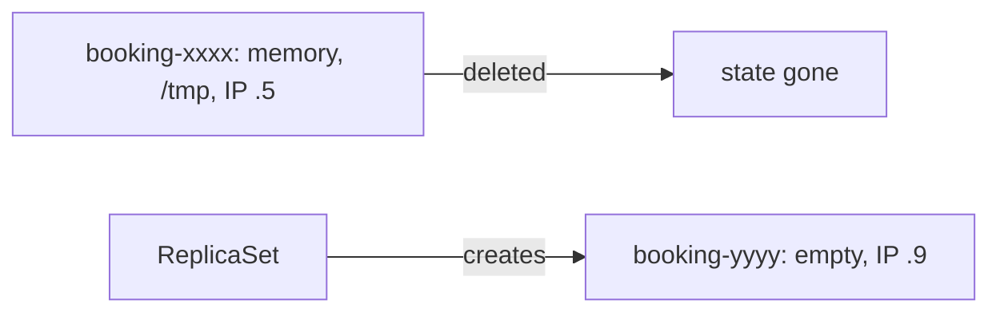

# Ephemeral state

*Stage 1 · Liftoff*

**You will be able to:** name which failure each storage location survives, before calling anything "self-healed".

## What a replacement Pod gets

| Inherited from the template | Lost for good |
|---|---|
| Image, labels, ConfigMap/Secret references, ServiceAccount | Process memory (in-flight requests, in-memory caches) |
| | Container writable layer (scratch files) |
| | Pod IP (new one assigned) |



## Survival table

| Storage | Container restart | Pod deleted | Node lost | Cluster lost |
|---|---|---|---|---|
| Process memory | ❌ | ❌ | ❌ | ❌ |
| Container writable layer | ✅ | ❌ | ❌ | ❌ |
| `emptyDir` | ✅ | ❌ | ❌ | ❌ |
| `hostPath` | ✅ | ✅ same node | ❌ | ❌ |
| PVC (kind `local-path`) | ✅ | ✅ | ❌ | ❌ |
| PVC (cloud block disk) | ✅ | ✅ | ✅ same zone | ❌ |
| Managed DB, multi-AZ | ✅ | ✅ | ✅ | ✅ within region |

- "Persistent" is not a property; **which failure it survives** is.

## Why vague words hurt

- In-flight booking whose confirmation was not yet queued: lost with the Pod.
- Postgres on `emptyDir`: a rollout or eviction **erases** the database although a "healthy" replacement starts (Stage 1 Exercise 7).
- Local-file caches: every rollout produces a cold cache and extra load downstream.

## Before you `kubectl delete`

1. Which objects go away?
2. Which children cascade through `ownerReferences`?
3. Which state becomes unrecoverable?

- Deleting a Pod removes its writable layer and `emptyDir`.
- Deleting a Deployment removes ReplicaSets and Pods, but **not** PVCs (independent lifecycle).

## Evidence

- `Running` only means a process started. Check the inputs it booted from, whether the data directory still has files, and run a real transaction.

```bash
kubectl exec -n apollo-airlines deploy/booking-db -- ls /var/lib/postgresql/data
kubectl exec -n apollo-airlines deploy/booking-db -- psql -U postgres -d booking -c '\dt'
```

## Check yourself

<details>
<summary>A database Pod is replaced and shows <code>Ready</code>. What else must you verify?</summary>

That its data directory came from durable storage and that real queries return the data. A new `emptyDir` produces an empty but healthy-looking database.
</details>

<details>
<summary>Which storage in the table survives a Pod deletion but not a node loss?</summary>

`hostPath` (same node) and a kind `local-path` PVC.
</details>
