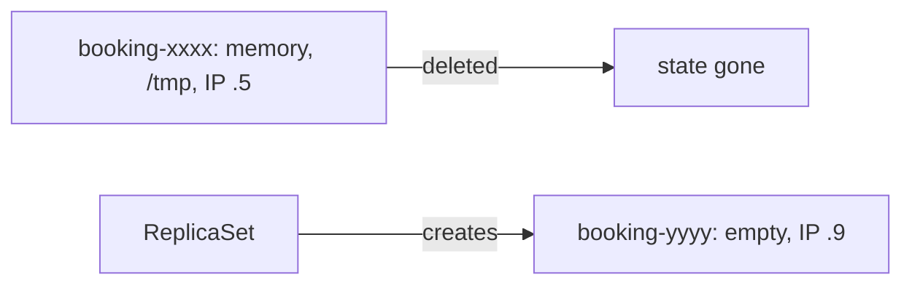

# Ephemeral state

*Stage 1 · Liftoff*

**You will be able to:** name which failure each kind of storage survives, before you call anything "self-healed".

Everything in Liftoff so far restores *processes*: a Pod is replaced, a Service finds it, config is injected. A replacement Pod shows `Running` and `Ready`, and it is tempting to conclude the airline recovered. But a Pod that is running and a Pod that has the **data** the old one had are different claims.

## What a replacement inherits

When a Pod is replaced, picture moving a worker into a brand-new office from the same job description. They get the same tools (the template), but the sticky notes on the old desk (memory) and the files in the old desk drawer (the container's writable layer) stay behind in the demolished office.

| Inherited from the template | Lost for good |
|---|---|
| Image, labels, ConfigMap/Secret references, ServiceAccount | Process memory: in-flight requests, in-memory caches |
| | Container writable layer: scratch files |
| | The Pod IP (a new one is assigned) |



## Name the failure, not the word "persistent"

Storage is not simply "temporary" or "permanent". What matters is **which failure** it survives. Read this table by row: pick the storage and see which events it crosses.

| Storage | Container restart | Pod deleted | Node lost | Cluster lost |
|---|---|---|---|---|
| Process memory | ❌ | ❌ | ❌ | ❌ |
| Container writable layer | ✅ | ❌ | ❌ | ❌ |
| `emptyDir` volume | ✅ | ❌ | ❌ | ❌ |
| `hostPath` | ✅ | ✅ same node | ❌ | ❌ |
| PVC on kind (`local-path`) | ✅ | ✅ | ❌ | ❌ |
| PVC on a cloud block disk | ✅ | ✅ | ✅ same zone | ❌ |
| Managed DB, multi-AZ | ✅ | ✅ | ✅ | ✅ within region |

An **`emptyDir`** is a scratch folder created when the Pod is scheduled and deleted with the Pod. It is useful for temporary files and sharing files between containers, but wrong for anything that must outlive the Pod.

## Why this matters for Apollo

- An in-flight booking whose confirmation had not yet been queued vanishes with its Pod.
- In Stage 1, the Postgres data directory is an `emptyDir`. A rollout or eviction replaces the Pod with an **empty** database that still reports healthy.
- A cache kept in local files goes cold at every rollout, pushing extra load to the database.

Stage 3 fixes the database case with PersistentVolumeClaims.

## Before you run `kubectl delete`

Ask three questions:

1. Which objects will be removed?
2. Which children are removed with them through `ownerReferences`?
3. Which state becomes unrecoverable?

Deleting a Pod removes its writable layer and `emptyDir`. Deleting a Deployment removes its ReplicaSets and Pods but **not** PVCs, which have an independent lifecycle.

## Try it

```bash
kubectl exec -n apollo-airlines deploy/booking-db -- ls /var/lib/postgresql/data
kubectl exec -n apollo-airlines deploy/booking-db -- psql -U postgres -d booking -c '\dt'
```

- `Running` only means the process started. Look at what the process booted from, then run a real query.

## Common misconceptions

- **"Ready means my data is back."** A new `emptyDir` gives an empty but healthy-looking database.
- **"Persistent means safe."** It means it survives *particular* failures; see the table.

## Check yourself

<details>
<summary>A database Pod is replaced and shows <code>Ready</code>. What else must you verify?</summary>

That its data directory came from durable storage and that real queries return the data.
</details>

<details>
<summary>Which storage survives a Pod deletion but not a node loss?</summary>

`hostPath` (same node) and a kind `local-path` PVC.
</details>

## Where this leads

Stage 1 ends with a working but forgetful airline. Stage 2 turns to how requests reach it; Stage 3 gives the databases durable storage.
