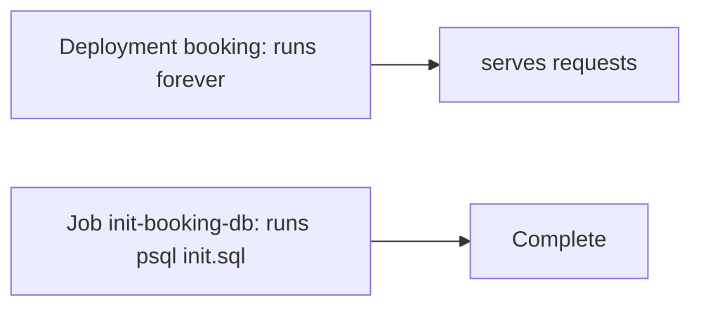

# Jobs and initialization

*Stage 1 · Liftoff*

**You will be able to:** choose Job vs Deployment, and write initialization that is safe to run twice.

## Key points

- Two booking replicas starting together would both try `CREATE TABLE`: races, lock contention, partial migrations.
- A **Job** runs a finite task to completion, separately from the app.

| | Deployment | Job |
|---|---|---|
| Purpose | Long-running service | Bounded task |
| `restartPolicy` | `Always` | `OnFailure` / `Never` |
| Controller goal | N replicas forever | `completions: 1` |
| On failure | Keep replacing | Retry up to `backoffLimit: 3`, then `Failed` |



## Why not in app startup

1. **Races** between replicas.
2. **Entangled failures:** a migration error becomes an app `CrashLoopBackOff`, hiding the cause.
3. **No independent retry** without restarting the web server.

- A Job does **not** make the Deployment wait. Your delivery workflow must wait for success before exposing a schema-dependent version.

## Idempotency

| Work | Make it safe to rerun |
|---|---|
| Schema | `CREATE TABLE IF NOT EXISTS`, `CREATE INDEX IF NOT EXISTS` |
| Seed | `INSERT … ON CONFLICT DO NOTHING / UPDATE` |
| DB not up yet | Retry loop on `pg_isready` (as in `init-booking-db`) |

## What `Complete` proves

- Proves: the container exited `0`.
- Does **not** prove: schema fits the current app, future changes are safe, or data was preserved.
- A completed Job does **not** rerun when the database is reset (Stage 1 Exercise 7). Stage 3 moves first-start seeding into Postgres' own init mechanism.

## Diagnose a failed Job

```bash
kubectl get job init-booking-db -n apollo-airlines
kubectl describe job init-booking-db -n apollo-airlines | sed -n '/Events:/,$p'
kubectl logs -n apollo-airlines -l app=init-booking-db
kubectl exec -n apollo-airlines deploy/booking-db -- psql -U postgres -d booking -c '\dt'
```

## Check yourself

<details>
<summary>Why does a Job retry up to <code>backoffLimit</code> and then stop?</summary>

It must finish; repeated failure is an error to fix, not a state to keep re-creating.
</details>

<details>
<summary>Why must init scripts be idempotent?</summary>

Retries, manual reruns and hooks will execute them more than once.
</details>
