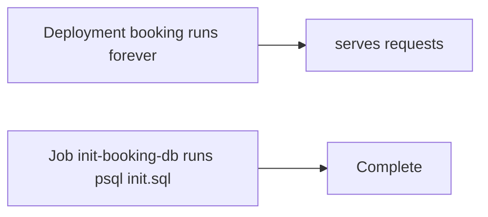

# Jobs and initialization

*Stage 1 · Liftoff*

**You will be able to:** choose between a Job and a Deployment, and write initialization that is safe to run twice.

## The problem

A new database is empty. Before booking can store anything, tables must be created. If booking does this itself on startup, picture two booking replicas starting at the same instant, each running `CREATE TABLE`: they race, one fails or leaves a half-finished schema, and the symptom shows up as a mysterious crash loop in the web service.

The work is **finite** (it should end), **one-off** (it should happen once, not once per replica) and **separate** from serving traffic. Deployments are built for the opposite: things that run forever.

## The idea in plain words

A Deployment is a restaurant that stays open; a **Job** is a delivery that has to arrive once. A Job runs a task until it succeeds, then stops. If the task fails, the Job tries again a limited number of times, and if it still fails it is marked failed so a person sees it.

| | Deployment | Job |
|---|---|---|
| Purpose | Long-running service | Bounded task |
| `restartPolicy` | `Always` | `OnFailure` or `Never` |
| Goal | N replicas forever | `completions: 1` |
| On failure | Keep replacing | Retry up to `backoffLimit` (3), then `Failed` |



## How it works

Apollo's `init-booking-db` Job runs the Postgres client image. It waits in a loop until `pg_isready` says the database is up (so it does not fail just because it started first), then runs `init.sql` and exits `0`. Kubernetes records the Job as `Complete`.

Running initialization outside the application gives you three things:

1. **No races:** one task, not one per replica.
2. **Clear failures:** a migration error shows up on the Job, not as an app crash loop.
3. **Independent retry:** you can re-run the Job without restarting the web server.

A Job does **not** make a Deployment wait for it. Your delivery process must wait for success before exposing a version that needs the new schema.

## Idempotency

Because retries and manual reruns happen, initialization must be **idempotent**: running it twice leaves the same result as running it once.

| Work | How to make it safe |
|---|---|
| Schema | `CREATE TABLE IF NOT EXISTS`, `CREATE INDEX IF NOT EXISTS` |
| Seed data | `INSERT … ON CONFLICT DO NOTHING` (or `DO UPDATE`) |
| Database not up yet | Retry loop on `pg_isready` |

## What `Complete` proves

It proves the container exited `0`. It does **not** prove the schema matches the current app, that future changes are safe, or that data was preserved. And a completed Job does not run again on its own: if the database is wiped later, you must recreate the Job (the Stage 1 apply script deletes and recreates the Jobs for this reason).

## Start-up order: Kubernetes converges, it doesn't sequence

Compose had `depends_on`. Kubernetes has no equivalent: apply booking and its database together, and both start at once. Booking fails readiness until the database answers, and Kubernetes keeps retrying until everything converges.

That works for long-running services, because readiness keeps traffic away until they are ready ([Services and readiness](./services-and-readiness)). It works badly for one-shot work: a seed Job that runs before its database exists can use up its `backoffLimit` and fail for good. So order is added only where it matters:

| Where | How Apollo orders it |
|---|---|
| Stage 1–4 scripts | `apply.sh` applies config, then databases, waits for them, then runs the Jobs and waits for `Complete`, then the apps |
| Inside a Job | The Job's own retry loop waits for `pg_isready` before running SQL |
| Stage 5 Helm | CRD bundles are installed before the chart, because a chart can't create objects of a kind that doesn't exist yet |
| Inside a Pod | Readiness keeps an unready container out of traffic, so a slow dependency delays traffic, not start-up |

## Try it

```bash
kubectl get job init-booking-db -n apollo-airlines
kubectl logs -n apollo-airlines -l app=init-booking-db
kubectl exec -n apollo-airlines deploy/booking-db -- psql -U postgres -d booking -c '\dt'
```

- Status, what the task printed, and the resulting tables: three independent pieces of evidence.

## Common misconceptions

- **"Complete means the database is healthy."** It means one task finished.
- **"The Deployment will wait for the Job."** It will not.
- **"Retries are harmless."** Only if the script is idempotent.

## Check yourself

<details>
<summary>Why does a Job retry up to <code>backoffLimit</code> and then stop?</summary>

It must finish; repeated failure is an error to fix, not a state to maintain forever.
</details>

<details>
<summary>Why must init scripts be idempotent?</summary>

Retries and manual reruns will execute them more than once.
</details>

## Where this leads

Once the app is running, you will need to ship new versions without taking it down. That is the rollout.
