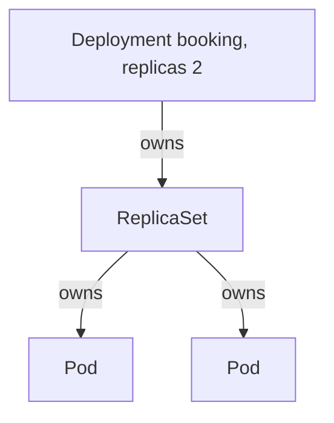

# Ownership, selection, and replicas

*Stage 1 · Liftoff*

**You will be able to:** explain who replaces a missing Pod, and separate *ownership* from *selection*.

## Key points

- **Pod:** a runtime home for containers. Replaceable; not a promise that *this* process lives on.
- **Replica:** one intended copy. `replicas: 2` is a target, not two named machines.
- **ReplicaSet:** keeps N Pods matching its selector alive. Creates from a saved template when too few; deletes when too many.
- **Deployment:** release intent. Owns ReplicaSets (one per template version). You almost never create ReplicaSets yourself.



## Two relationships that look alike

| | Ownership | Selection |
|---|---|---|
| Field | `metadata.ownerReferences` | `labels` ↔ `selector` |
| Question | Who is responsible for / garbage-collects this? | Which objects belong to this group? |
| Used by | Garbage collection, "who made this" | ReplicaSet counting, Service endpoints |
| Example | RS owns booking Pods | Service picks Pods with `app: booking` |

- A matching label gives **no** permission to create or delete a Pod.
- An owner reference does **not** route traffic.
- Relabel a Pod and the ReplicaSet **releases** it and creates a replacement (Stage 1 Exercise 2).
- A Deployment's `selector` must match its template labels, and is immutable after creation.

## After a failure

1. Pod deleted → ReplicaSet sees 1 matching Pod, wants 2.
2. It creates a Pod from the template.
3. Scheduler picks a node; kubelet starts it; readiness decides when it gets traffic.
4. Replacement has a **new UID**, usually a new IP, same template and labels. No memory or writable layer inherited.

## Evidence ladder

| Level | Command | Shows |
|---|---|---|
| Accepted | `kubectl apply` returned | API took it |
| Converged | `kubectl get deploy,rs,pods -l app=booking` | Counts match, owner chain correct |
| Useful | A booking request succeeds | Passenger outcome |

## Try it

```bash
kubectl get rs -n apollo-airlines -l app=booking
kubectl get pod -n apollo-airlines -l app=booking -o jsonpath='{.items[0].metadata.ownerReferences[0].kind}{"\n"}'
```

## Gotchas

- A Deployment keeps a count of Pods. It does not keep reservations in memory, give a stable address (that is a Service), or judge whether two versions are business-compatible.

## Check yourself

<details>
<summary>Which object directly owns a booking Pod?</summary>

The ReplicaSet (the Deployment owns the ReplicaSet).
</details>

<details>
<summary>You change a Pod's <code>app</code> label. What happens?</summary>

The ReplicaSet no longer counts it, releases it, and creates a replacement. The Service stops selecting the relabelled Pod.
</details>
