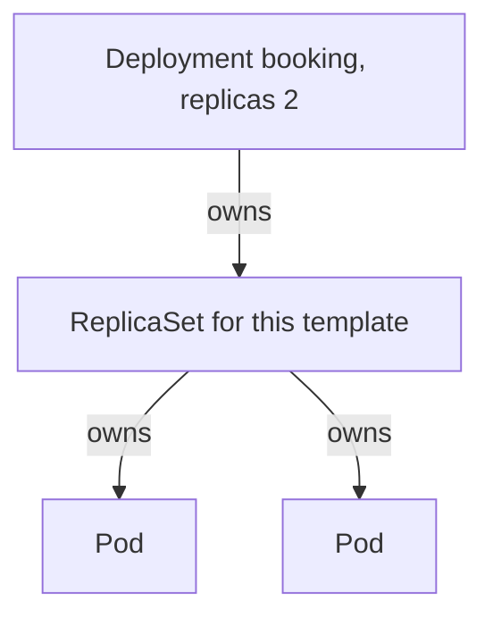

# Ownership, selection, and replicas

*Stage 1 · Liftoff*

**You will be able to:** explain who replaces a missing Pod, why there are three objects in the chain, and why *ownership* and *selection* are different relationships.

## The problem

In Ignition you deleted a bare Pod and it stayed deleted. For a real airline that is unacceptable: if a booking Pod dies, a replacement must appear without a person noticing first. So we need an object whose whole job is to keep a **number** of Pods alive, and a way to change that Pod's version safely over time.

## The idea in plain words

Think of a shift manager. You do not tell them "employ Alice and Bob"; you tell them "there must always be two people on the desk, trained like this." If someone leaves, the manager hires a replacement from the same job description. The replacement is a different person with the same role.

Kubernetes splits that manager into layers:

- A **Pod** is one running copy (the person).
- A **replica** is one *intended* copy. `replicas: 2` is a target count, not two named machines.
- A **ReplicaSet** keeps N Pods matching its description alive: too few and it creates one from its saved template, too many and it removes one.
- A **Deployment** sits above and manages *releases*: it owns a ReplicaSet for each version of the template. You almost never write ReplicaSets yourself.



## How it works

1. You apply a Deployment. It creates a ReplicaSet with the Pod template and a count.
2. The ReplicaSet counts the Pods that **match its selector** (labels). Say that is 0; it creates 2.
3. A Pod is deleted. The count is now 1; the ReplicaSet creates a replacement from the template.
4. The scheduler places it, the kubelet starts it, and a readiness check decides when it receives traffic.
5. The replacement has a **new UID**, usually a **new IP**, and no memory or writable files from the old Pod.

## Two relationships that look alike

This is the idea that causes most confusion, so go slowly.

- **Ownership** answers "who is responsible for this object, and who cleans it up?" It is stored in `metadata.ownerReferences`. When you delete a Deployment, its ReplicaSets and Pods are garbage-collected because they are owned.
- **Selection** answers "which objects belong to this group?" It uses **labels** (small key/value tags such as `app: booking`) and a **selector** (a query over labels). The ReplicaSet counts Pods by selector; later, a Service finds its Pods by selector.

| | Ownership | Selection |
|---|---|---|
| Field | `ownerReferences` | `labels` ↔ `selector` |
| Question | Who made and cleans up this? | Which objects form this group? |
| Used by | Garbage collection | Counting replicas, routing traffic |

They are independent. A label on a Pod gives nobody permission to delete it, and an owner reference does not route traffic. Change a Pod's `app` label and the ReplicaSet stops counting it (releasing it from ownership) and creates a replacement, while the old Pod keeps running as an orphan. You will use exactly that trick in the lab to take a Pod out of service while keeping it alive for inspection.

One more rule: a Deployment's `selector` must match its template's labels, and it cannot be changed after creation, because changing it could make it unclear which Pods belong to whom.

## Apollo example

`booking` is a Deployment with `replicas: 2`. Its ReplicaSet is named `booking-<hash>` (the hash identifies the template version). Its Pods are `booking-<hash>-<random>`.

## Try it

```bash
kubectl get rs -n apollo-airlines -l app=booking
kubectl get pod -n apollo-airlines -l app=booking -o jsonpath='{.items[0].metadata.ownerReferences[0].kind}{"\n"}'
```

- The Pod's owner prints `ReplicaSet`, not `Deployment`. The extra layer is what allows two versions to coexist during an update.

## Common misconceptions

- **"A Deployment runs my Pods directly."** It manages ReplicaSets; they manage Pods.
- **"Labels give a controller ownership."** Ownership is separate metadata.
- **"A Deployment preserves state."** It keeps a *count* of Pods. A reservation held only in memory still dies with its Pod.

## Check yourself

<details>
<summary>Which object directly owns a booking Pod?</summary>

The ReplicaSet (the Deployment owns the ReplicaSet).
</details>

<details>
<summary>You change a Pod's <code>app</code> label. What happens?</summary>

The ReplicaSet no longer counts it, releases it, and creates a replacement. The Service also stops selecting the relabelled Pod.
</details>

## Where this leads

Replacement Pods get new IPs, so callers cannot depend on Pod addresses. The next chapter introduces the stable name that sits in front of them.
