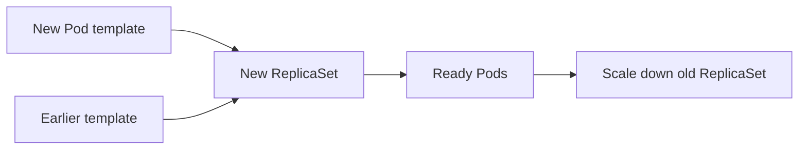

# Rollouts and rollback

Changing a Deployment template creates a new ReplicaSet and gradually replaces old Pods according to its strategy. Readiness gates rollout progress, but it cannot prove business correctness. A rollback changes the workload template toward an earlier revision; it does not reverse database writes, queue messages, or other external side effects.

*Diagram WL-03 — release history is not a transaction over external systems.*

## In the Liftoff mission

A new booking image changes a Deployment’s Pod template. The Deployment creates
a new ReplicaSet, waits according to its rollout strategy and readiness signals,
then reduces the old ReplicaSet. This creates a controlled handover between
versions rather than replacing every Pod at once.

## Evidence and limit

Use rollout conditions, ReplicaSet revisions, ready Pod counts, and a passenger
request to understand progress. Rolling back restores an earlier desired
template; it cannot undo an already-sent notification, an external payment, or
a database change made by the failed version.
