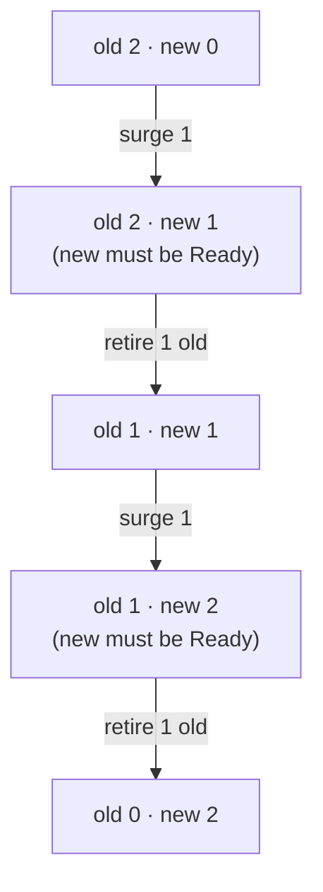
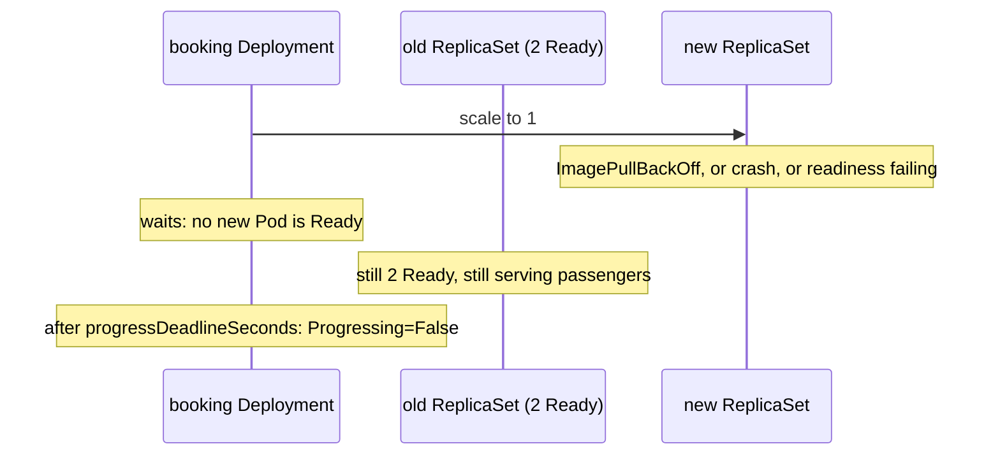
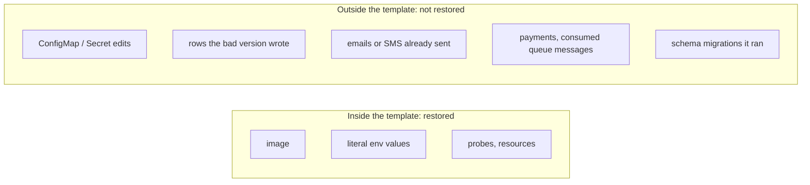
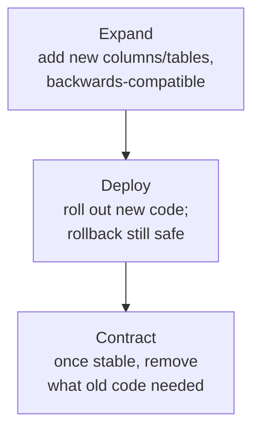

# Rollouts and rollback

*Stage 1 · Liftoff*

**You will be able to:** predict how a booking rollout proceeds with two replicas, explain why a bad release stalls without an outage, say which changes start a rollout and which do not, and list what `rollout undo` cannot restore.

[Deployments](../cluster/deployments) introduced the mechanism: one ReplicaSet per template version, replicas shifted across, gated on readiness. This chapter applies it to Apollo's services, where releases touch databases, configuration and other services, and where "roll back" has limits you need to plan for.

## The pace with two replicas

Apollo's services run `replicas: 2` with the default strategy. The defaults round differently:

- `maxSurge: 25%` of 2 = 0.5, **rounded up** to 1: one extra Pod may exist.
- `maxUnavailable: 25%` of 2 = 0.5, **rounded down** to 0: no Pod may be missing.


```mermaid
flowchart TB
  s0["old 2 · new 0"] -->|"surge 1"| s1["old 2 · new 1<br/>(new must be Ready)"]
  s1 -->|"retire 1 old"| s2["old 1 · new 1"]
  s2 -->|"surge 1"| s3["old 1 · new 2<br/>(new must be Ready)"]
  s3 -->|"retire 1 old"| s4["old 0 · new 2"]
```

So a booking rollout starts one new Pod and removes no old Pod until that new one is **Ready**. Two ready Pods serve throughout.

## Why a bad release stalls instead of breaking


```mermaid
sequenceDiagram
  participant D as booking Deployment
  participant Old as old ReplicaSet (2 Ready)
  participant New as new ReplicaSet
  D->>New: scale to 1
  Note over New: ImagePullBackOff, or crash, or readiness failing
  Note over D: waits: no new Pod is Ready
  Note over Old: still 2 Ready, still serving passengers
  Note over D: after progressDeadlineSeconds: Progressing=False
```

If the new Pod cannot pull its image, crashes on start, or keeps failing its readiness probe, it never becomes Ready, so the old Pods are never removed. Passengers keep being served by the old version. The rollout reports `Progressing=False` once its deadline passes.

The safety net is only as good as the **readiness check**. If booking's `/readyz` returns 200 while it cannot reach its database, a broken release becomes Ready, old Pods are retired, and the outage arrives on schedule. Stage 4's [probes](../reliability/probes) chapter covers what readiness should test.

## What starts a rollout, and what does not

A rollout starts only when the **Pod template** changes. That catches people out with configuration:

| Change | New ReplicaSet and rollout? |
|---|---|
| Image tag | Yes |
| A literal `env` value in the template | Yes |
| Probes, resources, labels in the template | Yes |
| `replicas` | No: the current ReplicaSet is just resized |
| Editing a **ConfigMap or Secret** the Pods read | **No.** Pods keep the values they started with (env vars), or see the file change only if the app re-reads it |
| `kubectl rollout restart` | Yes: it adds a timestamp annotation to the template |

To roll out a configuration change, either run `kubectl rollout restart`, or make the template depend on the config (for example, an annotation holding a hash of the ConfigMap, which tools like Helm and Kustomize can generate).

## What rollback restores

`kubectl rollout undo` copies the previous ReplicaSet's template back into the Deployment, and the same rolling process runs towards it. It restores the **Pod template** and nothing else.


```mermaid
flowchart LR
  subgraph In["Inside the template: restored"]
    direction TB
    i1["image"]
    i2["literal env values"]
    i3["probes, resources"]
  end
  subgraph Out["Outside the template: not restored"]
    direction TB
    o1["ConfigMap / Secret edits"]
    o2["rows the bad version wrote"]
    o3["emails or SMS already sent"]
    o4["payments, consumed queue messages"]
    o5["schema migrations it ran"]
  end
```

Plan releases so that going back is safe.

### Expand, deploy, contract

When a release changes the database schema, split it so both the old and new code can run against the database at every moment:


```mermaid
flowchart TB
  e["Expand<br/>add new columns/tables,<br/>backwards-compatible"] --> d["Deploy<br/>roll out new code;<br/>rollback still safe"] --> c["Contract<br/>once stable, remove<br/>what old code needed"]
```

1. **Expand:** add the new columns or tables without removing anything. Old and new code both work.
2. **Deploy** the new version. A rollback is safe, because the old code still works on the expanded schema.
3. **Contract:** once the new version has proven itself, remove the old columns in a later release.

During a rolling update, old and new Pods serve at the same time anyway, so this discipline is needed even when nothing goes wrong.

## Diagnose a rollout

```bash
kubectl rollout status deploy/booking -n apollo-airlines --timeout=30s
kubectl get rs,pods -n apollo-airlines -l app=booking
kubectl describe pod -n apollo-airlines -l app=booking | grep -E 'Failed|BackOff|Readiness'
kubectl rollout history deploy/booking -n apollo-airlines
kubectl rollout undo deploy/booking -n apollo-airlines
```

| Stuck with | Likely cause |
|---|---|
| `ImagePullBackOff` | Wrong tag or registry: the kubelet cannot pull |
| `Running`, `0/1` Ready | Readiness failing: bad config or a dependency it cannot reach |
| `Pending` | Scheduling or quota: no room for the surge Pod |

## Common misconceptions

- **"A stalled rollout means an outage."** The old Pods usually keep serving.
- **"Rollback undoes the release."** It restores the template, not its side effects.
- **"Editing a ConfigMap rolls out the change."** It does not touch the template, so no rollout starts.
- **"Rollback fixes a bad ConfigMap."** The ConfigMap is outside the template; undo leaves it as it is.

## Check yourself

<details>
<summary>Why did users keep getting 200s during a stalled booking rollout?</summary>

The new Pod never became Ready, so the old Pods were never removed.
</details>

<details>
<summary>You change <code>LOG_LEVEL</code> in booking's ConfigMap. Why does nothing happen, and how do you apply it?</summary>

The Pod template did not change, so the Deployment does nothing, and running processes keep the value they read at start. Run `kubectl rollout restart deploy/booking`, or tie the template to the ConfigMap's content.
</details>

<details>
<summary>Does rolling back undo a booking written by the buggy version?</summary>

No. Rollback restores the Pod template only; data and external effects stay.
</details>

## Where this leads

Rollback cannot restore data that lived in a Pod that no longer exists. The last Liftoff chapter names exactly what a replacement Pod loses.
