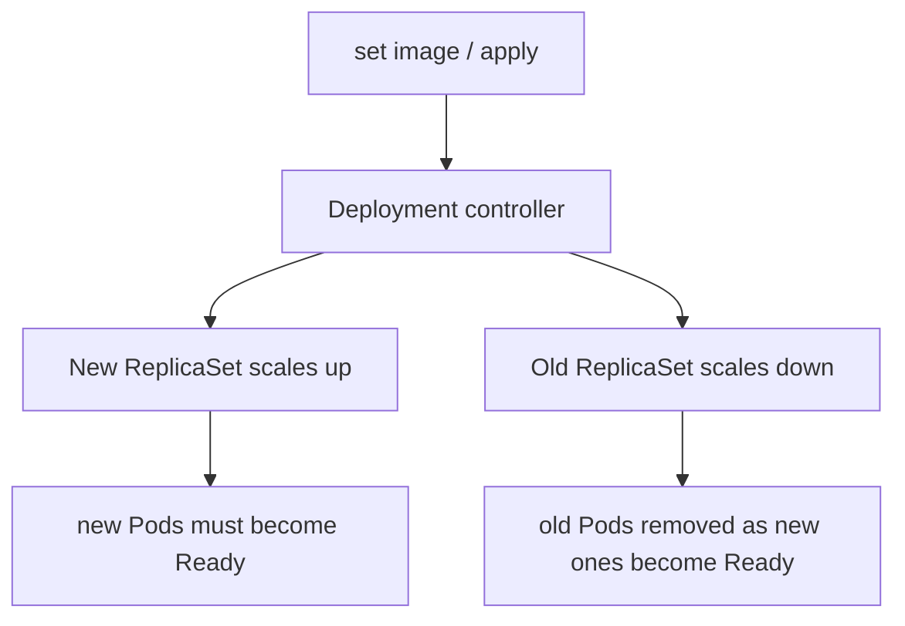

# Rollouts and rollback

*Stage 1 · Liftoff*

**You will be able to:** explain why a bad release can stall without causing an outage, and say what `rollout undo` does and does not restore.

## The problem

You have a new booking image. The crude way to deploy it is to stop everything and start the new version, which means a gap where passengers see errors, and if the new version is broken the gap never closes. We want to replace Pods gradually, verify each new one before relying on it, and keep the old ones until we are sure.

## The idea in plain words

Think of a shift handover: bring one new crew member aboard, check they are ready, then let one old member leave. Repeat. At every moment enough people are on duty.

A **rollout** does this with ReplicaSets. When you change anything in a Deployment's Pod template (image, environment, probes), the Deployment creates a **new ReplicaSet** for the new template. The old and new ReplicaSets exist together while Pods move across.

## How it works


```mermaid
flowchart TD
  Change[set image / apply] --> DC[Deployment controller]
  DC --> New[New ReplicaSet scales up]
  DC --> Old[Old ReplicaSet scales down]
  New --> NP[new Pods must become Ready]
  Old --> OP[old Pods removed as new ones become Ready]
```

Two numbers set the pace:

| Field | Default | Meaning |
|---|---|---|
| `maxSurge` | 25% (rounded up) | How many extra Pods may exist above the desired count |
| `maxUnavailable` | 25% (rounded down) | How many may be missing during the update |

With `replicas: 2`, surge rounds up to 1 and unavailable rounds down to 0. So the Deployment starts one new Pod and will not remove any old Pod until that new one is **Ready**.

That readiness gate is the safety net. If the new Pod cannot pull its image, crashes at start, or keeps failing its readiness probe, it never becomes Ready, so the old Pods are never removed. The rollout **stalls** while passengers keep being served by the old version.

## What rollback restores

`kubectl rollout undo` tells the Deployment to make the previous ReplicaSet the desired one again and scale it back up. It restores the **Pod template**. It does not restore anything the bad version did while it ran.

| Restored | Not restored |
|---|---|
| Previous image, literal env values, probes | A ConfigMap or Secret you edited (not in the template) |
| | Rows written by the bad version |
| | Emails or SMS already sent |
| | Payments, or consumed queue messages |

### Making rollback safe: expand, deploy, contract

When a release changes the database schema, split it into three steps so either version can run:

1. **Expand:** add new columns or tables in a backwards-compatible way. Old and new code both work.
2. **Deploy** the new version. Rolling back remains safe because the old code still works on the expanded schema.
3. **Contract:** after the new version is stable, remove the old columns.

## Diagnose a rollout

```bash
kubectl rollout status deploy/booking -n apollo-airlines --timeout=30s
kubectl get rs,pods -n apollo-airlines -l app=booking
kubectl describe pod -n apollo-airlines -l app=booking | grep -E 'Failed|BackOff|Readiness'
kubectl rollout history deploy/booking -n apollo-airlines
kubectl rollout undo deploy/booking -n apollo-airlines
```

| Stuck with | Likely cause |
|---|---|
| `ImagePullBackOff` | Wrong tag or registry (the kubelet cannot pull) |
| `Running`, `0/1` | Readiness failing: bad config or a down dependency |
| `Pending` | Scheduling or quota |

## Common misconceptions

- **"A stalled rollout means an outage."** The old Pods usually keep serving.
- **"Rollback undoes the release."** It restores the template, not its side effects.
- **"Undo fixes a bad ConfigMap."** The data is outside the template.

## Check yourself

<details>
<summary>Why did users keep getting 200s during a stalled rollout?</summary>

The new Pod never became Ready, so the old Pods were never removed.
</details>

<details>
<summary>Does rolling back undo a booking written by the buggy version?</summary>

No. Rollback restores the Pod template only; data and external effects stay.
</details>

## Where this leads

Rollback cannot restore data that lived in a Pod that no longer exists. The last Liftoff chapter names exactly what a replacement Pod loses.
