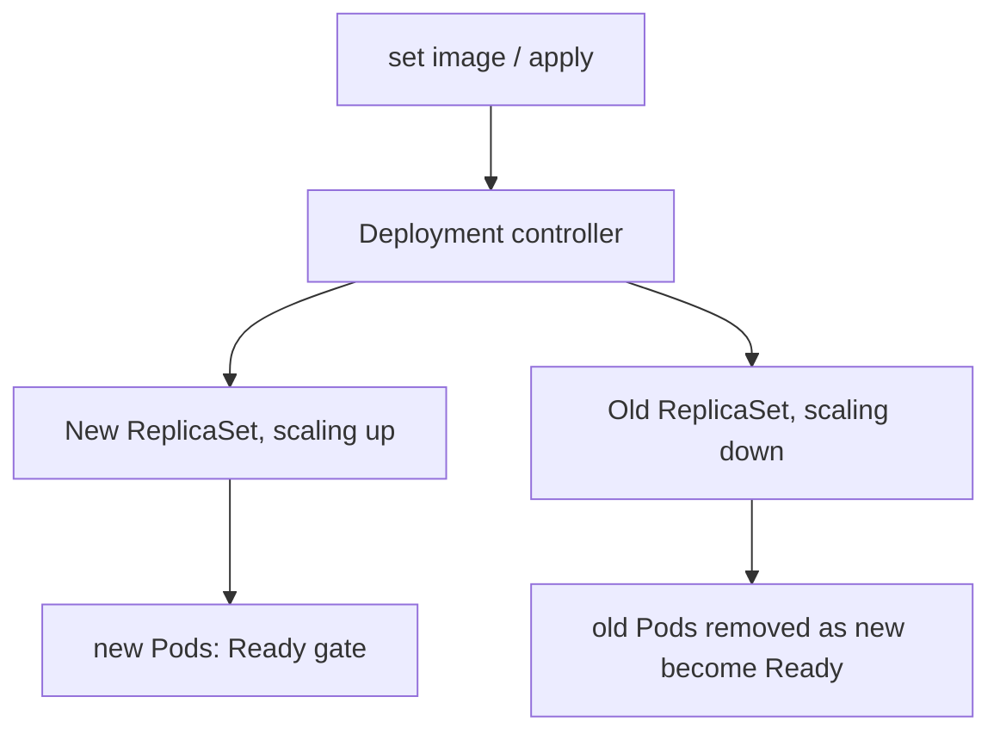

# Rollouts and rollback

*Stage 1 · Liftoff*

**You will be able to:** explain why a bad release can stall without an outage, and what `rollout undo` does and does not restore.

## Key points

- Any change to `spec.template` (image, env, probes) starts a **rollout**: the Deployment creates a **new ReplicaSet** and shifts Pods gradually.
- Old and new ReplicaSets coexist; old Pods go away only as new Pods become **Ready**.


```mermaid
flowchart TD
  Change[set image / apply] --> DC[Deployment controller]
  DC --> New[New ReplicaSet, scaling up]
  DC --> Old[Old ReplicaSet, scaling down]
  New --> NP[new Pods: Ready gate]
  Old --> OP[old Pods removed as new become Ready]
```

## Pace controls

| Field | Default | Meaning |
|---|---|---|
| `maxSurge` | 25% (rounded up) | Extra Pods above desired during update |
| `maxUnavailable` | 25% (rounded down) | Pods allowed to be missing |

- With `replicas: 2`: surge 1, unavailable 0 ⇒ a new Pod must be Ready before any old Pod is removed.
- A broken release (`ImagePullBackOff`, crash on boot, failing readiness) **stalls**; old Pods keep serving.

## What rollback restores

| `kubectl rollout undo` | Restores? |
|---|---|
| Previous ReplicaSet/template (image, env literal, probes) | ✅ |
| ConfigMap/Secret edits (not in the template) | ❌ |
| Rows written by the bad version | ❌ |
| Emails/SMS already sent | ❌ |
| Payments, consumed queue items | ❌ |

## Expand → deploy → contract

1. **Expand:** add columns/tables backwards-compatibly (v1 and v2 both work).
2. **Deploy** v2. Rolling back to v1 is safe.
3. **Contract:** after v2 is stable, remove the legacy columns.

## Diagnose a rollout

```bash
kubectl rollout status deploy/booking -n apollo-airlines --timeout=30s
kubectl get rs,pods -n apollo-airlines -l app=booking
kubectl describe pod -n apollo-airlines -l app=booking | grep -E 'Failed|BackOff|Readiness'
kubectl rollout history deploy/booking -n apollo-airlines
kubectl rollout undo deploy/booking -n apollo-airlines
```

| Stuck with | Likely |
|---|---|
| `ImagePullBackOff` | Wrong tag / registry (kubelet) |
| Running `0/1` | Readiness failing: config or dependency |
| `Pending` | Scheduling / quota |

## Check yourself

<details>
<summary>Why did users keep getting 200s during a stalled rollout?</summary>

The new Pod never became Ready, so the old Pods were never removed.
</details>

<details>
<summary>Does rolling back undo a booking written by the buggy version?</summary>

No. Rollback restores the Pod template only; data and external effects stay.
</details>
