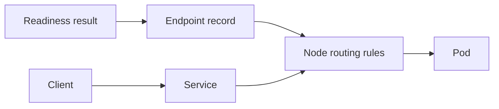

# Services and readiness

A Service gives callers a stable virtual address while selected Pods change. Readiness affects whether a Pod should be published as a usable endpoint. It does not make downstream dependencies healthy, and its effects propagate asynchronously through controllers and node routing implementations. We develop the control and packet paths in Networking.

*Diagram WL-02 — readiness is input to endpoint publication, not a synchronous traffic switch.*

## In the Liftoff mission

Apollo callers need a stable service name even while individual booking Pods
come and go. A Service provides that stable contract. Its selector identifies
candidate Pods, and readiness contributes to the endpoint information routing
implementations use. This lets a new, ready replacement become useful without
asking every caller to learn its new address.

## Evidence and limit

Check labels, readiness conditions, and endpoint records as separate facts.
A ready endpoint means the Pod passed its configured readiness check; it does
not prove every booking will succeed, and endpoint updates reach traffic rules
asynchronously. Guidance explains the complete control and packet paths.

## Begin with the passenger’s address

The replacement booking Pod has a new IP address. If every caller had to learn
that address, each replacement would become an application outage. A **Service**
is the stable object that gives callers one address while Pods change behind it.
It does not run the booking process and it is not a tiny proxy that owns the
request.

A Service has a selector. That selector asks which Pods have matching labels.
Kubernetes’ endpoint machinery then records eligible backends, taking readiness
into account. A routing implementation consumes that information and programs
the path a packet will use.

## Readiness is a traffic decision

A readiness check answers whether this Pod should receive a new request now. A
failed readiness check can leave the process running while its endpoint is
withheld from new traffic. This is useful when booking is alive but its database
is still starting. Readiness is sampled and its effect propagates through
controllers and routing rules; it is not an instant switch.

## Evidence and limit

Compare the Service selector, Pod labels, readiness conditions, endpoint records,
and a real request. A matching selector alone does not mean an endpoint is ready.
A ready endpoint does not guarantee every dependency call or business operation
will succeed. Guidance separates the control path that prepares routing from the
packet path that uses it.
